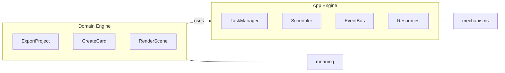
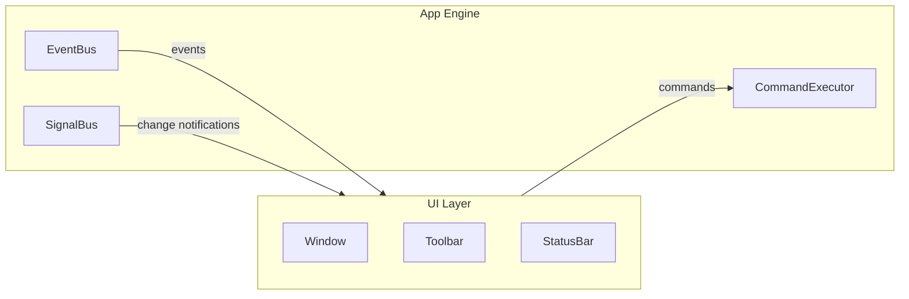
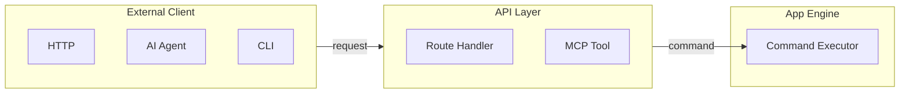

# What App Engine Is

## Overview

The **App Engine** is a generic application runtime infrastructure library. It provides the mechanisms that most applications need — lifecycle, commands, tasks, scheduling, events, signals, history, resources, services, plugins, configuration, persistence, concurrency, serialization, and developer tooling — without knowing what the application actually *does*.

```mermaid
flowchart TD
    subgraph AE[APP ENGINE]
        direction TB
        subgraph EXEC[Execution]
            CMD[Commands]
            TASK[Tasks]
            SCH[Scheduler]
            RES[Resources]
        end
        subgraph COMM[Communication]
            EVT[Events]
            SIG[Signals]
            HIST[History]
        end
        subgraph EXT[Extension]
            PLUG[Plugins]
            SERV[Services]
            PERM[Permissions]
        end
        subgraph SUPPORT[Supporting]
            LIFE[Runtime + Lifecycle + cleanup]
            STATE[Context + State (thread-safe)]
            CONFIG[Configuration + Preferences + persistence]
            CONTROL[Execution Control (cancel, deadline, stream)]
            CONC[Concurrency (thread-safe, async, TaskPool)]
            SERIAL[Serialization (Serializer, registry, IPC)]
            TEST[Testing (mocks, TestEngine, assertions)]
            META[Metadata (Version, PayloadSchema)]
        end
        subgraph REL[Reliability]
            PANIC[Panic isolation (catch_unwind)]
            PRIORITY[Event priority (High/Normal/Low)]
            RETRY[Retry policies (Fixed/Exponential)]
            RAII[RAII resource handles (auto-release)]
        end
    end
    AE -->|contracts| DE[DOMAIN ENGINE<br/>(app meaning)]
    DE -->|integration| API[API / MCP / UI]
```

---

## What App Engine Provides

### Execution Systems

| System | Purpose |
|---|---|
| **Commands** | Application intents — "do X." Registered and executed through `CommandHandler`. |
| **Tasks** | Managed work instances with lifecycle (`Pending → Running → Completed/Failed/Cancelled`). |
| **Scheduler** | Decides *when* tasks run (immediate, delayed, interval, triggered). Includes retry policies. |
| **Resources** | Load, cache, track, and release generic data. RAII handles auto-release on drop. |

### Communication Systems

| System | Purpose |
|---|---|
| **Events** | "Something happened" — one-to-many, past occurrence. Priority delivery + panic isolation. |
| **Signals** | "Something changed" — lightweight change notifications. Thread-safe. |
| **History** | Ordered operations with undo/redo/replay/transactions. Persistence-ready. |

### Extension Systems

| System | Purpose |
|---|---|
| **Services** | Long-lived capabilities that start/stop with the app. Panic-isolated lifecycle. |
| **Plugins** | Extension packages contributing commands, tasks, resources, etc. Permission-controlled. |

### Foundation Systems

| System | Purpose |
|---|---|
| **Runtime + Lifecycle** | Owns the application lifetime. Cancels tasks on stop, unloads resources on dispose. |
| **Context** | Identity hierarchy: `Application → Session → Execution`. |
| **State** | Generic key-value state store with validated transitions. Thread-safe. |
| **Configuration** | Persistent application settings. File/memory backends. Change notifications. |
| **Preferences** | User-facing settings (theme, language, etc.). Thread-safe. |

### Infrastructure Systems

| System | Purpose |
|---|---|
| **EngineRef** | Read-only bundle of engine subsystems passed to handlers. Handlers can publish events, load resources, write config, submit to scheduler, append to history. |
| **Execution Control** | `CancellationToken` (check `ctx.is_cancelled()`), `Deadline` (check `ctx.is_expired()`), `TaskOutputChannel` (progress streaming via SignalBus). |
| **Persistence** | `StorageBackend` trait with `FileStorageBackend` and `MemoryStorageBackend`. Used by `ConfigStore` and `HistoryStore`. |
| **Serialization** | `Serializer` trait + `SerializationRegistry`. `CommandInput`/`TaskInput`/`Event` carry optional serialized bytes for IPC. Zero external dependencies. |
| **Concurrency** | All managers are `Send + Sync` (`Mutex`/`RwLock`). `TaskPool` for concurrent execution. Optional `tokio` integration via `AsyncTaskHandler`. |
| **Panic Isolation** | All handler calls (tasks, commands, services, plugins, events) wrapped in `catch_unwind`. Panics converted to errors, Mutex not poisoned. |
| **Testing** | `MockCommandExecutor`, `MockEventBus`, `MockSignalBus`, `TestEngine`, assertion helpers. |
| **Metadata** | `Version` (semantic versioning), `PayloadSchema` (type descriptions), `Versioned` trait. |

---

## What App Engine Does NOT Provide

| Concern | Who owns it |
|---|---|
| **Domain logic** (what "export project" means) | Domain Engine |
| **Domain state** (which document is open, which card is selected) | Domain Engine |
| **UI** (windows, widgets, rendering) | UI Layer |
| **API/MCP** (HTTP endpoints, AI agent contracts) | Integration Layer |
| **Networking** (HTTP client, WebSocket, TLS) | External |
| **Rendering** (Wayland compositor, OpenGL/Vulkan) | External/Domain |
| **Database drivers** | External |
| **GPU resource management** | Domain |

The App Engine is deliberately **semantic-agnostic**. It knows that a `Task` exists and has a lifecycle, but it does not know whether that task exports a project or renders a scene.

---

## App Engine vs Domain Engine



- **Domain Engine** defines *what the application can do*.
- **App Engine** provides *how work is managed, scheduled, and communicated*.
- **Dependency direction**: `Domain Engine → App Engine` (never the reverse).

Example: The Domain Engine defines `ExportProjectCommand`. The App Engine provides the `CommandExecutor` that runs it, the `TaskManager` that manages it, the `Scheduler` that decides when it runs, and the `EventBus` that announces `ProjectExported`.

---

## App Engine vs UI

The App Engine has **no UI types**. No `Window`, `Widget`, `Theme`, `Layout`, `Renderer`, or `Canvas`.

- The UI reads application state through context, events, and signals.
- The UI sends intents through commands.
- The UI changes settings through preferences.
- The App Engine never imports or depends on a UI framework.



---

## App Engine vs API/MCP

The App Engine has **no API types**. No `Endpoint`, `Request`, `Response`, `Route`, or `McpTool`.

- API/MCP is an **external integration layer** that exposes App Engine capabilities to clients.
- The App Engine's `Command` system is the natural integration point: API requests can be translated into commands.



---

## When to Use App Engine

Use the App Engine when your application needs:

- **Managed execution** — commands, tasks, scheduling, retry policies
- **Undo/redo** — meaningful operation history with transactions
- **Plugin extensibility** — third-party or optional extensions with permission control
- **Decoupled communication** — events and signals instead of direct calls
- **Resource management** — load, cache, and release data with RAII handles and dependency tracking
- **Long-lived services** — background workers that start/stop with the app, panic-isolated
- **Thread safety** — all managers are `Send + Sync`, `Arc`-shareable across threads
- **Async execution** — optional `tokio` integration for I/O-heavy handlers
- **Serialization** — optional serialized bytes on all payloads for IPC and persistence
- **Stable contracts** — a clean boundary between runtime infrastructure and domain logic

You might **not** need it if:
- Your application is a simple script with no lifecycle, undo, or extensibility needs.
- You have no domain/UI/API separation concerns.

---

## Minimal Example

```rust
use app_shell::app_engine::{AppEngine, Bootstrap, Lifecycle};

fn main() {
    let mut engine: AppEngine = Bootstrap::create().expect("bootstrap failed");

    engine.initialize().expect("initialize failed");
    engine.start().expect("start failed");
    engine.run().expect("run failed");
    engine.stop().expect("stop failed");
    engine.dispose().expect("dispose failed");

    println!("Engine lifecycle complete: {:?}", engine.state());
}
```

This creates an `AppEngine`, runs through its full lifecycle (with automatic service/plugin startup, task cancellation on stop, resource cleanup on dispose), and shuts down cleanly. No UI, no API, no domain logic — just the runtime.

---

## Core Vocabulary

| Term | Definition |
|---|---|
| **AppEngine** | The composition root. Owns all subsystems. `Send + Sync`. |
| **Bootstrap** | Constructs a fully wired `AppEngine`. |
| **Lifecycle** | `Created → Initialized → Running → Stopped → Disposed`. Cleans up on stop/dispose. |
| **Context** | Identity: `Application → Session → Execution`. |
| **State** | Generic key-value state store with transitions. Thread-safe. |
| **Command** | An application intent — "do X." Registered and executed. Panic-isolated. |
| **Task** | A managed work instance with lifecycle, cancellation, deadline, progress streaming. |
| **Scheduler** | Decides *when* tasks run. Supports retry policies (Fixed/Exponential). |
| **Event** | "Something happened" — one-to-many, priority delivery, panic-isolated. |
| **Signal** | "Something changed" — lightweight, thread-safe. |
| **History** | Ordered operations with undo/redo/replay/transactions. Persistence-ready. |
| **Resource** | Managed data with load/cache/unload lifecycle. RAII handles auto-release. |
| **Service** | Long-lived capability. Panic-isolated lifecycle. |
| **Plugin** | Extension package. Permission-controlled. |
| **EngineRef** | Read-only bundle of subsystems passed to handlers. Handlers can write config, load resources, publish events, submit to scheduler. |
| **Configuration** | Persistent settings. File/memory backends. Change notifications. Thread-safe. |
| **Preferences** | User-facing settings. Thread-safe. |
| **Serializer** | Domain-provided trait for serializing type-erased payloads. For IPC and persistence. |
| **TaskPool** | Minimal thread pool for concurrent sync execution. |
| **AsyncRuntime** | Optional `tokio` wrapper for async task execution. |
| **Version** | Semantic versioning on command/task/plugin definitions. |
| **PayloadSchema** | Type metadata for command/task input/output. |
| **MockCommandExecutor** | Records executed commands. `assert_executed("app.echo")`. |
| **MockEventBus** | Records published events. `assert_published("task.completed")`. |
| **TestEngine** | Pre-configured lightweight engine for fast test setup. |
| **PermissionCheckedEngineRef** | Wraps `EngineRef` with permission checks. `try_load_resource()` returns `Result`. |

---

## Architecture at a Glance

```mermaid
flowchart TD
    APP[App]
    APP --> AE[App Engine — runtime infrastructure (this library)]
    APP --> DE[Domain Engine — application meaning and behavior]
    APP --> UI[UI / API / MCP — external access and presentation]
```

The App Engine is the **middle layer** — it provides the runtime machinery that the Domain Engine builds on, and that UI/API layers expose to users and external systems.

---

## Key Properties

| Property | Status |
|---|---|
| **Dependency-free** | ✅ Zero external crates by default |
| **Optional async** | ✅ `tokio` via `async-runtime` feature |
| **Thread-safe** | ✅ All managers `Send + Sync` |
| **Panic-isolated** | ✅ All handler calls wrapped in `catch_unwind` |
| **Backward compatible** | ✅ Default permissions = `FULL_ACCESS`, existing tests pass |
| **Headless** | ✅ Runs without UI, API, or MCP |
| **Serializable** | ✅ `Serializer` trait + `SerializationRegistry`, zero deps |
| **Persistent** | ✅ `StorageBackend` trait, file + memory backends |
| **Testable** | ✅ Mocks, `TestEngine`, assertion helpers |
| **Versioned** | ✅ `Version`, `PayloadSchema` on all definitions |

---

## Next Steps

- [02-architecture.md](02-architecture.md) — Internal architecture and module layout.
- [03-bootstrap-and-lifecycle.md](03-bootstrap-and-lifecycle.md) — Creating and running an engine.
- [11-handler-capabilities.md](11-handler-capabilities.md) — What handlers can access via `EngineRef`.
- [20-quick-start.md](20-quick-start.md) — 5-minute getting started guide.
- [09-domain-engine-integration.md](09-domain-engine-integration.md) — How the Domain Engine plugs in.