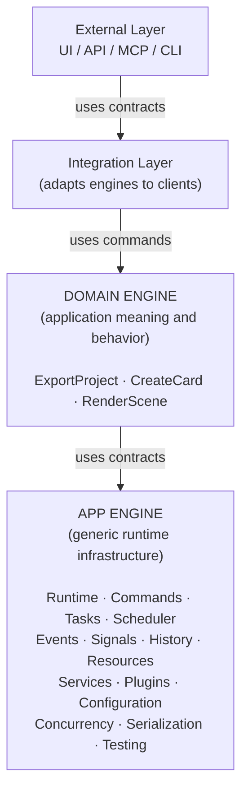
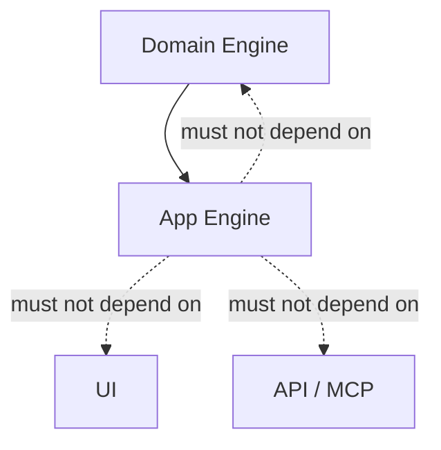
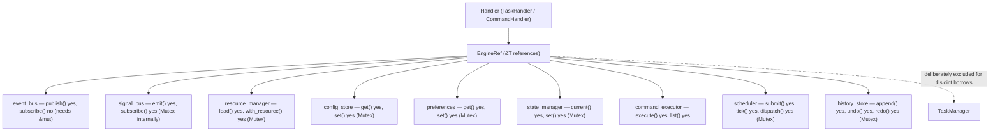
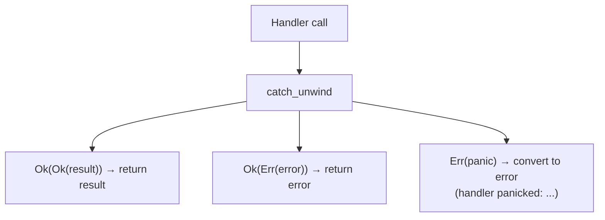
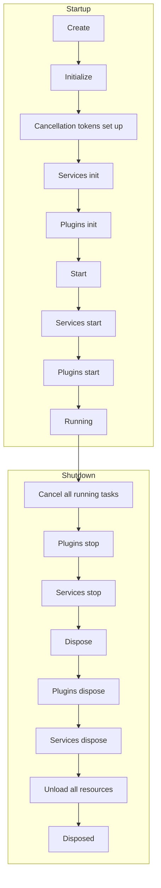
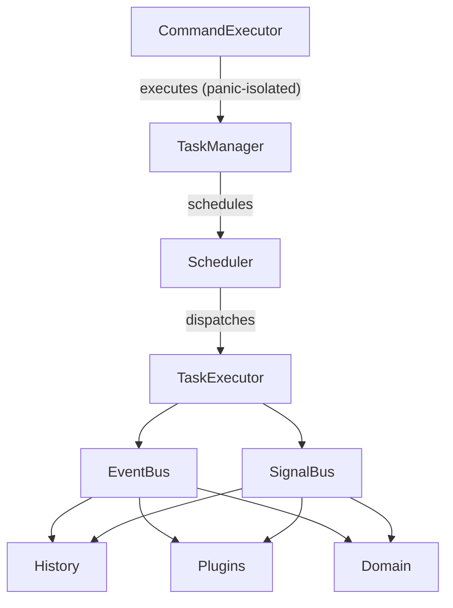

# Architecture & Boundaries

## Architecture Overview

The App Engine is designed around a strict layering principle: each layer knows the layer below it, never the layer above.



The dependency arrows always point downward. The App Engine never imports from the Domain Engine, the Integration Layer, or the UI.

---

## Project Structure

A real application built around the App Engine looks like:

```text
app/
├── app_engine/          ← generic runtime infrastructure (the engine library)
│   ├── runtime/
│   ├── lifecycle/
│   ├── context/
│   ├── state/
│   ├── commands/
│   ├── tasks/
│   ├── scheduling/
│   ├── events/
│   ├── signals/
│   ├── history/
│   ├── resources/
│   ├── services/
│   ├── plugins/
│   ├── configuration/
│   ├── persistence/
│   ├── serialization/
│   ├── capabilities/
│   ├── concurrency/
│   ├── testing/
│   ├── metadata/
│   └── mod.rs            ← public boundary (re-exports)
│
├── domain_engine/        ← application meaning and behavior
│   ├── project/
│   │   ├── export_project.rs
│   │   └── export_command.rs
│   ├── document/
│   │   ├── create_document.rs
│   │   └── document_model.rs
│   └── commands/         ← domain commands registered with App Engine
│       └── mod.rs
│
├── api/                  ← external access layer
│   ├── local/            ← local library/CLI access
│   ├── web/              ← HTTP/WebSocket
│   └── mcp/              ← AI agent integration
│
└── ui/                   ← presentation
    ├── desktop/          ← native UI (Qt, GTK, etc.)
    ├── web/              ← web frontend
    └── terminal/         ← TUI
```

Each layer has a single, clear responsibility.

---

## Dependency Direction

The most important architectural rule:



This means:

* The Domain Engine can import `AppEngine`, `TaskManager`, `CommandExecutor`, `EventBus`, etc.
* The App Engine **never** imports `ExportProject`, `Document`, `Card`, `Scene`, or any domain type.
* The App Engine **never** imports `Window`, `Widget`, `Route`, or `McpTool`.

If you find yourself adding a domain type to the App Engine, **stop**. It belongs in the Domain Engine.

---

## Composition Root

`AppEngine` is the **composition root** — the single object that owns and exposes all subsystems.

```rust
use app_shell::app_engine::{AppEngine, Bootstrap, Lifecycle};

let mut engine: AppEngine = Bootstrap::create().expect("bootstrap failed");
```

`AppEngine` owns:

```mermaid
flowchart TD
    AppEngine["AppEngine"]

    AppEngine --> Context["context_manager (Context)"]
    AppEngine --> State["state_manager (State)"]
    AppEngine --> Commands["command_executor (Commands)"]
    AppEngine --> Tasks["task_manager (Tasks)"]
    AppEngine --> Scheduler["scheduler (Scheduling)"]

    AppEngine --> Events["event_bus (Events)"]
    AppEngine --> Signals["signal_bus (Signals) — Arc<SignalBus>, shared with handlers"]

    AppEngine --> History["history_store (History)"]
    AppEngine --> Transactions["transaction_manager (Transactions)"]

    AppEngine --> Resources["resource_manager (Resources) — Arc<ResourceManager>, RAII-capable"]

    AppEngine --> Services["service_manager (Services)"]
    AppEngine --> Plugins["plugin_manager (Plugins)"]

    AppEngine --> Config["config_store (Configuration) — thread-safe, persistence-ready"]
    AppEngine --> Preferences["preferences (User Preferences) — thread-safe"]
```



`AppEngine` is **not a god object**. It does not implement domain logic, execute tasks, or handle UI events. It **composes and exposes** subsystems; each subsystem owns its own behavior.

---

## Public vs Internal API

### Public API

Accessible through `app_shell::app_engine::*` — these are the types consumers depend on:

```rust
// Core
AppEngine, Bootstrap, Lifecycle, RuntimeState

// Context
ApplicationContext, SessionContext, ExecutionContext, ContextManager

// State
StateId, StateManager, StateStore, StateTransition

// Commands
Command, CommandDefinition, CommandExecutor, CommandHandler, CommandInput, CommandResult

// Tasks
Task, TaskDefinition, TaskManager, TaskHandler, TaskInput, TaskResult, TaskState

// Scheduling
Schedule, Scheduler, Job, JobQueue, Trigger, RetryPolicy

// Communication
Event, EventBus, EventHandler, EventPriority, HandlerId
Signal, SignalBus, SubscriptionId

// History
HistoryEntry, HistoryEntryId, HistoryStore, UndoResult, RedoResult
TransactionManager, TransactionId, Replay

// Resources
Resource, ResourceId, ResourceHandle, ResourceLoader, ResourceManager, ResourceCache
ResourceDependencyGraph

// Services
Service, ServiceDefinition, ServiceManager, ServiceState

// Plugins
Plugin, PluginManifest, PluginManager, PluginLoader, PluginPermissions
PluginContext, PluginRegistry, DynamicPluginLoader

// Configuration
Config, ConfigSchema, ConfigStore, ConfigPropertyDefinition, Preferences

// Capabilities
EngineRef, PermissionCheckedEngineRef

// Execution Control
CancellationToken, Deadline, TaskOutputChannel

// Persistence
StorageBackend, FileStorageBackend, MemoryStorageBackend, PersistenceError

// Serialization
Serializer, SerializationRegistry, SerializationError

// Concurrency
TaskPool, AsyncTaskHandler, AsyncCommandHandler
AsyncRuntime (with async-runtime feature)

// Testing
MockCommandExecutor, MockEventBus, MockSignalBus, TestEngine

// Metadata
Version, Versioned, PayloadSchema

// Errors
EngineError, CommandError, TaskError, ResourceError, ServiceError
PluginError, SchedulingError, HistoryError, ConfigurationError
PersistenceError, SerializationError, PluginSecurityError, AsyncError
```

### Internal API

Not re-exported — these are implementation details that can change without breaking consumers:

```text
- EventDispatcher (internal routing — use EventBus instead)
- ServiceEntry (internal wrapper — use ServiceManager instead)
- PluginEntry (internal wrapper — use PluginManager instead)
- JobQueue internals (use Scheduler instead)
- StateStore internals (use StateManager instead)
- StoredHandler enum (use register/register_async instead)
- Bootstrap wiring details
- extract_panic_message helpers
```

Consumers should never need to reach into internal modules. If they do, the public API needs improvement.

---

## Subsystem Boundaries

Each subsystem is a self-contained module with clear boundaries:

| Subsystem     | What it owns         | What it does NOT do          |
| ------------- | -------------------- | ---------------------------- |
| Runtime       | Lifetime, cleanup    | Domain logic, execution      |
| Lifecycle     | Transition rules     | Side effects, domain state   |
| Context       | Identity hierarchy   | Domain objects               |
| State         | Generic state store  | Domain data                  |
| Commands      | Intent + execution   | What commands mean           |
| Tasks         | Work lifecycle       | What tasks compute           |
| Scheduler     | When work runs       | How work executes            |
| Events        | Pub/sub + priority   | Consumer behavior            |
| Signals       | Change notification  | Consumer behavior            |
| History       | Operation record     | What operations mean         |
| Resources     | Load/cache/unload    | What resources contain       |
| Services      | Long-lived lifecycle | Service-specific behavior    |
| Plugins       | Extension lifecycle  | Plugin implementations       |
| Config        | Settings storage     | What settings mean           |
| Persistence   | Key-value storage    | What keys mean               |
| Concurrency   | Thread pool, async   | Application-specific logic   |
| Serialization | Serializer trait     | What types serialize         |
| Testing       | Mocks, TestEngine    | Application test cases       |
| Metadata      | Version, schema      | What versions represent      |
| Execution     | Cancel, deadline     | What work is being cancelled |
| Capabilities  | EngineRef access     | What handlers do with it     |
| Permissions   | Permission flags     | What permissions authorize   |

---

## What Belongs Where

### In App Engine (generic)

```text
✓ "Run this command."
✓ "Schedule this task for 10 minutes from now."
✓ "Publish TaskCompleted with retry if it fails."
✓ "Undo the last 3 operations."
✓ "Load resource from file:///assets/image.png."
✓ "Start the autosave service (panic-isolated)."
✓ "Register the image plugin (with LOAD_RESOURCES permission)."
✓ "Save configuration: worker_count = 4 (persisted to file)."
✓ "Execute this task asynchronously on tokio."
✓ "Check if cancellation was requested (ctx.is_cancelled())."
✓ "Report progress at 75% (emits task.progress_changed signal)."
✓ "Serialize this CommandInput to bytes for IPC."
✓ "Cancel all running tasks on engine.stop()."
✓ "Unload all non-in-use resources on engine.dispose()."
```

### In Domain Engine (semantic)

```text
✓ "Export the project to PDF."
✓ "Create a card with these stats."
✓ "Render the scene at 1920x1080."
✓ "The document has 37 layers."
✓ "The selected object is a Rectangle."
✓ "Card database contains 1200 entries."
```

### In UI Layer (presentation)

```text
✓ "Show the toolbar."
✓ "Display the progress bar at 50%."
✓ "User clicked the Export button."
✓ "Theme is dark mode."
✓ "Canvas is 1920x1080."
```

### In API/MCP Layer (external access)

```text
✓ "POST /api/export → ExportProjectCommand"
✓ "MCP tool: create_card(name, attack, defense)"
✓ "WebSocket: subscribe to TaskProgressChanged"
✓ "CLI: --worker-count 8"
```

---

## EngineRef — Handler Capability Boundary

`EngineRef` is the controlled environment through which handlers access engine systems:



**What handlers CAN do through EngineRef:**

* Publish events
* Emit signals
* Load resources (RAII handles auto-release)
* Read and write configuration
* Read and write preferences
* Read and write state
* Execute sub-commands
* Submit work to scheduler
* Append to history, undo, redo
* All thread-safe (`Send + Sync`)

**What handlers CANNOT do through EngineRef:**

* Subscribe to events (requires `&mut EventBus` — setup time only)
* Register commands (requires `&mut CommandExecutor` — setup time only)
* Access TaskManager (excluded for disjoint borrows)
* Access ServiceManager/PluginManager (managed by runtime)
* Access ContextManager (setup time only)

**Permission-checked access (Phase 28):**

```rust
// For plugins that want permission enforcement:
let checked = PermissionCheckedEngineRef::new(engine, permissions, "my_plugin");
let mgr = checked.try_load_resource()?;  // Returns Err if no LOAD_RESOURCES
```

---

## Thread Safety Model

All managers are `Send + Sync`:

| Manager           | Lock Type                                                            | Reason                                                     |
| ----------------- | -------------------------------------------------------------------- | ---------------------------------------------------------- |
| `TaskManager`     | `Mutex` (tasks) + `RwLock` (executor)                                | `Task` has `Box<dyn Any + Send>` (Send, not Sync)          |
| `ConfigStore`     | `Mutex` (config)                                                     | `Config` has `HashMap<String, String>`                     |
| `Preferences`     | `Mutex` (values)                                                     | `HashMap<String, String>`                                  |
| `ResourceManager` | `Mutex` (cache, source_index, ref_counts, deps) + `RwLock` (loaders) | `Resource` has `Box<dyn Any + Send>`                       |
| `Scheduler`       | `Mutex` (scheduled, queue) + `RwLock` (triggers, paused)             | Jobs are `Clone`                                           |
| `HistoryStore`    | `Mutex` (entries, position)                                          | `HistoryEntry` has `Box<dyn Any + Send>`                   |
| `SignalBus`       | `Mutex` (subscriptions)                                              | Already had Mutex                                          |
| `StateManager`    | `Mutex` (via StateStore)                                             | Already had Mutex                                          |
| `EventBus`        | No lock                                                              | `publish(&self)`, `subscribe(&mut self)` — setup time only |
| `CommandExecutor` | No lock                                                              | `execute(&self)`, `register(&mut self)` — setup time only  |
| `ServiceManager`  | No lock                                                              | `&mut self` — managed by runtime                           |
| `PluginManager`   | No lock                                                              | `&mut self` — managed by runtime                           |

**Key rule:** `Mutex` is used when the contained type has `Box<dyn Any + Send>` (Send but not Sync). `RwLock` is used when the contained type is `Send + Sync`.

---

## Panic Isolation Model

All handler/lifecycle calls are wrapped in `catch_unwind`:



| Handler Type      | Isolated? | Where?                                            |
| ----------------- | --------- | ------------------------------------------------- |
| Event handlers    | ✅         | `EventDispatcher::dispatch()`                     |
| Task handlers     | ✅         | `TaskExecutor::execute()`                         |
| Command handlers  | ✅         | `CommandExecutor::execute()`                      |
| Service lifecycle | ✅         | `ServiceManager::initialize/start/stop/dispose()` |
| Plugin lifecycle  | ✅         | `PluginManager::initialize/start/stop/dispose()`  |

Mutex locks are **not poisoned** — the panic is caught before the lock is released.

---

## Lifecycle Integration

All long-lived systems start and stop with the engine:



---

## Communication Topology

Systems communicate through established contracts, not direct references:



Key principle: **the producer announces that something happened; it does not need to know who reacts to it.**

---

## Avoiding Accidental Coupling

### Bad: Direct dependency

```rust
// DON'T: TaskExecutor directly depends on HistoryStore
impl TaskExecutor {
    fn execute(&self, task: &Task) {
        // ... execute task ...
        self.history_store.append(entry);  // ← coupling!
    }
}
```

### Good: Decoupled through events

```rust
// DO: TaskExecutor publishes an event; History subscribes
impl TaskExecutor {
    fn execute(&self, task: &Task, engine: &EngineRef) {
        // ... execute task ...
        engine.event_bus.publish(&Event::new("task.completed"));
    }
}

// History is a separate consumer:
event_bus.subscribe("task.completed", Box::new(history_handler));
```

### Rules to prevent coupling

1. **Systems never import each other directly.** Use Events/Signals/Commands.
2. **No domain types in App Engine.** If you need `Document`, it's in the Domain Engine.
3. **No UI types in App Engine.** If you need `Window`, it's in the UI Layer.
4. **No API types in App Engine.** If you need `Route`, it's in the API Layer.
5. **Configuration ≠ State.** Don't store runtime state in `ConfigStore`.
6. **History ≠ Telemetry.** Don't record every internal function call in `HistoryStore`.
7. **Panic isolation everywhere.** A panicking handler returns an error, not a crash.
8. **Thread safety everywhere.** All managers are `Send + Sync`.
9. **RAII for resources.** Handles auto-release on drop — no manual cleanup needed.
10. **Permissions for plugins.** Use `PermissionCheckedEngineRef` for restricted access.

---

## Checklist: Am I Doing It Right?

| Question                                              | Answer should be                   |
| ----------------------------------------------------- | ---------------------------------- |
| Does App Engine import any domain type?               | No                                 |
| Does App Engine import any UI type?                   | No                                 |
| Does App Engine import any API type?                  | No                                 |
| Do subsystems import each other directly?             | No (use events/signals)            |
| Is `ConfigStore` used to store runtime state?         | No (use `StateManager`)            |
| Is `HistoryStore` recording every function call?      | No (only meaningful operations)    |
| Does `TaskExecutor` know about `HistoryStore`?        | No (publish events instead)        |
| Are plugins defining App Engine contracts?            | No (they consume them)             |
| Is `AppEngine` a god object with hundreds of methods? | No (it composes and exposes)       |
| Are all managers `Send + Sync`?                       | Yes                                |
| Are all handlers panic-isolated?                      | Yes                                |
| Do resource handles auto-release on drop?             | Yes                                |
| Does `engine.stop()` cancel running tasks?            | Yes                                |
| Does `engine.dispose()` unload resources?             | Yes                                |
| Are retry policies actually enforced?                 | Yes (`handle_task_failure`)        |
| Are plugin permissions checked?                       | Yes (`PermissionCheckedEngineRef`) |

If any answer is wrong, revisit the architecture. The App Engine's value comes from its **clean boundaries** — once those are violated, the entire layering benefit erodes.

---

## Next Steps

* [03-bootstrap-and-lifecycle.md](03-bootstrap-and-lifecycle.md) — Creating and running an engine.
* [11-handler-capabilities.md](11-handler-capabilities.md) — What handlers can access via `EngineRef`.
* [14-concurrency-and-async.md](14-concurrency-and-async.md) — Thread safety and async execution.
* [09-domain-engine-integration.md](09-domain-engine-integration.md) — How the Domain Engine plugs in.
