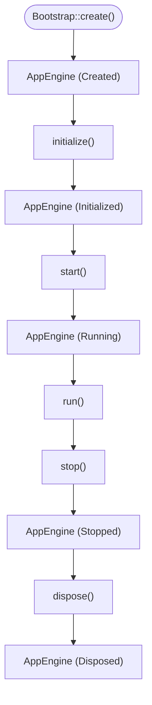
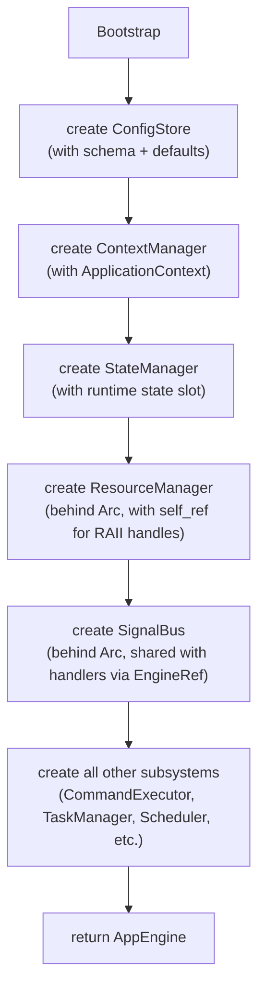
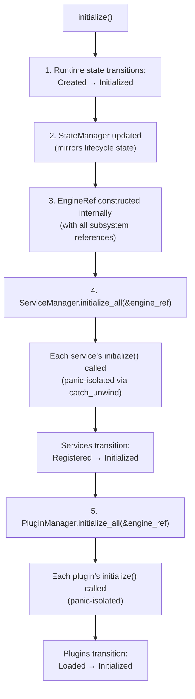
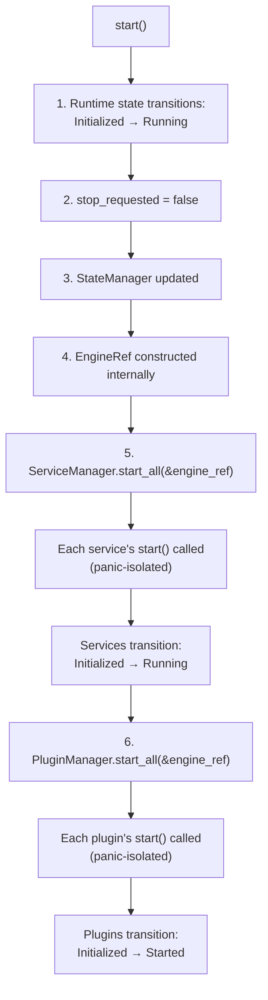
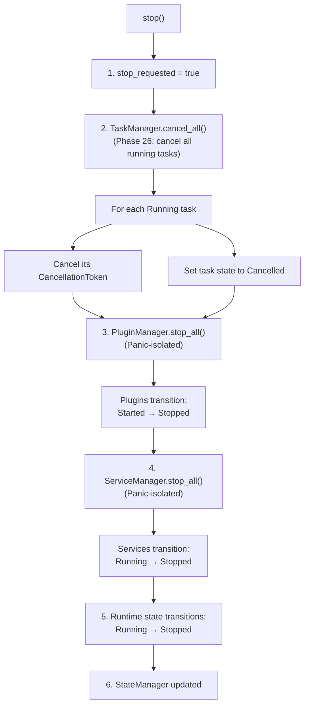
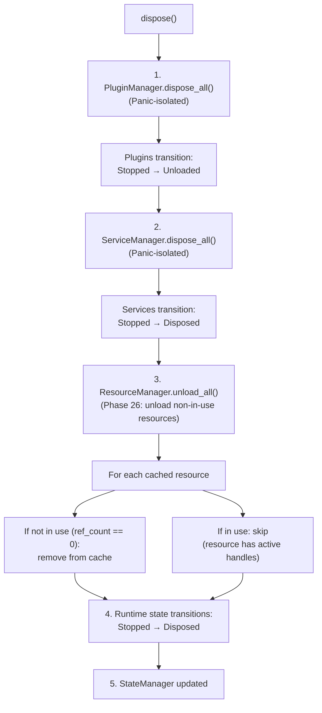
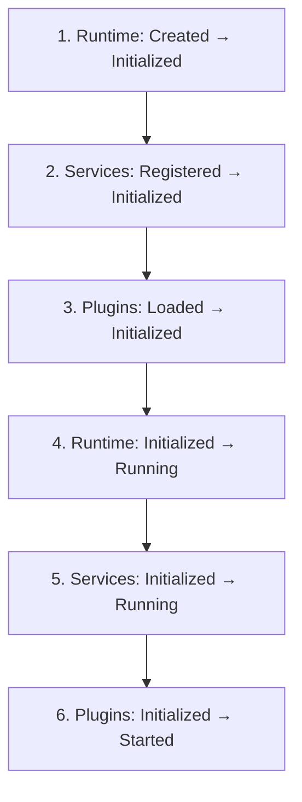
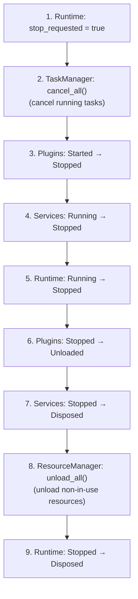

# Creating and Running an App

## Overview

Every application starts the same way: create an `AppEngine`, transition it through its lifecycle, and shut it down cleanly. This chapter shows how.



---

## Creating an AppEngine

The entry point is `Bootstrap::create()`:

```rust
use app_shell::app_engine::{AppEngine, Bootstrap, Lifecycle};

let mut engine: AppEngine = Bootstrap::create().expect("bootstrap failed");
```

`Bootstrap` wires all subsystems together:



At construction, the engine is in the `Created` state:

```rust
assert_eq!(engine.state(), RuntimeState::Created);
```

### Custom Application Identity

If you need a specific application ID:

```rust
let engine = Bootstrap::create_with_context(
    ApplicationContext::new("my_app")
)?;
```

---

## The Lifecycle Trait

`AppEngine` implements the `Lifecycle` trait:

```rust
pub trait Lifecycle {
    fn initialize(&mut self) -> Result<(), EngineError>;
    fn start(&mut self) -> Result<(), EngineError>;
    fn stop(&mut self) -> Result<(), EngineError>;
    fn dispose(&mut self) -> Result<(), EngineError>;
    fn state(&self) -> LifecycleState;
}
```

Every method returns `Result<(), EngineError>` — lifecycle failures are explicit, not silent.

---

## Initialization

```rust
engine.initialize()?;
```

What happens during `initialize()`:



Services initialize **before** plugins because plugins may depend on services being available.

### Panic Isolation (Phase 24)

If a service or plugin panics during `initialize()`, the panic is caught:

```rust
// In ServiceManager::initialize():
let result = std::panic::catch_unwind(std::panic::AssertUnwindSafe(|| {
    entry.instance.initialize(engine)
}));

match result {
    Ok(Ok(())) => { entry.state = ServiceState::Initialized; }
    Ok(Err(e)) => return Err(ServiceError::InitializeFailed { ... }),
    Err(panic) => return Err(ServiceError::InitializeFailed {
        reason: format!("service panicked: {}", extract_message(panic)),
    }),
}
```

The engine continues running — the failing service reports an error, but the engine doesn't crash.

### Invalid Transitions

```rust
let mut engine = Bootstrap::create()?;

engine.initialize()?;   // OK
engine.initialize()?;   // Error: already initialized
engine.start()?;        // OK (from Initialized)
engine.initialize()?;   // Error: already started
```

Invalid transitions return `EngineError`:

```rust
match engine.initialize() {
    Ok(()) => println!("Initialized"),
    Err(EngineError::AlreadyInitialized) => {
        eprintln!("Already initialized — continuing");
    }
    Err(EngineError::SubsystemFailure { subsystem, reason }) => {
        eprintln!("{} failed: {}", subsystem, reason);
    }
    Err(e) => eprintln!("Unexpected: {}", e),
}
```

---

## Startup

```rust
engine.start()?;
```

What happens during `start()`:



After startup, the engine is `Running`:

```rust
assert_eq!(engine.state(), RuntimeState::Running);
```

All registered services and plugins are now active.

---

## Running

```rust
engine.run()?;
```

`run()` is an **operation while Running**, not a state transition. It validates that the engine is in the `Running` state and returns.

For applications with a continuous main loop:

```rust
engine.start()?;

while !engine.stop_requested() {
    // 1. Evaluate scheduled jobs (move eligible to queue)
    engine.scheduler().tick();

    // 2. Dispatch and execute ready jobs
    while let Some(job) = engine.scheduler().dispatch() {
        let task_id = job.task_id();

        // Check for retry policy on the job
        match engine.start_task(task_id) {
            Ok(result) => {
                if result.is_completed() {
                    engine.event_bus().publish(
                        &Event::new("task.completed")
                            .with_source("TaskExecutor")
                    );
                } else if result.is_failed() && job.retry_policy().should_retry() {
                    // Retry on failure (Phase 27)
                    if let Some(retry_id) = engine.scheduler().handle_task_failure(&job) {
                        engine.scheduler().tick(); // Move retry job if delay expired
                    }
                }
            }
            Err(e) => {
                eprintln!("Task {} failed: {}", task_id.value(), e);
            }
        }
    }

    // 3. Small sleep to avoid busy-waiting
    std::thread::sleep(std::time::Duration::from_millis(10));
}

engine.stop()?;
```

For simpler applications, `run()` can just return immediately:

```rust
engine.start()?;
engine.run()?;  // no-op for synchronous engines; real work happens via commands/tasks
engine.stop()?;
```

---

## Shutdown (Stop)

```rust
engine.stop()?;
```

What happens during `stop()` (Phase 26 adds cleanup):



The reverse ordering is critical: plugins stop before services because plugins may depend on services being available during their shutdown.

### Task Cancellation on Stop (Phase 26)

```rust
// In TaskManager::cancel_all():
// First pass: cancel tokens for running tasks
{
    let tokens = self.cancellation_tokens.read().unwrap();
    let tasks = self.tasks.lock().unwrap();
    for (id, task) in tasks.iter() {
        if task.state() == TaskState::Running {
            if let Some(token) = tokens.get(id) {
                token.cancel();  // Sets atomic flag
            }
        }
    }
}

// Second pass: set state to Cancelled
{
    let mut tasks = self.tasks.lock().unwrap();
    for (id, task) in tasks.iter_mut() {
        if task.state() == TaskState::Running {
            task.set_state(TaskState::Cancelled);
        }
    }
}
```

After `stop()`, no tasks should be in `Running` state.

---

## Disposal

```rust
engine.dispose()?;
```

What happens during `dispose()` (Phase 26 adds cleanup):



After disposal, the engine is terminal:

```rust
assert_eq!(engine.state(), RuntimeState::Disposed);
```

No further lifecycle operations are valid:

```rust
engine.initialize()?;  // Error: disposed
engine.start()?;       // Error: disposed
engine.stop()?;        // Error: disposed
engine.dispose()?;     // Error: disposed
```

### Resource Cleanup on Dispose (Phase 26)

```rust
// In ResourceManager::unload_all():
let cache_ids: Vec<ResourceId> = self.cache.lock().unwrap().ids();
for id in cache_ids {
    if !self.is_in_use(id) {
        self.cache.lock().unwrap().remove(id);
        self.ref_counts.lock().unwrap().remove(&id);
    }
}
```

Resources with active RAII handles are NOT unloaded — the `Weak<ResourceManager>` callback handles their release when the handles drop.

---

## Lifecycle with Subsystems

When services and plugins are registered before `initialize()`, they participate automatically:

```rust
use app_shell::app_engine::{
    AppEngine, Bootstrap, Lifecycle,
    Service, ServiceDefinition, ServiceError, ServiceState,
    Plugin, PluginContext, PluginError, PluginManifest, PluginState,
};
use std::sync::{Arc, Mutex};

// --- A simple service ---

struct LoggerService {
    active: Arc<Mutex<bool>>,
}

impl Service for LoggerService {
    fn service_type(&self) -> &str { "logger" }
    fn initialize(&mut self, _engine: &EngineRef) -> Result<(), ServiceError> { Ok(()) }
    fn start(&mut self, _engine: &EngineRef) -> Result<(), ServiceError> {
        *self.active.lock().unwrap() = true;
        println!("[Logger] Started");
        Ok(())
    }
    fn stop(&mut self) -> Result<(), ServiceError> {
        *self.active.lock().unwrap() = false;
        println!("[Logger] Stopped");
        Ok(())
    }
    fn dispose(&mut self) -> Result<(), ServiceError> {
        println!("[Logger] Disposed");
        Ok(())
    }
}

// --- A simple plugin ---

struct AnalyticsPlugin;
impl Plugin for AnalyticsPlugin {
    fn id(&self) -> &str { "analytics" }
    fn initialize(&mut self, _ctx: &PluginContext, _engine: &EngineRef) -> Result<(), PluginError> {
        println!("[Analytics] Initialized");
        Ok(())
    }
    fn start(&mut self, _engine: &EngineRef) -> Result<(), PluginError> {
        println!("[Analytics] Started");
        Ok(())
    }
    fn stop(&mut self) -> Result<(), PluginError> {
        println!("[Analytics] Stopped");
        Ok(())
    }
    fn dispose(&mut self) -> Result<(), PluginError> {
        println!("[Analytics] Disposed");
        Ok(())
    }
}

fn main() {
    let mut engine = Bootstrap::create().unwrap();

    let logger_active = Arc::new(Mutex::new(false));

    // Register before lifecycle starts
    engine.service_manager_mut().register(
        ServiceDefinition::new("logger", "Logger", "Logging service"),
        Box::new(LoggerService { active: logger_active.clone() }),
    ).unwrap();

    engine.plugin_manager_mut().register(
        PluginManifest::new("analytics", "Analytics Plugin"),
        Box::new(AnalyticsPlugin),
    ).unwrap();

    // Lifecycle automatically manages subsystems
    engine.initialize().unwrap();
    // Output: [Logger] Initialized  (service first)
    //         [Analytics] Initialized (plugin second)

    engine.start().unwrap();
    // Output: [Logger] Started
    //         [Analytics] Started
    assert!(*logger_active.lock().unwrap());

    engine.stop().unwrap();
    // Output: [Analytics] Stopped  (plugin first — reverse order)
    //         [Logger] Stopped
    assert!(!*logger_active.lock().unwrap());

    engine.dispose().unwrap();
    // Output: [Analytics] Disposed
    //         [Logger] Disposed
}
```

---

## Lifecycle Ordering Summary

### Startup (forward)



### Shutdown (reverse)



---

## Configuration During Bootstrap

Configuration is available from the moment the engine is created:

```rust
use app_shell::app_engine::{
    AppEngine, Bootstrap, ConfigPropertyDefinition, ConfigSchema, ConfigStore, Lifecycle,
};

fn main() {
    let mut engine = Bootstrap::create().unwrap();

    // Set configuration values during or after initialization
    engine.config_store_mut().set("app.name", "MyApp").unwrap();
    engine.config_store_mut().set("worker_count", "8").unwrap();

    // Services can read configuration during their lifecycle
    engine.initialize().unwrap();
    engine.start().unwrap();

    // ...
    engine.stop().unwrap();
    engine.dispose().unwrap();
}
```

For applications that load configuration from a file:

```rust
// Load and merge configuration
let mut loaded_config = Config::new();
loaded_config.set("app.name", "MyApp");
loaded_config.set("worker_count", "8");
engine.config_store_mut().save(loaded_config)?;

engine.initialize()?;
engine.start()?;
```

---

## State Visibility

The runtime's lifecycle state is visible through two systems:

```rust
// Direct accessor
assert_eq!(engine.state(), RuntimeState::Running);

// Through StateManager (mirrors lifecycle transitions)
let state_id = engine.runtime_state_id();
assert_eq!(
    engine.state_manager().current(state_id),
    Some(LifecycleState::Running)
);
```

Both reflect the same state — the `StateManager` mirrors lifecycle transitions so that external systems (plugins, services) can observe the runtime's condition.

---

## Error Handling

```rust
use app_shell::app_engine::{AppEngine, Bootstrap, EngineError, Lifecycle};

let mut engine = Bootstrap::create()?;

// All lifecycle methods return Result<(), EngineError>
match engine.initialize() {
    Ok(()) => println!("Initialized"),
    Err(EngineError::AlreadyInitialized) => {
        eprintln!("Already initialized — continuing");
    }
    Err(EngineError::InvalidLifecycleTransition { from, to }) => {
        eprintln!("Invalid: {} -> {}", from, to);
    }
    Err(EngineError::SubsystemFailure { subsystem, reason }) => {
        eprintln!("{} failed: {}", subsystem, reason);
        // A service or plugin failed during initialization
    }
    Err(e) => {
        eprintln!("Unexpected: {}", e);
    }
}
```

Subsystem failures (service/plugin initialization, startup, etc.) are wrapped in `EngineError::SubsystemFailure` with the subsystem name and reason:

```text
service subsystem failure: Service 3 failed to start: database unreachable
plugin subsystem failure: Plugin 5 failed to initialize: dependency 'core' not met
```

---

## Complete Application Shell

```rust
use app_shell::app_engine::{AppEngine, Bootstrap, Lifecycle, RuntimeState};

fn main() {
    let mut engine: AppEngine = match Bootstrap::create() {
        Ok(e) => e,
        Err(e) => {
            eprintln!("Failed to create engine: {}", e);
            std::process::exit(1);
        }
    };

    if let Err(e) = engine.initialize() {
        eprintln!("Initialization failed: {}", e);
        std::process::exit(1);
    }

    if let Err(e) = engine.start() {
        eprintln!("Startup failed: {}", e);
        // Try to dispose before exiting
        let _ = engine.dispose();
        std::process::exit(1);
    }

    // Main loop
    engine.run().unwrap();

    // Shutdown
    if let Err(e) = engine.stop() {
        eprintln!("Shutdown warning: {}", e);
    }

    if let Err(e) = engine.dispose() {
        eprintln!("Disposal warning: {}", e);
    }

    println!("Engine state: {:?}", engine.state());
}
```

---

## Quick Reference

| Method | From state | To state | Also does |
|---|---|---|---|
| `Bootstrap::create()` | — | `Created` | Wires all subsystems, sets up `Arc<ResourceManager>` |
| `initialize()` | `Created` | `Initialized` | Init services → Init plugins (panic-isolated) |
| `start()` | `Initialized` / `Stopped` | `Running` | Start services → Start plugins (panic-isolated) |
| `run()` | `Running` | `Running` | Validates running state |
| `stop()` | `Running` | `Stopped` | Cancel all tasks → Stop plugins → Stop services |
| `dispose()` | `Stopped` | `Disposed` | Dispose plugins → Dispose services → Unload resources |

---

## Next Steps

- [04-context-and-state.md](04-context-and-state.md) — Execution context and state management.
- [05-commands-and-tasks.md](05-commands-and-tasks.md) — Registering and executing work.
- [11-handler-capabilities.md](11-handler-capabilities.md) — What handlers can access via `EngineRef`.
- [08-services-and-plugins.md](08-services-and-plugins.md) — Registering services and plugins with the lifecycle.