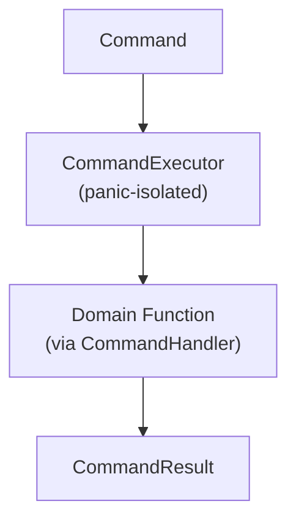
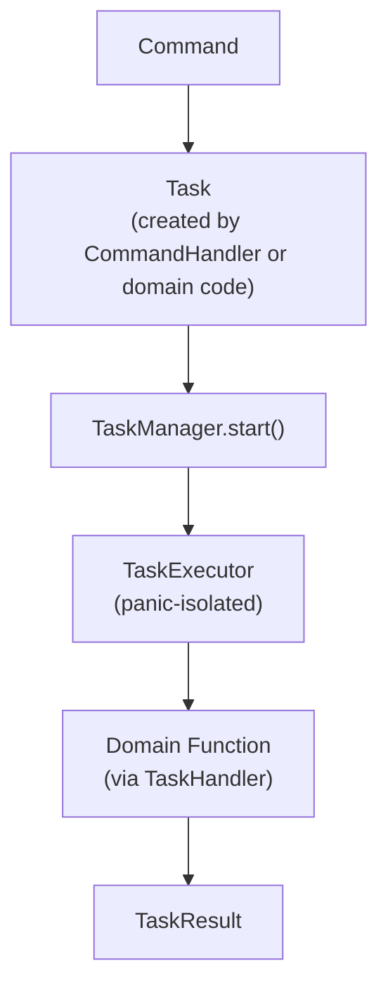
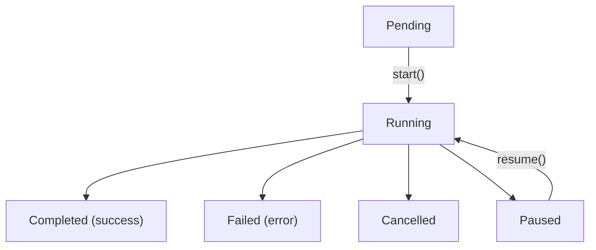
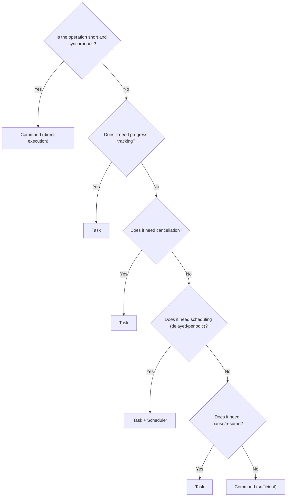

# Application Operations

## Overview

The App Engine provides two execution mechanisms:

```text
Command = an application intent — "do X"
Task    = a managed work instance — "X is being performed with lifecycle"
```

They are **not interchangeable**. Each serves a different purpose:

| | Command | Task |
|---|---|---|
| **Represents** | Intent / capability | Work instance |
| **Lifecycle** | Fire-and-forget | Pending → Running → Completed/Failed |
| **Has progress** | No | Yes (via `TaskOutputChannel`) |
| **Cancellable** | No (just don't execute) | Yes (`CancellationToken`) |
| **Pausable** | No | Yes (if supported) |
| **Scheduled** | No (directly) | Yes (via Scheduler) |
| **Panic-isolated** | Yes (`catch_unwind`) | Yes (`catch_unwind`) |
| **Good for** | Short, synchronous operations | Long, managed, observable operations |

---

## Two Execution Paths

### Simple Operation

For short, synchronous operations:



### Managed Operation

For work that needs lifecycle, progress, cancellation, or scheduling:



---

## Commands

### Defining a Command

A `Command` is an executable intent — it carries a definition ID, a context, and type-erased input:

```rust
use app_shell::app_engine::{
    Command, CommandContext, CommandInput, ExecutionId,
};

let exec_id = ExecutionId::new();
let context = CommandContext::new(exec_id)
    .with_application(app_id)
    .with_session(session_id);

let command = Command::new(
    "document.create",
    context,
    CommandInput::new("MyDocument".to_string()),
);
```

### Command Definition

Before a command can be executed, its definition must be registered. A `CommandDefinition` describes the command's metadata:

```rust
use app_shell::app_engine::CommandDefinition;

let definition = CommandDefinition::new(
    "document.create",           // id
    "Create Document",           // name
    "Creates a new document",    // description
)
.with_metadata("category", "file")
.with_version(Version::new(1, 0, 0))                          // Phase 20
.with_input_schema(PayloadSchema::of::<String>())             // Phase 20
.with_output_schema(PayloadSchema::of::<String>());           // Phase 20
```

### Registering a Command Handler

Commands are executed through `CommandHandler` implementations. Domain code provides the handler:

```rust
use app_shell::app_engine::{
    CommandHandler, CommandInput, CommandContext, CommandResult, CommandError,
    EngineRef,
};

struct CreateDocumentHandler;

impl CommandHandler for CreateDocumentHandler {
    fn execute(
        &self,
        input: &CommandInput,
        _context: &CommandContext,
        engine: &EngineRef,                        // Phase 13: handler capabilities
    ) -> Result<CommandResult, CommandError> {
        let name: &String = input.get::<String>()
            .ok_or_else(|| CommandError::InvalidArguments("expected document name".to_string()))?;

        // Call domain function
        let document_id = create_document_in_domain(name);

        // Optional: publish an event through EngineRef
        engine.event_bus.publish(
            &Event::new("document.created")
                .with_payload(document_id.clone())
                .with_source("CreateDocumentCommand")
        );

        Ok(CommandResult::success_with(document_id))
    }
}

// Register with the engine
engine.command_executor_mut().register(
    CommandDefinition::new("document.create", "Create Document", "Creates a new document"),
    Box::new(CreateDocumentHandler),
)?;
```

### Executing a Command

```rust
let command = Command::new(
    "document.create",
    CommandContext::new(ExecutionId::new()),
    CommandInput::new("MyDocument".to_string()),
);

let result = engine.execute_command(&command)?;

assert!(result.is_success());
assert_eq!(result.output::<String>(), Some(&"doc_42".to_string()));
```

### Command Result

```rust
// Success with output
let result = CommandResult::success_with("doc_42".to_string());

// Success without output
let result = CommandResult::success();

// Failure
let result = CommandResult::failure();

// Failure with details
let result = CommandResult::failure_with("insufficient permissions".to_string());

// With metadata
let result = CommandResult::success()
    .with_metadata("duration_ms", "42")
    .with_metadata("trace_id", "abc123");

// Inspect
result.is_success();        // true
result.is_failure();        // false
result.has_output();        // true
result.output::<String>();  // Some("doc_42")
result.error();             // None
```

### Command Errors

```rust
match engine.execute_command(&command) {
    Ok(result) => { /* handle result */ }
    Err(CommandError::UnknownCommand { id }) => {
        eprintln!("No command registered: {}", id);
    }
    Err(CommandError::InvalidArguments(msg)) => {
        eprintln!("Bad input: {}", msg);
    }
    Err(CommandError::ExecutionFailed(msg)) => {
        eprintln!("Handler failed: {}", msg);
    }
    Err(e) => eprintln!("Command error: {}", e),
}
```

### Panic Isolation (Phase 24)

If a command handler panics, the panic is caught and converted to an error:

```rust
struct PanickingHandler;
impl CommandHandler for PanickingHandler {
    fn execute(&self, _: &CommandInput, _: &CommandContext, _: &EngineRef) -> Result<CommandResult, CommandError> {
        panic!("handler crashed!");
    }
}

// Register and execute
engine.command_executor_mut().register(
    CommandDefinition::new("app.fail", "Fail", "Always fails"),
    Box::new(PanickingHandler),
)?;

let cmd = Command::with_empty_input("app.fail", CommandContext::new(ExecutionId::new()));
let result = engine.execute_command(&cmd);

assert!(result.is_err());
assert!(result.unwrap_err().to_string().contains("handler panicked: handler crashed!"));
// Engine continues running — no crash, no Mutex poisoning
```

### Type-Erased Input

`CommandInput` holds `Box<dyn Any + Send>`. The handler downcasts to its expected type:

```rust
// Pass a struct as input
#[derive(Debug)]
struct ExportInput {
    document_id: String,
    format: String,
    output_path: String,
}

let input = CommandInput::new(ExportInput {
    document_id: "doc_42".to_string(),
    format: "pdf".to_string(),
    output_path: "/tmp/export.pdf".to_string(),
});

// In the handler:
let export_input: &ExportInput = input.get::<ExportInput>()
    .ok_or_else(|| CommandError::InvalidArguments("expected ExportInput".to_string()))?;
```

The App Engine **never inspects** what's inside `CommandInput`. It just stores and forwards it.

### Serialized Input (Phase 22)

For IPC and persistence, `CommandInput` can carry serialized bytes:

```rust
// Create from serialized bytes (for IPC)
let input = CommandInput::from_bytes(
    "my_domain::ExportInput",
    serialized_bytes,
);

// Create with both typed and serialized forms
let input = CommandInput::with_serialized(
    ExportInput { document_id: "doc_42".to_string(), format: "pdf".to_string(), output_path: "/tmp/x.pdf".to_string() },
    serialized_bytes,
);

// Serialize using a registry
let registry = SerializationRegistry::new();
registry.register(Box::new(ExportInputSerializer));

let mut input = CommandInput::new(ExportInput { /* ... */ });
input.ensure_serialized(&registry)?;  // Serializes if not already
let bytes = input.serialized().unwrap();

// Deserialize from bytes
let mut received = CommandInput::from_bytes("my_domain::ExportInput", bytes);
received.ensure_deserialized(&registry)?;
let data: &ExportInput = received.get::<ExportInput>().unwrap();
```

---

## Tasks

### When to Use a Task Instead of a Command

| Situation | Use |
|---|---|
| Short, synchronous operation | Command |
| Needs progress tracking | Task |
| Needs cancellation | Task |
| Needs pause/resume | Task |
| Long-running (seconds+) | Task |
| Needs scheduling (delayed, periodic) | Task |
| Needs state (Pending, Running, Failed) | Task |
| Should appear in history as one operation | Task |

### Defining a Task Type

```rust
use app_shell::app_engine::TaskDefinition;

let definition = TaskDefinition::new(
    "project.export",                    // id
    "Export Project",                    // name
    "Exports the current project",       // description
)
.with_pause_support()                    // Can be paused/resumed
.with_cancel_support()                   // Can be cancelled
.with_version(Version::new(2, 0, 0))                           // Phase 20
.with_input_schema(PayloadSchema::of::<ExportProjectInput>())  // Phase 20
.with_output_schema(PayloadSchema::of::<ExportResult>());      // Phase 20
```

### Registering a Task Handler

```rust
use app_shell::app_engine::{
    TaskHandler, TaskInput, TaskContext, TaskResult, TaskError,
    EngineRef,
};

struct ExportProjectHandler;

impl TaskHandler for ExportProjectHandler {
    fn execute(
        &self,
        input: &TaskInput,
        context: &TaskContext,
        engine: &EngineRef,                        // Phase 13: handler capabilities
    ) -> Result<TaskResult, TaskError> {
        let input: &ExportProjectInput = input.get::<ExportProjectInput>()
            .ok_or_else(|| TaskError::ExecutionFailed {
                id: 0, reason: "expected ExportProjectInput".to_string()
            })?;

        // Phase 14: Check cancellation during long loops
        if context.is_cancelled() {
            return Ok(TaskResult::cancelled());
        }

        // Phase 14: Check deadline for timeout
        if context.is_expired() {
            return Err(TaskError::ExecutionFailed {
                id: 0, reason: "timeout".to_string()
            });
        }

        // Phase 14: Report progress (emits task.progress_changed signal)
        context.output().progress(0.5);

        // Phase 13: Publish completion event through EngineRef
        engine.event_bus.publish(
            &Event::new("project.exporting")
                .with_source("ExportProjectHandler")
        );

        // Call domain function
        let result = domain_engine.export_project(
            &input.project_id,
            &input.format,
            &input.output_path,
        )?;

        // Report completion progress
        context.output().progress(1.0);

        Ok(TaskResult::completed_with(result)
            .with_metadata("format", &input.format))
    }
}

// Register
engine.task_manager_mut().register(
    TaskDefinition::new("project.export", "Export Project", "Exports the project")
        .with_cancel_support(),
    Box::new(ExportProjectHandler),
)?;
```

### Creating a Task Instance

```rust
use app_shell::app_engine::{
    TaskContext, TaskInput, ExecutionId,
};

let exec_id = ExecutionId::new();
let task_context = TaskContext::new(exec_id)
    .with_application(app_id)
    .with_session(session_id)
    .with_deadline(Deadline::after(Duration::from_secs(30)));  // Phase 14

let task_id = engine.task_manager_mut().create(
    "project.export",
    task_context,
    TaskInput::new(ExportProjectInput {
        project_id: "proj_42".to_string(),
        format: "pdf".to_string(),
        output_path: "/tmp/export.pdf".to_string(),
    }),
)?;

// Task starts in Pending state
assert_eq!(engine.task_manager().get_state(task_id), Some(TaskState::Pending));
```

The `TaskManager` automatically:
- Assigns a unique `TaskId`
- Creates and injects a `CancellationToken` (Phase 14)
- Creates and injects a `TaskOutputChannel` (Phase 14)
- Sets the `task_id` on the context

### Starting a Task

```rust
// Synchronous execution
let result = engine.start_task(task_id)?;

assert!(result.is_completed());
assert_eq!(result.output::<ExportResult>().unwrap().output_path, "/tmp/export.pdf");
assert_eq!(engine.task_manager().get_state(task_id), Some(TaskState::Completed));
```

### Async Execution (Phase 21)

For I/O-heavy handlers, use `AsyncTaskHandler` with the `async-runtime` feature:

```rust
use app_shell::app_engine::{
    AsyncTaskHandler, AsyncTaskFuture, TaskInput, TaskContext,
    TaskResult, TaskError, EngineRef,
};
use std::pin::Pin;

struct AsyncExportHandler;

impl AsyncTaskHandler for AsyncExportHandler {
    fn execute(
        &self,
        input: &TaskInput,
        _context: &TaskContext,
        _engine: &EngineRef,
    ) -> AsyncTaskFuture {
        // Clone what you need before the async boundary
        // (the future must be 'static)
        let project_id = input.get::<String>().cloned().unwrap_or_default();

        Box::pin(async move {
            // Async I/O here
            tokio::time::sleep(std::time::Duration::from_millis(10)).await;
            Ok(TaskResult::completed_with(project_id))
        })
    }
}

// Register async handler
engine.register_async_task(
    TaskDefinition::new("async.export", "Async Export", "Export asynchronously"),
    Box::new(AsyncExportHandler),
)?;

// Execute asynchronously
let runtime = AsyncRuntime::new()?;
let result = engine.start_task_async(task_id, &runtime)?;
```

**Important:** The async handler's `execute()` is called synchronously to obtain the `Box<dyn Future>`. The future is then spawned on tokio. The handler must clone/own whatever it needs from `EngineRef` before returning the future (the future must be `'static`).

---

## Task Lifecycle States



```rust
use app_shell::app_engine::TaskState;

assert!(TaskState::Pending.can_start());
assert!(TaskState::Running.can_pause());
assert!(TaskState::Paused.can_resume());
assert!(TaskState::Running.can_cancel());
assert!(TaskState::Completed.is_terminal());
assert!(TaskState::Failed.is_terminal());
```

---

## Task Result

```rust
// Completed with output
let result = TaskResult::completed_with("/tmp/export.pdf".to_string());

// Completed without output
let result = TaskResult::completed();

// Cancelled
let result = TaskResult::cancelled();

// Failed with error message
let result = TaskResult::failed("disk full");

// Failed with partial output
let result = TaskResult::failed_with("timeout", partial_log_data);

// With metadata
let result = TaskResult::completed()
    .with_metadata("duration_ms", "4200")
    .with_metadata("file_size", "2.4MB");

// Inspect
result.is_completed();      // true
result.is_cancelled();      // false
result.is_failed();         // false
result.status();            // TaskResultStatus::Completed
result.output::<String>();  // Some("/tmp/export.pdf")
result.error();             // None
```

---

## Cancellation (Phase 14)

Tasks that support cancellation can be cancelled before or during execution:

### Cancel Before Start

```rust
let definition = TaskDefinition::new("export", "Export", "Export")
    .with_cancel_support(); // ← required

engine.task_manager_mut().register(definition, Box::new(ExportProjectHandler))?;

let task_id = engine.task_manager_mut().create(
    "export",
    TaskContext::new(ExecutionId::new()),
    TaskInput::new("data".to_string()),
)?;

// Cancel while still Pending
engine.task_manager_mut().cancel(task_id)?;
assert_eq!(
    engine.task_manager().get_state(task_id),
    Some(TaskState::Cancelled),
);
```

### Cancel During Execution (CancellationToken)

```rust
struct RenderHandler;
impl TaskHandler for RenderHandler {
    fn execute(&self, _: &TaskInput, ctx: &TaskContext, _: &EngineRef) -> Result<TaskResult, TaskError> {
        for i in 0..1000 {
            // Check cancellation — the token is shared with TaskManager::cancel()
            if ctx.is_cancelled() {
                return Ok(TaskResult::cancelled());
            }
            render_frame(i);
        }
        Ok(TaskResult::completed())
    }
}
```

When `cancel()` is called on a Running task:
1. The shared `CancellationToken` is set (atomic flag)
2. The handler checks `ctx.is_cancelled()` and returns `TaskResult::cancelled()`
3. The task state transitions to `Cancelled`

### Cancel Non-Cancellable Task

```rust
let definition = TaskDefinition::new("rigid", "Rigid", "Not cancellable");
// .with_cancel_support() NOT called

engine.task_manager_mut().register(definition, Box::new(SomeHandler))?;

let task_id = engine.task_manager_mut().create(
    "rigid",
    TaskContext::new(ExecutionId::new()),
    TaskInput::empty(),
)?;

let result = engine.task_manager_mut().cancel(task_id);
assert!(matches!(result, Err(TaskError::NotCancellable { .. })));
```

---

## Pause and Resume

Tasks that support pausing can be paused while running and resumed later:

```rust
let definition = TaskDefinition::new("render", "Render", "Render scene")
    .with_pause_support()
    .with_cancel_support();

engine.task_manager_mut().register(definition, Box::new(RenderHandler))?;

let task_id = engine.task_manager_mut().create(
    "render",
    TaskContext::new(ExecutionId::new()),
    TaskInput::new("scene_data".to_string()),
)?;

// Start the task
engine.start_task(task_id)?;
assert_eq!(engine.task_manager().get_state(task_id), Some(TaskState::Running));

// Pause (only in Running state)
engine.task_manager_mut().pause(task_id)?;
assert_eq!(engine.task_manager().get_state(task_id), Some(TaskState::Paused));

// Resume
engine.task_manager_mut().resume(task_id)?;
assert_eq!(engine.task_manager().get_state(task_id), Some(TaskState::Running));
```

---

## When a Command Should Create a Task

The most powerful pattern is a **command that creates a task** — combining intent with managed execution:

```rust
struct StartExportCommand;

impl CommandHandler for StartExportCommand {
    fn execute(&self, input: &CommandInput, _context: &CommandContext, engine: &EngineRef) -> Result<CommandResult, CommandError> {
        let export_input: &ExportProjectInput = input.get::<ExportProjectInput>()
            .ok_or_else(|| CommandError::InvalidArguments("expected ExportProjectInput".to_string()))?;

        // Instead of exporting directly, delegate to the task system
        // (In a real app, the engine would be passed differently)
        Ok(CommandResult::success()
            .with_metadata("task_definition", "project.export"))
    }
}
```

### Decision Flowchart



### Examples

| Operation | Mechanism | Why |
|---|---|---|
| Set zoom level | Command | Instant, no lifecycle needed |
| Change color | Command | Instant |
| Export project | Task | Long-running, cancellable, has progress |
| Render scene | Task | Long-running, pausable |
| Autosave | Task + Scheduler | Periodic, scheduled |
| Load font | Resource (via loader) | Not a command or task |
| Undo last operation | Command → History | Triggers history undo, then re-executes |

---

## Managing Multiple Tasks

```rust
// Create multiple tasks
let task_a = engine.task_manager_mut().create(
    "project.export",
    TaskContext::new(ExecutionId::new()),
    TaskInput::new(export_a),
)?;

let task_b = engine.task_manager_mut().create(
    "render.scene",
    TaskContext::new(ExecutionId::new()),
    TaskInput::new(render_data),
)?;

assert_eq!(engine.task_manager().count(), 2);

// Start them
engine.start_task(task_a)?;
engine.start_task(task_b)?;

// Verify states
assert_eq!(engine.task_manager().get_state(task_a), Some(TaskState::Completed));
assert_eq!(engine.task_manager().get_state(task_b), Some(TaskState::Completed));

// Remove completed tasks
engine.task_manager_mut().remove(task_a)?;
assert_eq!(engine.task_manager().count(), 1);
```

---

## Error Handling

### Command Errors

```rust
// Unknown command
let cmd = Command::with_empty_input("unknown.cmd", context);
match engine.execute_command(&cmd) {
    Err(CommandError::UnknownCommand { id }) => {
        eprintln!("No handler for: {}", id);
    }
    _ => {}
}

// Invalid input (handler rejects)
let cmd = Command::new("document.create", context, CommandInput::new(42_i64)); // wrong type
match engine.execute_command(&cmd) {
    Err(CommandError::InvalidArguments(msg)) => {
        eprintln!("Handler rejected input: {}", msg);
    }
    _ => {}
}
```

### Task Errors

```rust
// Task not found
match engine.task_manager_mut().start(TaskId::new()) { // bogus id
    Err(TaskError::NotFound { id }) => {
        eprintln!("Task {} not found", id);
    }
    _ => {}
}

// Invalid state transition
engine.start_task(task_id)?; // → Completed
match engine.task_manager_mut().start(task_id) { // can't start completed task
    Err(TaskError::InvalidState { current, requested, .. }) => {
        eprintln!("Can't start: {} → {}", current, requested);
    }
    _ => {}
}

// Handler failure
struct FailingHandler;
impl TaskHandler for FailingHandler {
    fn execute(&self, _: &TaskInput, _: &TaskContext, _: &EngineRef) -> Result<TaskResult, TaskError> {
        Err(TaskError::ExecutionFailed { id: 0, reason: "disk full".to_string() })
    }
}

// When start() fails, the task transitions to Failed
let result = engine.task_manager_mut().start(failing_task_id);
assert!(result.is_err());
assert_eq!(
    engine.task_manager().get_state(failing_task_id),
    Some(TaskState::Failed),
);
```

### Panic-Isolated Task Errors (Phase 24)

```rust
struct PanickingTaskHandler;
impl TaskHandler for PanickingTaskHandler {
    fn execute(&self, _: &TaskInput, _: &TaskContext, _: &EngineRef) -> Result<TaskResult, TaskError> {
        panic!("task handler crashed!");
    }
}

// Register and execute
engine.task_manager_mut().register(
    TaskDefinition::new("panic.task", "Panic", "Panics"),
    Box::new(PanickingTaskHandler),
)?;

let task_id = engine.task_manager_mut().create(
    "panic.task",
    TaskContext::new(ExecutionId::new()),
    TaskInput::empty(),
)?;

let result = engine.start_task(task_id);

assert!(result.is_err());
let err = result.unwrap_err();
assert!(err.to_string().contains("handler panicked: task handler crashed!"));

// Task is in Failed state
assert_eq!(engine.task_manager().get_state(task_id), Some(TaskState::Failed));

// TaskManager still usable (Mutex not poisoned)
assert_eq!(engine.task_manager().count(), 1);
```

---

## Complete Example: Command → Task → Result

```rust
use app_shell::app_engine::*;

// --- Domain data types ---

#[derive(Debug)]
struct ExportInput {
    project_path: String,
    format: String,
    output_path: String,
}

// --- Task handler (executes the actual work) ---

struct ExportProjectHandler;

impl TaskHandler for ExportProjectHandler {
    fn execute(
        &self,
        input: &TaskInput,
        ctx: &TaskContext,
        engine: &EngineRef,
    ) -> Result<TaskResult, TaskError> {
        let input: &ExportInput = input.get::<ExportInput>()
            .ok_or_else(|| TaskError::ExecutionFailed {
                id: 0, reason: "expected ExportInput".into()
            })?;

        // Check cancellation
        if ctx.is_cancelled() {
            return Ok(TaskResult::cancelled());
        }

        // Report progress
        ctx.output().progress(0.0);

        // Domain function call
        let result = domain_export_project(&input.project_path, &input.format, &input.output_path);

        ctx.output().progress(1.0);

        match result {
            Ok(path) => {
                // Publish completion event
                engine.event_bus.publish(
                    &Event::new("task.completed").with_source("ExportProjectHandler")
                );
                Ok(TaskResult::completed_with(path))
            }
            Err(e) => Err(TaskError::ExecutionFailed {
                id: 0, reason: e.to_string()
            }),
        }
    }
}

// --- Setup ---

fn setup_engine() -> AppEngine {
    let mut engine = Bootstrap::create().unwrap();
    engine.task_manager_mut().register(
        TaskDefinition::new("project.export", "Export Project", "Export the project")
            .with_cancel_support(),
        Box::new(ExportProjectHandler),
    ).unwrap();
    engine
}

// --- Usage ---

fn main() {
    let engine = setup_engine();
    engine.initialize().unwrap();
    engine.start().unwrap();

    // Create a task
    let task_id = engine.task_manager().create(
        "project.export",
        TaskContext::new(ExecutionId::new())
            .with_deadline(Deadline::after(std::time::Duration::from_secs(30))),
        TaskInput::new(ExportInput {
            project_path: "/projects/demo.proj".to_string(),
            format: "pdf".to_string(),
            output_path: "/tmp/demo.pdf".to_string(),
        }),
    ).unwrap();

    // Execute
    let result = engine.start_task(task_id).unwrap();

    assert!(result.is_completed());
    assert_eq!(result.output::<String>(), Some(&"/tmp/demo.pdf".to_string()));

    engine.stop().unwrap();
    engine.dispose().unwrap();
}
```

---

## Quick Reference

### Command API

```rust
// Register
engine.command_executor_mut().register(definition, handler)?;

// Execute (convenience method — constructs EngineRef internally)
let result: CommandResult = engine.execute_command(&cmd)?;

// Query
engine.command_executor().contains(&definition_id);   // bool
engine.command_executor().get(&definition_id);        // Option<&CommandDefinition>
engine.command_executor().list();                     // Vec<&CommandDefinition>
```

### Task API

```rust
// Register
engine.task_manager_mut().register(definition, handler)?;

// Create (returns TaskId)
let task_id = engine.task_manager_mut().create(definition_id, context, input)?;

// Lifecycle
engine.start_task(task_id)?;     // Pending → Running → Completed/Failed
engine.task_manager_mut().cancel(task_id)?;    // → Cancelled
engine.task_manager_mut().pause(task_id)?;     // Running → Paused
engine.task_manager_mut().resume(task_id)?;    // Paused → Running

// Query
engine.task_manager().get_state(task_id);       // Option<TaskState>
engine.task_manager().count();                  // usize

// Remove
engine.task_manager_mut().remove(task_id);    // Option<Task>
```

### Async API (with async-runtime feature)

```rust
// Register async handler
engine.register_async_task(definition, Box::new(AsyncHandler))?;

// Execute asynchronously
let runtime = AsyncRuntime::new()?;
let result = engine.start_task_async(task_id, &runtime)?;
```

---

## Next Steps

- [06-scheduling-and-communication.md](06-scheduling-and-communication.md) — Scheduling tasks and decoupled communication.
- [11-handler-capabilities.md](11-handler-capabilities.md) — What handlers can access via `EngineRef`.
- [12-execution-control.md](12-execution-control.md) — Cancellation, deadlines, and progress streaming.
- [07-history-and-resources.md](07-history-and-resources.md) — Undo/redo and resource management.
- [09-domain-engine-integration.md](09-domain-engine-integration.md) — How domain functions become commands and tasks.