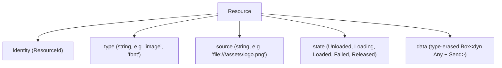
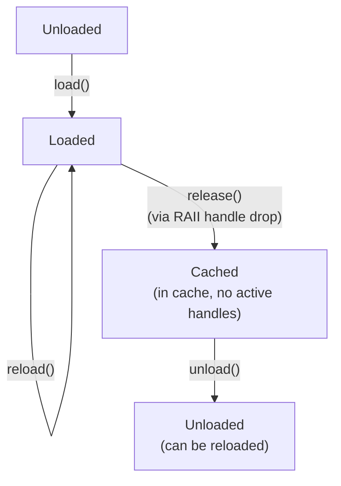
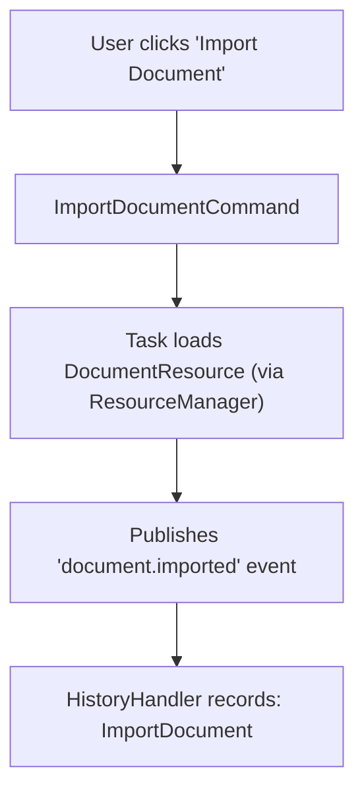

# History & Resources

## Overview

Two systems provide application continuity:

```text
History   = "What happened?"   (record of meaningful operations)
Resource  = "What's available?" (managed data/content lifecycle)
```

They are deliberately separate:

```text
HistoryStore records operations    StateStore records conditions
ResourceCache stores loaded data  HistoryStore stores actions
```

History is about **the path** — how the application got to where it is. Resources are about **the content** — what data is available to use.

---

## Part 1: History

### What History Records

History records **meaningful application operations**, not every internal function call:

```text
✓ CreateDocument
✓ MoveObject
✓ ChangeProperty
✓ DeleteObject
✓ ExportProject

✗ update_position()
✗ invalidate_layout()
✗ sort_array()
✗ allocate_buffer()
```

If `MoveObjectCommand` internally calls `update_position()`, `update_bounds()`, and `invalidate_layout()`, history should contain **one entry**: `MoveObject`.

### History Entry

```rust
use app_shell::app_engine::{HistoryEntry, HistoryEntryId, TransactionId};
use std::time::Instant;

// Create a history entry with operation data and inverse data
let entry = HistoryEntry::new("object.move")
    .undoable()
    .with_data(MoveData {
        object: "rect_1".to_string(),
        from: (100.0, 200.0),
        to: (50.0, 50.0),
    })
    .with_inverse(MoveData {
        object: "rect_1".to_string(),
        from: (50.0, 50.0),
        to: (100.0, 200.0),
    })
    .with_source("MoveObjectCommand")
    .with_command_id("object.move_command");

assert!(entry.is_undoable());
assert_eq!(entry.operation(), "object.move");
assert_eq!(entry.source(), Some("MoveObjectCommand"));
assert!(entry.has_data());
assert!(entry.has_inverse_data());
```

### Undoable vs Non-Undoable

Not every operation can be reversed:

```rust
// Undoable: position change (has inverse)
let undoable = HistoryEntry::new("object.move")
    .undoable()
    .with_data(new_position)
    .with_inverse(old_position);

// Non-undoable: file export (no meaningful undo)
let non_undoable = HistoryEntry::new("file.export")
    .non_undoable()
    .with_data(output_path);

assert!(undoable.is_undoable());
assert!(!non_undoable.is_undoable());
```

### Storing History

```rust
// Append entries to the store
let id1 = engine.history_store().append(
    HistoryEntry::new("object.create").undoable().with_data("rect_1".to_string()),
);
let id2 = engine.history_store().append(
    HistoryEntry::new("object.move").undoable()
        .with_data(move_forward)
        .with_inverse(move_backward),
);
let id3 = engine.history_store().append(
    HistoryEntry::new("object.resize").undoable(),
);

assert_eq!(engine.history_store().active_count(), 3);
assert_eq!(engine.history_store().position(), 3);
```

### Accessing Entries (Phase 22+23)

`HistoryStore` uses `Mutex` internally (thread-safe). Entries can't be returned by reference through a lock — use the tuple/closure patterns:

```rust
// Tuple-based access (Copy data only)
let current = engine.history_store().current();
// Returns: Option<(HistoryEntryId, String, bool)>  — (id, operation, undoable)
assert_eq!(current.unwrap().1, "object.resize");  // .1 = operation string
assert!(current.unwrap().2);  // .2 = undoable

// Closure-based access (full entry data)
let entry_data = engine.history_store().with_current(|e| {
    e.data::<MoveData>().map(|d| d.clone())
}).flatten();
assert_eq!(entry_data.unwrap().to, (100.0, 200.0));

// Access by ID
let entry = engine.history_store().with_entry(id2, |e| {
    (e.operation().to_string(), e.is_undoable())
}).unwrap();
assert_eq!(entry.0, "object.move");
assert!(entry.1);
```

### Undo

```rust
use app_shell::app_engine::UndoResult;

let result: UndoResult = engine.history_store_mut().undo();

assert_eq!(result.count(), 1);
assert!(!result.is_empty());

// Position moved back
assert_eq!(engine.history_store().position(), 2);
assert_eq!(
    engine.history_store().current().unwrap().1,
    "object.move",
);

// Look up the undone entry to get inverse data
let undone_id = result.undone_entry_ids()[0];
let inverse = engine.history_store().with_entry(undone_id, |e| {
    e.inverse_data::<MoveData>().map(|d| d.clone())
}).flatten();
// Use inverse to create an undo command
```

### Redo

```rust
use app_shell::app_engine::RedoResult;

let result: RedoResult = engine.history_store_mut().redo();

assert_eq!(result.count(), 1);
assert_eq!(engine.history_store().position(), 3);
```

### Redo Branch Invalidation

If you undo and then perform a **new** operation, the redo branch is discarded:

```rust
// State: [A, B, C] position=3
engine.history_store().undo();  // position=2, [A, B, C] — C is redoable
engine.history_store().undo();  // position=1, [A, B, C] — B, C are redoable

// New operation — invalidates redo branch
engine.history_store().append(HistoryEntry::new("object.rotate").undoable());

// Now: [A, D] position=2 — B and C are gone
assert_eq!(engine.history_store().entry_count(), 2);
assert!(!engine.history_store().can_redo());
```

### Transactions

Group multiple operations into one undo/redo unit:

```rust
use app_shell::app_engine::TransactionManager;

// Begin a transaction
let tx = engine.transaction_manager_mut().begin();

// Append multiple entries under the same transaction
engine.history_store().append(
    HistoryEntry::new("object.move").with_transaction(tx),
);
engine.history_store().append(
    HistoryEntry::new("object.resize").with_transaction(tx),
);
engine.history_store().append(
    HistoryEntry::new("object.rotate").with_transaction(tx),
);

// Commit (entries stay in history)
engine.transaction_manager_mut().commit();

assert_eq!(engine.history_store().active_count(), 3);

// Undo the entire transaction at once
let result = engine.history_store().undo();
assert_eq!(result.count(), 3);  // all three undone
assert!(result.transaction_undone());
assert_eq!(engine.history_store().active_count(), 0);
```

### Transaction Rollback

```rust
let tx = engine.transaction_manager_mut().begin();

engine.history_store().append(
    HistoryEntry::new("step.a").with_transaction(tx),
);
engine.history_store().append(
    HistoryEntry::new("step.b").with_transaction(tx),
);

// Something went wrong — rollback
engine.transaction_manager_mut().rollback();
engine.history_store().remove_transaction(tx);  // remove entries

assert_eq!(engine.history_store().entry_count(), 0);
```

### Replay

Replay re-executes recorded operations in sequence:

```rust
// Record operations
engine.history_store().append(
    HistoryEntry::new("object.create").with_data("rect_1".to_string()),
);
engine.history_store().append(
    HistoryEntry::new("object.move").with_data("rect_1_moved".to_string()),
);
engine.history_store().append(
    HistoryEntry::new("object.resize").with_data("rect_1_resized".to_string()),
);

// Replay: iterate over active entries
let replayed: Vec<String> = engine.history_store().replay()
    .map(|(_, op, _)| op)
    .collect();

assert_eq!(replayed, vec![
    "object.create".to_string(),
    "object.move".to_string(),
    "object.resize".to_string(),
]);
```

Replay **reuses existing execution mechanisms** — the caller creates commands from history entries and executes them via `CommandExecutor`. The history system is **not** a second execution engine.

### Replay Excludes Undone Entries

```rust
engine.history_store().undo();  // "object.resize" undone

let replayed: Vec<String> = engine.history_store().replay()
    .map(|(_, op, _)| op)
    .collect();

// Only active entries are replayed
assert_eq!(replayed, vec!["object.create".to_string(), "object.move".to_string()]);
```

### Persistence (Phase 22)

HistoryStore can optionally persist via `StorageBackend`:

```rust
use app_shell::app_engine::{HistoryStore, MemoryStorageBackend};

// Create with a persistence backend
let backend = Box::new(MemoryStorageBackend::new());
let store = HistoryStore::with_backend(backend);
assert!(store.has_backend());

// Append (entry metadata is persisted)
let id = store.append(
    HistoryEntry::new("test.operation").undoable(),
);
assert_eq!(store.entry_count(), 1);
```

### Command → History Integration

The cleanest pattern: commands produce events, and a history handler subscribes:


```rust
// History handler subscribes to "meaningful" events
engine.event_bus_mut().subscribe(
    "document.created",
    event_handler(|event: &Event| {
        // Record in history for undo/redo
        // engine.history_store().append(
        //     HistoryEntry::new("document.create")
        //         .undoable()
        //         .with_data(event.payload::<String>().unwrap().clone())
        //         .with_source(event.source().unwrap_or("unknown")),
        // );
    }),
);

// When a command executes and publishes an event, history records it
engine.event_bus().publish(
    &Event::new("document.created")
        .with_payload("doc_42".to_string())
        .with_source("CreateDocumentCommand"),
);

assert_eq!(engine.history_store().entry_count(), 1);
```

### What NOT to Record in History

```text
✗ MouseMoved, FrameRendered, ProgressChanged → signals, not history
✗ ResourceLoaded, ResourceReleased → runtime infrastructure
✗ JobCreated, JobQueued, JobDispatched → scheduling internals
✗ TaskStarted → record TaskCompleted instead (one meaningful entry per operation)
```

History is for **user-visible, undoable application operations**.

---

## Part 2: Resources

### What Is a Resource?

A resource is a managed piece of data whose **lifetime matters** to the application:

```text
files, images, fonts, audio, documents, database connections, GPU assets...
```

The App Engine doesn't know what any of these mean. It only knows:



### Resource Lifecycle



### Defining a Resource

```rust
use app_shell::app_engine::{Resource, ResourceId, ResourceState, ResourceKey};

let resource = Resource::new("image", "file:///assets/logo.png")
    .with_data("pixel_data_here".to_string());

assert_eq!(resource.resource_type(), "image");
assert_eq!(resource.source(), "file:///assets/logo.png");
assert_eq!(resource.state(), ResourceState::Loaded);
assert!(resource.has_data());
assert_eq!(resource.data::<String>(), Some(&"pixel_data_here".to_string()));
```

### Resource States

```rust
assert!(ResourceState::Loaded.is_loaded());
assert!(!ResourceState::Unloaded.is_loaded());
assert!(ResourceState::Loading.is_active());
assert!(ResourceState::Unloaded.is_terminal());
```

### RAII Resource Handles (Phase 25)

`ResourceHandle` is a RAII reference to a managed resource. When dropped, it automatically decrements the reference count:

```rust
{
    let handle = engine.resource_manager().load("image", "file:///logo.png")?;
    let id = handle.resource_id();
    assert_eq!(engine.resource_manager().active_count(id), 1);
    // ... use resource ...
}  // ← handle dropped, ref count decremented automatically

// After scope exit, ref count is 0
assert_eq!(engine.resource_manager().active_count(id), 0);
// Resource stays in cache (not unloaded)
assert!(engine.resource_manager().exists(id));
```

**How RAII works (Phase 25):**

The `ResourceManager` is stored behind `Arc` in `AppRuntime`. When `load()` creates a handle, it captures a `Weak<ResourceManager>` callback:

```rust
fn create_raii_handle(&self, id: ResourceId) -> ResourceHandle {
    let weak = self.self_ref.lock().unwrap().clone();
    ResourceHandle::with_release_callback(id, move |resource_id| {
        if let Some(ref weak) = weak {
            if let Some(mgr) = weak.upgrade() {
                let _ = mgr.release_by_id(resource_id);
            }
        }
    })
}
```

When the handle drops:
1. The `Drop` impl fires
2. The callback upgrades the `Weak<ResourceManager>` to `Arc`
3. Calls `release_by_id()` — decrements ref count

If the `ResourceManager` has already been dropped, `Weak::upgrade()` returns `None` — no crash.

### Multiple Handles

```rust
let handle = engine.resource_manager().load("image", "file:///logo.png")?;
let id = handle.resource_id();
assert_eq!(engine.resource_manager().active_count(id), 1);

// Acquire a second handle
engine.resource_manager().acquire(&handle)?;
assert_eq!(engine.resource_manager().active_count(id), 2);

// Drop first handle
drop(handle);
assert_eq!(engine.resource_manager().active_count(id), 1);

// Manually release the second ref
engine.resource_manager().release_by_id(id)?;
assert_eq!(engine.resource_manager().active_count(id), 0);
```

### Manual Release (still possible)

```rust
let handle = engine.resource_manager().load("text", "file:///test.txt")?;
let id = handle.resource_id();

// Manual release — uses std::mem::forget to prevent double-release from Drop
engine.resource_manager().release(handle)?;
assert_eq!(engine.resource_manager().active_count(id), 0);
```

### Cache Reuse

Loading the same source twice returns the **same** resource:

```rust
let h1 = engine.resource_manager().load("image", "file:///logo.png")?;
let h2 = engine.resource_manager().load("image", "file:///logo.png")?;

// Same resource — deduplicated by (type, source)
assert_eq!(h1.resource_id(), h2.resource_id());
assert_eq!(engine.resource_manager().resource_count(), 1);
assert_eq!(engine.resource_manager().active_count(h1.resource_id()), 2);
```

### Unload

```rust
let id;
{
    let handle = engine.resource_manager().load("image", "file:///logo.png")?;
    id = handle.resource_id();
    // handle drops here → ref count = 0
}

// Now we can unload
engine.resource_manager().unload(id)?;
assert!(!engine.resource_manager().exists(id));
```

Can't unload while in use:

```rust
let handle = engine.resource_manager().load("image", "file:///logo.png")?;
let id = handle.resource_id();

// Still in use (handle alive)
let result = engine.resource_manager().unload(id);
assert!(matches!(result, Err(ResourceError::InUse { .. })));

// Drop handle, then unload works
drop(handle);
engine.resource_manager().unload(id)?;
```

### Reload

Replace a resource's data without changing its identity:

```rust
let handle = engine.resource_manager().load("image", "file:///logo.png")?;
let id = handle.resource_id();

// ... file changes on disk ...

// Reload from source
engine.resource_manager().reload(id)?;

// Same ResourceId, new data
let has_data = engine.resource_manager().with_resource(id, |r| r.has_data()).unwrap();
assert!(has_data);
```

### Accessing Resource Data (Phase 23)

`ResourceManager` uses `Mutex` internally. Can't return `&Resource` through a lock — use the closure pattern:

```rust
// Access resource data within the lock
let data = engine.resource_manager().with_resource(handle.resource_id(), |r| {
    r.data::<String>().map(|s| s.clone())
}).flatten();
assert_eq!(data, Some("pixels:file:///logo.png".to_string()));

// Access multiple fields
let (rtype, has_data, state) = engine.resource_manager().with_resource(id, |r| {
    (r.resource_type().to_string(), r.has_data(), r.state())
}).unwrap();
assert_eq!(rtype, "image");
assert!(has_data);
assert_eq!(state, ResourceState::Loaded);
```

### ResourceLoader

Domain code provides loaders that know how to obtain specific resource types:

```rust
use app_shell::app_engine::{ResourceLoader, ResourceError};
use std::any::Any;

struct ImageLoader;

impl ResourceLoader for ImageLoader {
    fn resource_type(&self) -> &str {
        "image"
    }

    fn load(&self, source: &str) -> Result<Box<dyn Any + Send>, ResourceError> {
        // Domain-specific loading logic
        if source.contains("missing") {
            return Err(ResourceError::LoadFailed {
                source: source.to_string(),
                reason: "file not found".to_string(),
            });
        }
        Ok(Box::new(format!("pixels:{}", source)))
    }
}

// Register the loader
engine.resource_manager().register_loader(Box::new(ImageLoader));
```

### Loading Failure

```rust
let result = engine.resource_manager().load("image", "file:///missing.png");
assert!(matches!(result, Err(ResourceError::LoadFailed { .. })));

// Manager state is clean — no partial resource
assert_eq!(engine.resource_manager().resource_count(), 0);
```

### Resource Dependencies (Phase 16)

Resources can declare dependencies — loading a resource automatically loads its dependencies first:

```rust
// Register that "font:arial" depends on "file:///fonts/arial.ttf"
engine.resource_manager().register_dependency(
    "font:arial",
    "text:file:///fonts/arial.ttf",  // must be loaded first
);

// Load the font — the dependency is auto-loaded
let handle = engine.resource_manager().load("font", "arial")?;

// Both resources are in the cache
assert_eq!(engine.resource_manager().resource_count(), 2);
```

Dependency chains work recursively:

```rust
// Image depends on font, font depends on base file
engine.resource_manager().register_dependency(
    "image:file:///logo.png",
    "text:file:///font.txt",
);
engine.resource_manager().register_dependency(
    "text:file:///font.txt",
    "text:file:///base.txt",
);

// Load the image — cascade-loads font and base
let handle = engine.resource_manager().load("image", "file:///logo.png")?;
assert_eq!(engine.resource_manager().resource_count(), 3);
```

Unload protection — can't unload a resource that has dependents:

```rust
// The base file has a dependent (font)
assert!(engine.resource_manager().has_dependents("text:file:///base.txt"));

// Can't unload base while font exists
let base_id = /* get base resource ID */;
let result = engine.resource_manager().unload(base_id);
assert!(matches!(result, Err(ResourceError::InUse { .. })));
```

### Unload All on Dispose (Phase 26)

When `engine.dispose()` is called, all non-in-use resources are unloaded:

```rust
// Load resources (handles auto-release on drop)
{
    let _h1 = engine.resource_manager().load("text", "file:///a.txt")?;
    let _h2 = engine.resource_manager().load("text", "file:///b.txt")?;
}  // handles drop → ref counts = 0

assert_eq!(engine.resource_manager().resource_count(), 2);

engine.dispose()?;

// After dispose, non-in-use resources are unloaded
assert_eq!(engine.resource_manager().resource_count(), 0);
```

Resources with active handles are NOT unloaded — the RAII callback handles their release.

### Serialized Resource Data (Phase 22)

Resource data can carry optional serialized bytes for persistence and IPC:

```rust
// Create resource with both typed and serialized data
let resource = Resource::new("image", "file:///logo.png")
    .with_data_and_serialized(
        "pixel_data".to_string(),
        serialized_bytes,
    );

assert!(resource.has_data());
// Access serialized bytes (for IPC/persistence)
// resource.serialized() — available on the container types
```

---

## Practical Example: DocumentResource

A complete example showing how a Domain Engine provides a document resource:

```rust
use app_shell::app_engine::*;
use std::any::Any;

// --- Domain data type ---

#[derive(Debug, Clone)]
struct DocumentData {
    title: String,
    content: String,
    word_count: usize,
}

// --- Domain loader ---

struct DocumentLoader;

impl ResourceLoader for DocumentLoader {
    fn resource_type(&self) -> &str {
        "document"
    }

    fn load(&self, source: &str) -> Result<Box<dyn Any + Send>, ResourceError> {
        // In a real app, this would read from a file
        let doc = DocumentData {
            title: source.to_string(),
            content: "Lorem ipsum dolor sit amet.".to_string(),
            word_count: 5,
        };
        Ok(Box::new(doc))
    }
}

// --- Setup ---

fn main() {
    let mut engine = Bootstrap::create().unwrap();
    engine.resource_manager().register_loader(Box::new(DocumentLoader));

    // Load a document resource (RAII handle auto-releases on drop)
    let handle = engine.resource_manager()
        .load("document", "file:///docs/intro.dp")
        .unwrap();

    // Access the document data through the closure pattern
    let doc_data = engine.resource_manager()
        .with_resource(handle.resource_id(), |r| {
            r.data::<DocumentData>().map(|d| d.clone())
        })
        .flatten()
        .unwrap();

    println!("Title: {}", doc_data.title);
    println!("Words: {}", doc_data.word_count);

    // A task can acquire the resource handle
    engine.resource_manager().acquire(&handle).unwrap();

    // ... task uses the document ...

    // Release when done
    engine.resource_manager().release_by_id(handle.resource_id()).unwrap();

    // Handle drops here → ref count = 0
    // Resource stays in cache for potential reuse

    engine.stop().unwrap();
    engine.dispose().unwrap();
}
```

The App Engine managed the resource lifecycle (load, cache, reference count, RAII release, unload on dispose). The Domain Engine provided the `DocumentData` type and `DocumentLoader` implementation. Neither knew about the other's internals.

---

## History + Resources Integration

Don't record resource lifecycle operations in history:

```text
✓ History: ImportDocument (meaningful user operation)
✗ History: LoadResource (runtime infrastructure)
✗ History: CacheHit (performance detail)
✗ History: UnloadResource (cleanup)
```

But a resource operation can **trigger** a history entry through events:



The resource system and history system don't know about each other — they're connected through the event bus.

---

## Quick Reference

### History API

```rust
// Store
let id = engine.history_store().append(entry);
engine.history_store().with_entry(id, |e| ...);   // closure access
engine.history_store().with_current(|e| ...);     // closure access
engine.history_store().current();                 // → Option<(id, op, undoable)>
engine.history_store().position();                // → usize
engine.history_store().can_undo();                // → bool
engine.history_store().can_redo();                // → bool

// Undo / Redo
let result = engine.history_store().undo();  // UndoResult
let result = engine.history_store().redo();  // RedoResult

// Transactions
let tx = engine.transaction_manager_mut().begin();
engine.transaction_manager_mut().commit();
engine.transaction_manager_mut().rollback();
engine.history_store().remove_transaction(tx);

// Replay
for (id, op, undoable) in engine.history_store().replay() {
    // Create command from entry data and execute
}
```

### Resource API

```rust
// Register loader
engine.resource_manager().register_loader(loader);

// Load (returns RAII handle)
let handle = engine.resource_manager().load("type", "source")?;

// Access data (closure pattern)
let data = engine.resource_manager().with_resource(handle.resource_id(), |r| {
    r.data::<String>().map(|s| s.clone())
}).flatten();

// Ref counting
engine.resource_manager().acquire(&handle)?;
engine.resource_manager().release_by_id(id)?;
engine.resource_manager().active_count(id);   // → usize

// Unload / Reload
engine.resource_manager().unload(id)?;
engine.resource_manager().reload(id)?;

// Dependencies
engine.resource_manager().register_dependency("dep_key", "dependency_key");
engine.resource_manager().has_dependents("key");  // → bool

// Query
engine.resource_manager().resource_count();   // → usize
engine.resource_manager().exists(id);         // → bool
engine.resource_manager().is_in_use(id);      // → bool
```

---

## Next Steps

- [08-services-and-plugins.md](08-services-and-plugins.md) — Long-lived services and plugin extensions.
- [11-handler-capabilities.md](11-handler-capabilities.md) — What handlers can access via `EngineRef`.
- [13-persistence-and-serialization.md](13-persistence-and-serialization.md) — Storage backends and serialization.
- [09-domain-engine-integration.md](09-domain-engine-integration.md) — How domain code provides resources, commands, and tasks.