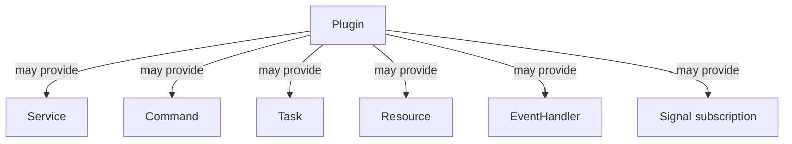
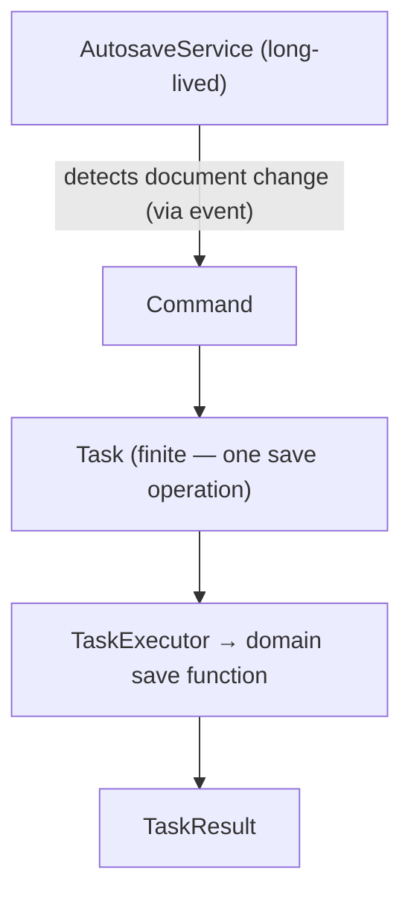
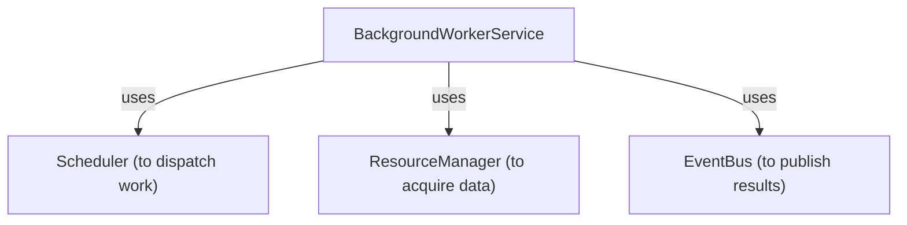
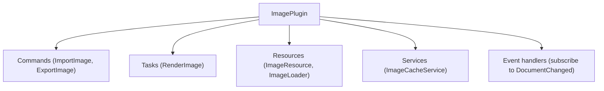
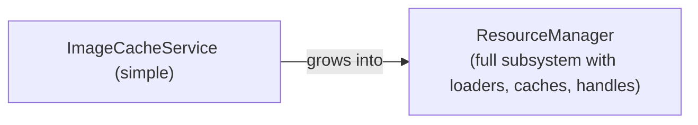
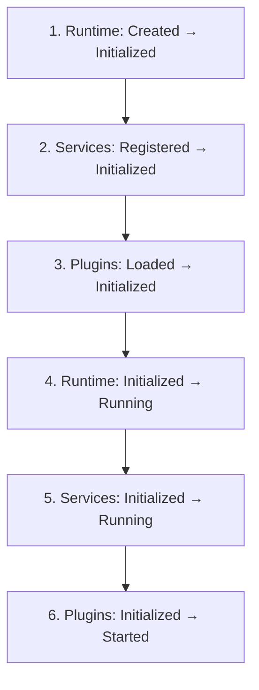
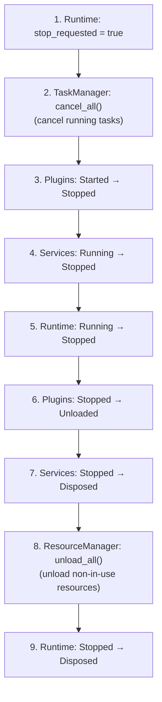

# Services & Plugins

## Overview

Two systems provide extensibility at different levels:

```text
Service = long-lived runtime capability (starts with app, stays running)
Plugin  = extension package (contributes commands, tasks, resources, services, handlers)
```

They are complementary:



A plugin is the **package**. A service is one **capability** inside it.

---

## Part 1: Services

### What Is a Service?

```text
Task    = finite work instance (has a start and end)
Service = long-lived capability (starts with app, stays alive, stops with app)
```

| | Task | Service |
|---|---|---|
| **Lifetime** | Finite — Pending → Completed | Long — starts with app, stays running |
| **Created by** | Command or direct call | Registration before `engine.start()` |
| **Lifecycle** | Task lifecycle (6 states) | Service lifecycle (5 states) |
| **Example** | Export project | Autosave service |

### The Service Trait

```rust
use app_shell::app_engine::{Service, ServiceError, EngineRef};

struct AutosaveService {
    active: bool,
}

impl Service for AutosaveService {
    fn service_type(&self) -> &str { "autosave" }

    fn initialize(&mut self, _engine: &EngineRef) -> Result<(), ServiceError> {
        println!("[Autosave] Initializing");
        Ok(())
    }

    fn start(&mut self, _engine: &EngineRef) -> Result<(), ServiceError> {
        self.active = true;
        println!("[Autosave] Started — monitoring for changes");
        Ok(())
    }

    fn stop(&mut self) -> Result<(), ServiceError> {
        self.active = false;
        println!("[Autosave] Stopped");
        Ok(())
    }

    fn dispose(&mut self) -> Result<(), ServiceError> {
        println!("[Autosave] Disposed");
        Ok(())
    }
}
```

### Service Registration

```rust
use app_shell::app_engine::ServiceDefinition;

let service_id = engine.service_manager_mut().register(
    ServiceDefinition::new("autosave", "Autosave", "Automatic document saving")
        .with_metadata("interval", "300"),
    Box::new(AutosaveService { active: false }),
)?;

assert_eq!(engine.service_manager().count(), 1);
assert!(engine.service_manager().contains_type("autosave"));
assert_eq!(
    engine.service_manager().state(service_id),
    Some(ServiceState::Registered),
);
```

### Service Lifecycle

```text
Registered → Initialized → Running → Stopped → Disposed
```

```rust
// Individual lifecycle (panic-isolated — Phase 24)
engine.service_manager_mut().initialize(service_id, &engine_ref)?;
assert_eq!(engine.service_manager().state(service_id), Some(ServiceState::Initialized));

engine.service_manager_mut().start(service_id, &engine_ref)?;
assert_eq!(engine.service_manager().state(service_id), Some(ServiceState::Running));

engine.service_manager_mut().stop(service_id)?;
assert_eq!(engine.service_manager().state(service_id), Some(ServiceState::Stopped));

engine.service_manager_mut().dispose(service_id)?;
assert_eq!(engine.service_manager().state(service_id), Some(ServiceState::Disposed));
```

### Automatic Lifecycle (Via Engine)

Services participate automatically in the engine's lifecycle:

```rust
// Register services BEFORE engine.initialize()
engine.service_manager_mut().register(
    ServiceDefinition::new("autosave", "Autosave", "Autosave"),
    Box::new(AutosaveService { active: false }),
)?;
engine.service_manager_mut().register(
    ServiceDefinition::new("worker", "Background Worker", "Background processing"),
    Box::new(BackgroundWorkerService { active: false }),
)?;

// Engine lifecycle manages services automatically
engine.initialize()?;  // → initialize_all() (services → Initialized)
engine.start()?;       // → start_all() (services → Running)

// ... application runs — services are active ...

engine.stop()?;        // → stop_all() (services → Stopped, reverse order)
engine.dispose()?;     // → dispose_all() (services → Disposed, reverse order)
```

### Panic Isolation (Phase 24)

If a service panics during lifecycle, it doesn't crash the engine:

```rust
struct PanickingService;
impl Service for PanickingService {
    fn service_type(&self) -> &str { "panic_svc" }
    fn initialize(&mut self, _engine: &EngineRef) -> Result<(), ServiceError> {
        panic!("service init crashed!");
    }
    fn start(&mut self, _engine: &EngineRef) -> Result<(), ServiceError> { Ok(()) }
    fn stop(&mut self) -> Result<(), ServiceError> { Ok(()) }
    fn dispose(&mut self) -> Result<(), ServiceError> { Ok(()) }
}

let id = engine.service_manager_mut().register(
    ServiceDefinition::new("panic_svc", "Panic", "Panics"),
    Box::new(PanickingService),
)?;

let result = engine.service_manager_mut().initialize(id, &engine_ref);
assert!(result.is_err());
assert!(result.unwrap_err().to_string().contains("service panicked"));
// Engine continues running — no crash
```

### Service State Validation

```rust
// Can't start before initialize
let result = engine.service_manager_mut().start(id, &engine_ref);
assert!(matches!(result, Err(ServiceError::InvalidState { .. })));

engine.service_manager_mut().initialize(id, &engine_ref)?;

// Can't initialize twice
let result = engine.service_manager_mut().initialize(id, &engine_ref);
assert!(matches!(result, Err(ServiceError::InvalidState { .. })));

engine.service_manager_mut().start(id, &engine_ref)?;

// Can't dispose while running (must stop first)
let result = engine.service_manager_mut().dispose(id);
assert!(matches!(result, Err(ServiceError::InvalidState { .. })));
```

### Service: Autosave Example

A real autosave service that reacts to events and schedules tasks:

```rust
struct AutosaveService {
    save_count: usize,
}

impl Autoservice {
    fn new() -> Self {
        Self { save_count: 0 }
    }
}

impl Service for AutosaveService {
    fn service_type(&self) -> &str { "autosave" }

    fn initialize(&mut self, engine: &EngineRef) -> Result<(), ServiceError> {
        // Subscribe to document change events
        // (Note: subscribe requires &mut EventBus — must be done
        //  before the engine starts, not during initialize())
        Ok(())
    }

    fn start(&mut self, engine: &EngineRef) -> Result<(), ServiceError> {
        // In a real service, this would start a periodic check
        // The service could use the scheduler to submit backup tasks
        // engine.scheduler().submit(backup_task_id, Schedule::Interval(Duration::from_secs(300)), 3);
        self.save_count = 0;
        Ok(())
    }

    fn stop(&mut self) -> Result<(), ServiceError> {
        // Perform a final save
        Ok(())
    }

    fn dispose(&mut self) -> Result<(), ServiceError> {
        Ok(())
    }
}
```

The service doesn't perform the save itself. It **coordinates**: detects when a save should happen and creates/schedules a task to do it.

### Service vs Task



The service doesn't implement saving. It **coordinates**: detects when a save should happen and creates/schedules a task.

### Service Dependencies

Services can depend on other App Engine systems:



Prefer services that depend on App Engine capabilities rather than services depending on other services:

```text
✓ Service → Scheduler / EventBus / ResourceManager
✗ Service A → Service B → Service C → Service D  (chain)
```

If shared behavior is needed, it should live in an **App Engine subsystem**, not be chained through services.

---

## Part 2: Plugins

### What Is a Plugin?

```text
Service = one long-lived capability
Plugin  = an extension package that may provide multiple capabilities
```

A plugin can contribute:



### The Plugin Trait

```rust
use app_shell::app_engine::{
    Plugin, PluginContext, PluginError, EngineRef,
};

struct ImagePlugin {
    initialized: bool,
}

impl Plugin for ImagePlugin {
    fn id(&self) -> &str { "image-plugin" }

    fn initialize(&mut self, ctx: &PluginContext, _engine: &EngineRef) -> Result<(), PluginError> {
        println!("[ImagePlugin] Initializing (context: {})", ctx.plugin_id());
        self.initialized = true;
        Ok(())
    }

    fn start(&mut self, _engine: &EngineRef) -> Result<(), PluginError> {
        println!("[ImagePlugin] Started");
        Ok(())
    }

    fn stop(&mut self) -> Result<(), PluginError> {
        println!("[ImagePlugin] Stopped");
        Ok(())
    }

    fn dispose(&mut self) -> Result<(), PluginError> {
        println!("[ImagePlugin] Disposed");
        Ok(())
    }
}
```

### Plugin Manifest

A manifest describes a plugin without loading its implementation:

```rust
use app_shell::app_engine::PluginManifest;

let manifest = PluginManifest::new("image-plugin", "Image Plugin")
    .with_version("2.0.0")
    .with_description("Image import, export, and processing")
    .with_author("Alice")
    .with_dependency("core-plugin")   // requires another plugin
    .with_capability("commands")      // provides commands
    .with_capability("resources")     // provides resource loaders
    .with_capability("services")      // provides services
    .with_permissions(PluginPermissions::new(    // Phase 17
        LOAD_RESOURCES | REGISTER_COMMANDS | SUBSCRIBE_EVENTS
    ))
    .with_engine_api_version(Version::new(1, 0, 0));  // Phase 20
```

### Plugin Registration

```rust
let plugin_id = engine.plugin_manager_mut().register(
    PluginManifest::new("image-plugin", "Image Plugin"),
    Box::new(ImagePlugin { initialized: false }),
)?;

assert_eq!(engine.plugin_manager().count(), 1);
assert!(engine.plugin_manager().contains_type("image-plugin"));
assert_eq!(
    engine.plugin_manager().state(plugin_id),
    Some(PluginState::Loaded),
);
```

### Plugin Lifecycle

```text
Discovered → Loaded → Initialized → Started → Stopped → Unloaded
```

```rust
// Individual lifecycle (panic-isolated — Phase 24)
engine.plugin_manager_mut().initialize(plugin_id, &engine_ref)?;
assert_eq!(engine.plugin_manager().state(plugin_id), Some(PluginState::Initialized));

engine.plugin_manager_mut().start(plugin_id, &engine_ref)?;
assert_eq!(engine.plugin_manager().state(plugin_id), Some(PluginState::Started));

engine.plugin_manager_mut().stop(plugin_id)?;
assert_eq!(engine.plugin_manager().state(plugin_id), Some(PluginState::Stopped));

engine.plugin_manager_mut().dispose(plugin_id)?;
assert_eq!(engine.plugin_manager().state(plugin_id), Some(PluginState::Unloaded));
```

### Automatic Lifecycle (Via Engine)

Plugins participate in the engine's lifecycle, **after** services:

```rust
// Register plugins BEFORE engine.initialize()
engine.plugin_manager_mut().register(
    PluginManifest::new("image-plugin", "Image Plugin"),
    Box::new(ImagePlugin::new()),
)?;

// Engine lifecycle manages plugins automatically
engine.initialize()?;  // → init services, then init plugins
engine.start()?;       // → start services, then start plugins

// ... application runs — plugins are active ...

engine.stop()?;        // → stop plugins first, then stop services
engine.dispose()?;     // → dispose plugins first, then dispose services
```

### Panic Isolation (Phase 24)

If a plugin panics during lifecycle, it doesn't crash the engine:

```rust
struct PanickingPlugin;
impl Plugin for PanickingPlugin {
    fn id(&self) -> &str { "panic_plugin" }
    fn initialize(&mut self, _: &PluginContext, _: &EngineRef) -> Result<(), PluginError> {
        panic!("plugin init crashed!");
    }
    fn start(&mut self, _: &EngineRef) -> Result<(), PluginError> { Ok(()) }
    fn stop(&mut self) -> Result<(), PluginError> { Ok(()) }
    fn dispose(&mut self) -> Result<(), PluginError> { Ok(()) }
}

let id = engine.plugin_manager_mut().register(
    PluginManifest::new("panic_plugin", "Panic Plugin"),
    Box::new(PanickingPlugin),
)?;

let result = engine.plugin_manager_mut().initialize(id, &engine_ref);
assert!(result.is_err());
assert!(result.unwrap_err().to_string().contains("plugin panicked"));
// Engine continues running — no crash
```

### PluginContext

The `PluginContext` is created by the `PluginManager` during initialization:

```rust
impl Plugin for MyPlugin {
    fn initialize(&mut self, ctx: &PluginContext, engine: &EngineRef) -> Result<(), PluginError> {
        // The context provides the plugin's identity
        assert_eq!(ctx.plugin_id(), "my_plugin");

        // The engine provides access to all subsystems
        // engine.event_bus, engine.resource_manager, etc.

        Ok(())
    }
}
```

`PluginContext` is intentionally minimal — it provides the plugin's identity and engine metadata, not unlimited access to the runtime.

### Plugin Dependencies

A plugin may depend on another plugin:

```rust
// Plugin "a" depends on plugin "b"
let manifest = PluginManifest::new("a", "A")
    .with_dependency("b");

engine.plugin_manager_mut().register(manifest, Box::new(PluginA))?;

// "b" is not registered → validation fails
assert!(engine.plugin_manager_mut().validate_all_dependencies().is_err());

// Register "b"
engine.plugin_manager_mut().register(
    PluginManifest::new("b", "B"),
    Box::new(PluginB),
)?;

// Now validation passes
engine.plugin_manager_mut().validate_all_dependencies()?;
```

`initialize_all()` validates dependencies before initializing:

```rust
// If dependencies are not met, initialize_all() fails:
engine.plugin_manager_mut().initialize_all(&engine_ref)
    .expect_err("dependency not met");
```

---

## Part 3: Plugin Permissions (Phases 17 + 28)

### Permission Flags

```rust
use app_shell::app_engine::PluginPermissions;

// No permissions
let none = PluginPermissions::new(0);

// Full access (default — backward compatible)
let full = PluginPermissions::FULL;

// Combined permissions
let limited = PluginPermissions::new(
    REGISTER_COMMANDS | SUBSCRIBE_EVENTS,
);
assert!(limited.can_register_commands());
assert!(limited.can_subscribe_events());
assert!(!limited.can_load_resources());
assert!(!limited.can_write_config());
```

### Manifest with Permissions

```rust
let manifest = PluginManifest::new("limited", "Limited Plugin")
    .with_permissions(PluginPermissions::new(
        REGISTER_COMMANDS | SUBSCRIBE_EVENTS,
    ));
// Can register commands and subscribe to events
// Cannot load resources or write config
```

### Permission Queries on PluginManager

```rust
let id = engine.plugin_manager_mut().register(
    PluginManifest::new("limited", "Limited")
        .with_permissions(PluginPermissions::new(REGISTER_COMMANDS)),
    Box::new(StubPlugin),
)?;

assert!(engine.plugin_manager().can_register_commands(id));
assert!(!engine.plugin_manager().can_load_resources(id));
assert!(!engine.plugin_manager().can_publish_events(id));
```

### PermissionCheckedEngineRef (Phase 28)

For explicit permission enforcement, wrap `EngineRef` with permission checks:

```rust
use app_shell::app_engine::PermissionCheckedEngineRef;

// In a plugin's initialize():
fn initialize(&mut self, _ctx: &PluginContext, engine: &EngineRef) -> Result<(), PluginError> {
    // Wrap engine with permission checking
    let checked = PermissionCheckedEngineRef::new(
        engine,
        PluginPermissions::new(LOAD_RESOURCES | SUBSCRIBE_EVENTS),
        "my_plugin",
    );

    // Read-only access — always allowed
    let config = checked.config_store();
    let prefs = checked.preferences();

    // Permission-checked access
    let mgr = checked.try_load_resource()?;   // OK — has LOAD_RESOURCES
    let result = checked.try_write_config();  // Err — no WRITE_CONFIG
    assert!(matches!(result, Err(PluginSecurityError::PermissionDenied { .. })));

    Ok(())
}
```

### `try_*` Methods

| Method | Permission Required | Returns |
|---|---|---|
| `try_write_config()` | `WRITE_CONFIG` | `Result<&ConfigStore, PluginSecurityError>` |
| `try_load_resource()` | `LOAD_RESOURCES` | `Result<&ResourceManager, PluginSecurityError>` |
| `try_publish_event()` | `PUBLISH_EVENTS` | `Result<&EventBus, PluginSecurityError>` |
| `try_subscribe_events()` | `SUBSCRIBE_EVENTS` | `Result<&EventBus, PluginSecurityError>` |
| `try_register_commands()` | `REGISTER_COMMANDS` | `Result<&CommandExecutor, PluginSecurityError>` |
| `try_register_tasks()` | `REGISTER_TASKS` | `Result<&CommandExecutor, PluginSecurityError>` |
| `try_register_services()` | `REGISTER_SERVICES` | `Result<&CommandExecutor, PluginSecurityError>` |

Read-only access (config read, state read, history read, etc.) is **always allowed** regardless of permissions.

### Full Access (Backward Compatible)

```rust
// Default permissions = FULL_ACCESS
let checked = PermissionCheckedEngineRef::new(
    engine,
    PluginPermissions::default(),  // = FULL
    "full_access_plugin",
);

// All try_* methods succeed
assert!(checked.try_load_resource().is_ok());
assert!(checked.try_write_config().is_ok());
assert!(checked.try_publish_event().is_ok());
```

### Restricted Plugin Still Gets Lifecycle

```rust
// A plugin with NO permissions still has a normal lifecycle:
let id = engine.plugin_manager_mut().register(
    PluginManifest::new("restricted", "Restricted")
        .with_permissions(PluginPermissions::new(0)),
    Box::new(StubPlugin),
)?;

// Lifecycle works — permissions don't block lifecycle
engine.plugin_manager_mut().initialize(id, &engine_ref)?;
engine.plugin_manager_mut().start(id, &engine_ref)?;
engine.plugin_manager_mut().stop(id)?;
engine.plugin_manager_mut().dispose(id)?;
```

---

## Part 4: Dynamic Plugin Loading (Phase 17)

### DynamicPluginLoader

The `DynamicPluginLoader` is a contract stub for loading plugins from shared libraries (`.so`/`.dll`/`.dylib`):

```rust
use app_shell::app_engine::DynamicPluginLoader;

let loader = DynamicPluginLoader::new();

// Detect shared libraries
assert!(DynamicPluginLoader::is_shared_library("plugin.so"));
assert!(DynamicPluginLoader::is_shared_library("plugin.dll"));
assert!(DynamicPluginLoader::is_shared_library("plugin.dylib"));
assert!(!DynamicPluginLoader::is_shared_library("plugin.rs"));
```

With search paths:

```rust
let mut loader = DynamicPluginLoader::new();
loader.add_search_path("/tmp/plugins");

// Load from a file path
// (Actual loading requires the `libloading` crate — this is a stub)
let result = loader.load("my_plugin.so");
assert!(matches!(result, Err(PluginError::LoadFailed { .. })));
```

The contract for dynamic plugins:
1. The shared library exports `create_plugin() -> Box<dyn Plugin>`
2. The shared library exports `create_manifest() -> PluginManifest`
3. The loader calls both, verifies the manifest, and returns them

---

## Plugin → App Engine Integration

A plugin contributes to the engine through established contracts. Here's a complete example:

```rust
use app_shell::app_engine::*;
use std::any::Any;
use std::sync::{Arc, Mutex};

// --- Plugin-provided command handler ---

struct ImportImageHandler;
impl CommandHandler for ImportImageHandler {
    fn execute(&self, input: &CommandInput, _ctx: &CommandContext, _engine: &EngineRef) -> Result<CommandResult, CommandError> {
        let path: &String = input.get::<String>()
            .ok_or_else(|| CommandError::InvalidArguments("expected path".to_string()))?;
        Ok(CommandResult::success_with(format!("imported:{}", path)))
    }
}

// --- Plugin-provided resource loader ---

struct ImageResourceLoader;
impl ResourceLoader for ImageResourceLoader {
    fn resource_type(&self) -> &str { "image" }
    fn load(&self, source: &str) -> Result<Box<dyn Any + Send>, ResourceError> {
        Ok(Box::new(format!("pixels:{}", source)))
    }
}

// --- Plugin-provided service ---

struct ImageCacheService;
impl Service for ImageCacheService {
    fn service_type(&self) -> &str { "image_cache" }
    fn initialize(&mut self, _engine: &EngineRef) -> Result<(), ServiceError> { Ok(()) }
    fn start(&mut self, _engine: &EngineRef) -> Result<(), ServiceError> { Ok(()) }
    fn stop(&mut self) -> Result<(), ServiceError> { Ok(()) }
    fn dispose(&mut self) -> Result<(), ServiceError> { Ok(()) }
}

// --- Plugin-provided task handler ---

struct RenderImageTask;
impl TaskHandler for RenderImageTask {
    fn execute(&self, input: &TaskInput, _ctx: &TaskContext, _engine: &EngineRef) -> Result<TaskResult, TaskError> {
        let path: &String = input.get::<String>()
            .ok_or_else(|| TaskError::ExecutionFailed {
                id: 0, reason: "expected path".into()
            })?;
        Ok(TaskResult::completed_with(format!("rendered:{}", path)))
    }
}

// --- The plugin itself ---

struct ImagePlugin;

impl Plugin for ImagePlugin {
    fn id(&self) -> &str { "image-plugin" }

    fn initialize(&mut self, _ctx: &PluginContext, _engine: &EngineRef) -> Result<(), PluginError> {
        // In a real plugin, start() would register commands, resources, etc.
        // The engine reference would be used to access CommandExecutor, ResourceManager, etc.
        Ok(())
    }

    fn start(&mut self, _engine: &EngineRef) -> Result<(), PluginError> { Ok(()) }
    fn stop(&mut self) -> Result<(), PluginError> { Ok(()) }
    fn dispose(&mut self) -> Result<(), PluginError> { Ok(()) }
}

// --- Registration function ---

pub fn register_with_engine(engine: &mut AppEngine) -> Result<(), Box<dyn std::error::Error>> {
    // Register plugin
    let pid = engine.plugin_manager_mut().register(
        PluginManifest::new("image-plugin", "Image Plugin")
            .with_permissions(PluginPermissions::FULL)
            .with_capability("commands")
            .with_capability("resources")
            .with_capability("services")
            .with_capability("tasks"),
        Box::new(ImagePlugin),
    )?;

    // Initialize and start the plugin
    // (In a real app, engine.initialize() and engine.start() handle this)
    engine.plugin_manager_mut().initialize(pid, &engine.engine_ref())?;
    engine.plugin_manager_mut().start(pid, &engine.engine_ref())?;

    // Register the plugin's contributions with the engine
    engine.command_executor_mut().register(
        CommandDefinition::new("image.import", "Import Image", "Import an image file"),
        Box::new(ImportImageHandler),
    )?;

    engine.resource_manager().register_loader(Box::new(ImageResourceLoader));

    engine.service_manager_mut().register(
        ServiceDefinition::new("image_cache", "Image Cache", "Image cache service"),
        Box::new(ImageCacheService),
    )?;

    engine.task_manager_mut().register(
        TaskDefinition::new("image.render", "Render Image", "Render an image"),
        Box::new(RenderImageTask),
    )?;

    Ok(())
}
```

The App Engine never knew that `ImportImageHandler` came from a plugin. It just saw a `CommandHandler` registered with the `CommandExecutor`.

---

## When to Create a Service vs a Plugin vs a New Subsystem

### When to Use a Service

```text
✓ Long-lived capability that starts/stops with the app
✓ Coordinates other systems (scheduler, events, resources)
✓ Does NOT contain the core domain logic
```

Example: `AutosaveService` — watches for changes, schedules save tasks. Doesn't implement saving itself.

### When to Use a Plugin

```text
✓ Extension package that bundles multiple capabilities
✓ Can be added/removed independently
✓ May provide commands, tasks, resources, services, and event handlers
```

Example: `ImagePlugin` — bundles image import/export commands, image resource loader, image cache service, and render task.

### When to Create a New App Engine Subsystem

```text
✓ The behavior is fundamental to all applications
✓ Every domain needs it, not just one
✓ It has its own complex internal architecture
```

If something starts as a service and grows to have its own managers, registries, loaders, and lifecycle — it may need to become a subsystem.

```text
Plugin → Service → Subsystem (growth path)
```

Example:



| Scale | Solution |
|---|---|
| One capability, short code | Service |
| Bundle of related capabilities | Plugin |
| Complex internal architecture used by all apps | App Engine subsystem |

---

## Lifecycle Ordering Summary

### Startup (forward)



### Shutdown (reverse)



---

## Quick Reference

### Service API

```rust
// Register
let id = engine.service_manager_mut().register(definition, service)?;

// Lifecycle (panic-isolated)
engine.service_manager_mut().initialize(id, &engine_ref)?;
engine.service_manager_mut().start(id, &engine_ref)?;
engine.service_manager_mut().stop(id)?;
engine.service_manager_mut().dispose(id)?;

// Bulk (called automatically by engine lifecycle)
engine.service_manager_mut().initialize_all(&engine_ref)?;
engine.service_manager_mut().start_all(&engine_ref)?;
engine.service_manager_mut().stop_all()?;
engine.service_manager_mut().dispose_all()?;

// Query
engine.service_manager().get(id);                 // Option<&dyn Service>
engine.service_manager().state(id);               // Option<ServiceState>
engine.service_manager().contains_type("type");   // bool
engine.service_manager().get_definition(id);      // Option<&ServiceDefinition>
engine.service_manager().count();                 // usize
```

### Plugin API

```rust
// Register
let id = engine.plugin_manager_mut().register(manifest, plugin)?;

// Loader
engine.plugin_manager_mut().register_loader(loader);
let id = engine.plugin_manager_mut().load("source")?;

// Lifecycle (panic-isolated)
engine.plugin_manager_mut().initialize(id, &engine_ref)?;
engine.plugin_manager_mut().start(id, &engine_ref)?;
engine.plugin_manager_mut().stop(id)?;
engine.plugin_manager_mut().dispose(id)?;

// Bulk (called automatically by engine lifecycle)
engine.plugin_manager_mut().initialize_all(&engine_ref)?;
engine.plugin_manager_mut().start_all(&engine_ref)?;
engine.plugin_manager_mut().stop_all()?;
engine.plugin_manager_mut().dispose_all()?;

// Dependencies
engine.plugin_manager_mut().validate_dependencies(id)?;
engine.plugin_manager_mut().validate_all_dependencies()?;

// Permissions
engine.plugin_manager().permissions(id);            // Option<PluginPermissions>
engine.plugin_manager().can_register_commands(id);  // bool
engine.plugin_manager().can_load_resources(id);     // bool
engine.plugin_manager().can_publish_events(id);     // bool

// Query
engine.plugin_manager().get(id);             // Option<&dyn Plugin>
engine.plugin_manager().state(id);           // Option<PluginState>
engine.plugin_manager().contains_type("id"); // bool
engine.plugin_manager().get_manifest(id);    // Option<&PluginManifest>
engine.plugin_manager().count();             // usize
```

### PermissionCheckedEngineRef API

```rust
let checked = PermissionCheckedEngineRef::new(engine, permissions, "plugin_id");

// Read-only (always allowed)
checked.config_store();
checked.preferences();
checked.state_manager();
checked.history_store();

// Permission-checked
checked.try_write_config()?;       // requires WRITE_CONFIG
checked.try_load_resource()?;      // requires LOAD_RESOURCES
checked.try_publish_event()?;      // requires PUBLISH_EVENTS
checked.try_subscribe_events()?;   // requires SUBSCRIBE_EVENTS
checked.try_register_commands()?;  // requires REGISTER_COMMANDS
```

---

## Next Steps

- [09-domain-engine-integration.md](09-domain-engine-integration.md) — How the Domain Engine uses all of these systems.
- [11-handler-capabilities.md](11-handler-capabilities.md) — What handlers can access via `EngineRef`.
- [17-plugin-security.md](17-plugin-security.md) — Permissions and enforcement in depth.
- [10-application-integration.md](10-application-integration.md) — UI, API, and MCP integration.