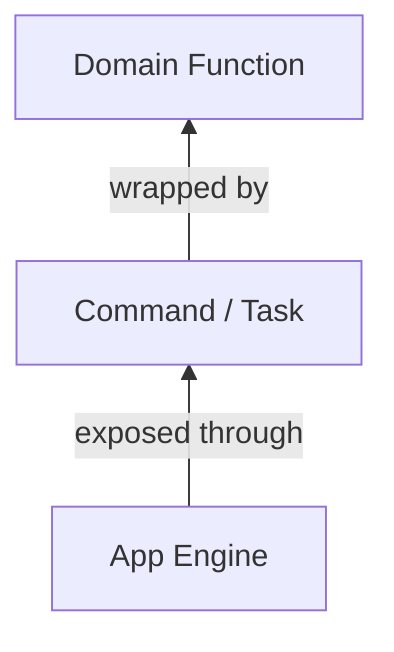
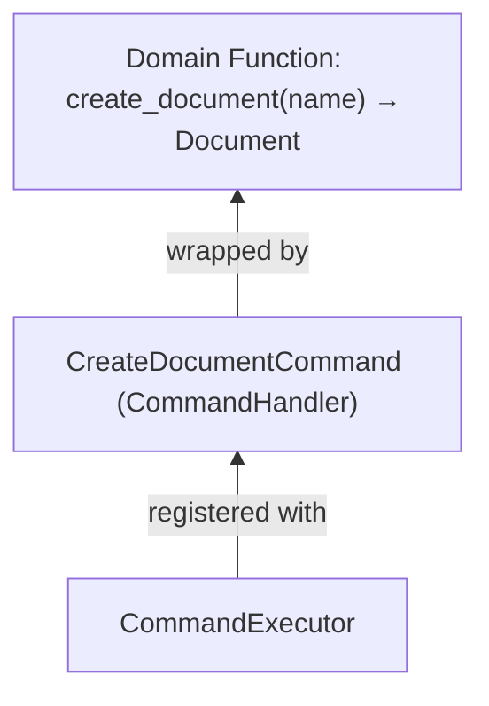
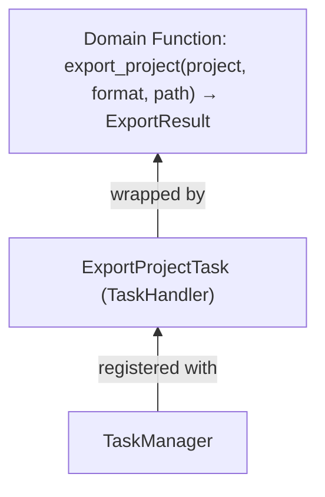
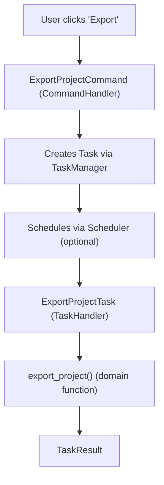
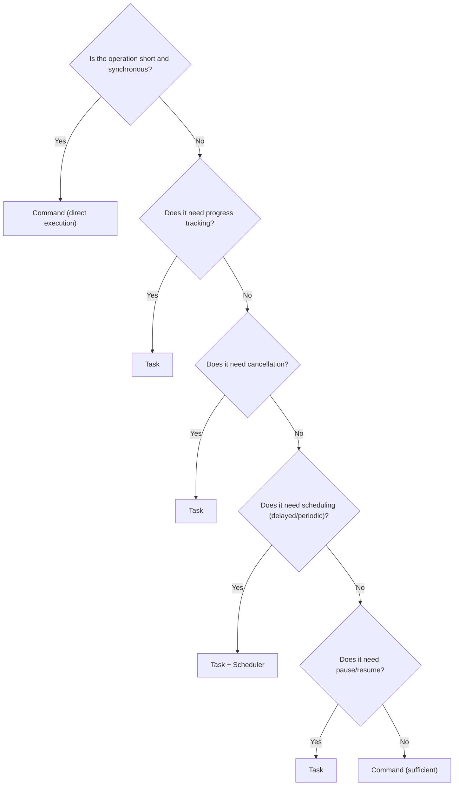
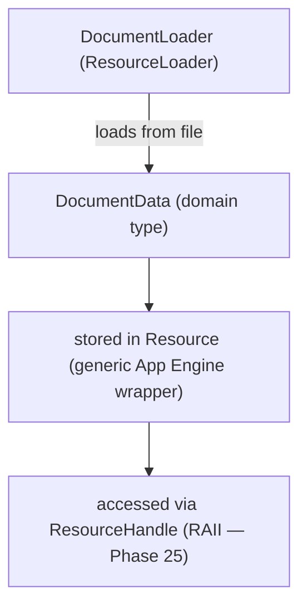
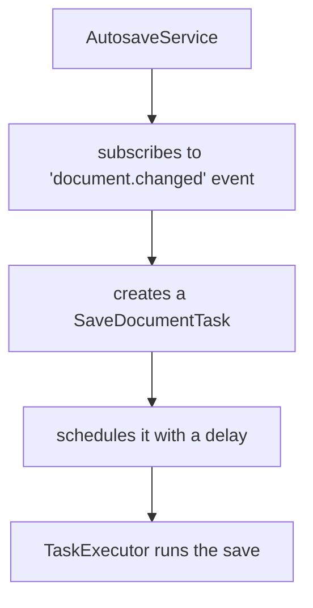

# Building a Domain Engine on App Engine

## Overview

This chapter answers the central question:

> **How do I build my application's domain layer using the App Engine?**

The answer is a single architectural pattern applied consistently:



The Domain Engine provides the **meaning**. The App Engine provides the **machinery**. Together, they form a complete application.

---

## Ownership Boundary

### Domain Engine Owns

```text
✓ Meaning — what "export project" actually does
✓ Rules — validation, business logic, constraints
✓ Objects — Project, Document, Card, Scene, Layer
✓ Operations — create_document(), export_project(), render_scene()
✓ Domain data — document contents, card stats, scene hierarchy
✓ Domain resource types — DocumentResource, ProjectResource
✓ Domain-specific commands — ExportProjectCommand, CreateCardCommand
✓ Domain-specific tasks — ExportProjectTask, RenderSceneTask
✓ Domain events — DocumentCreated, ProjectExported, CardMoved
```

### App Engine Owns

```text
✓ Lifecycle — Created → Initialized → Running → Stopped → Disposed
✓ Execution — CommandExecutor, TaskExecutor (panic-isolated)
✓ Scheduling — Scheduler, JobQueue, Schedule, Trigger, RetryPolicy
✓ Communication — EventBus (priority + isolation), SignalBus
✓ Resource management — ResourceManager (thread-safe, RAII handles)
✓ History infrastructure — HistoryStore, Undo, Redo, Replay
✓ Plugin infrastructure — PluginManager, permissions
✓ Configuration — ConfigStore (persistent, thread-safe)
✓ Concurrency — TaskPool, AsyncRuntime (optional tokio)
✓ Serialization — Serializer trait, SerializationRegistry
✓ Testing — Mocks, TestEngine, assertion helpers
```

The key rule: **App Engine never imports Domain Engine types.** The dependency goes one way:

```text
Domain Engine ──→ App Engine
App Engine     ✗→ Domain Engine
```

---

## Domain Engine Structure

```mermaid
flowchart TD
    ROOT["domain_engine/"] --> P["project/"]
    ROOT --> C["commands/<br/>← domain commands (App Engine handlers)"]
    ROOT --> T["tasks/<br/>← domain tasks (App Engine handlers)"]
    ROOT --> R["resources/<br/>← domain resources (App Engine loaders)"]
    ROOT --> S["services/<br/>← domain services (App Engine services)"]
    ROOT --> Z["serializers/<br/>← domain serializers (Phase 22)"]
    ROOT --> E["events/<br/>← domain event definitions"]

    P --> P1["mod.rs"]
    P --> P2["project.rs ← domain object"]
    P --> P3["document.rs ← domain object"]
    P --> P4["create_document.rs ← domain function"]
    P --> P5["save_document.rs ← domain function"]
    P --> P6["export_project.rs ← domain function"]

    C --> C1["mod.rs"]
    C --> C2["create_document.rs ← CommandHandler impl"]
    C --> C3["save_document.rs ← CommandHandler impl"]
    C --> C4["export_project.rs ← CommandHandler impl"]

    T --> T1["mod.rs"]
    T --> T2["export_project.rs ← TaskHandler impl"]

    R --> R1["mod.rs"]
    R --> R2["document_loader.rs ← ResourceLoader impl"]
    R --> R3["document_data.rs ← resource data type"]

    S --> S1["mod.rs"]
    S --> S2["autosave_service.rs ← Service impl"]

    Z --> Z1["mod.rs"]
    Z --> Z2["document_serializer.rs ← Serializer impl"]

    E --> E1["mod.rs"]
    E --> E2["document_events.rs"]
```



Each subdirectory maps to an App Engine contract.

---

## Pattern 1: Domain Function → Command

For short, synchronous operations:



### Domain Function

```rust
// domain_engine/project/document.rs

pub struct Document {
    pub id: String,
    pub title: String,
    pub content: String,
}

// domain_engine/project/create_document.rs

pub fn create_document(title: &str) -> Document {
    Document {
        id: format!("doc_{}", rand::random::<u32>()),
        title: title.to_string(),
        content: String::new(),
    }
}
```

### Domain Command (CommandHandler)

```rust
// domain_engine/commands/create_document.rs

use app_shell::app_engine::*;
use crate::project::{create_document, Document};

pub struct CreateDocumentCommand;

#[derive(Debug, Clone)]
pub struct CreateDocumentInput {
    pub title: String,
}

impl CommandHandler for CreateDocumentCommand {
    fn execute(
        &self,
        input: &CommandInput,
        _context: &CommandContext,
        engine: &EngineRef,                        // Phase 13: handler capabilities
    ) -> Result<CommandResult, CommandError> {
        let input: &CreateDocumentInput = input.get::<CreateDocumentInput>()
            .ok_or_else(|| CommandError::InvalidArguments("expected CreateDocumentInput".to_string()))?;

        // Call domain function
        let document = create_document(&input.title);

        // Phase 13: Publish event through EngineRef
        engine.event_bus.publish(
            &Event::new("document.created")
                .with_payload(document.id.clone())
                .with_source("CreateDocumentCommand")
        );

        Ok(CommandResult::success_with(document.id.clone())
            .with_metadata("title", &document.title))
    }
}
```

### Registration

```rust
// During application setup:
engine.command_executor_mut().register(
    CommandDefinition::new("document.create", "Create Document", "Creates a new document")
        .with_version(Version::new(1, 0, 0))                          // Phase 20
        .with_input_schema(PayloadSchema::of::<CreateDocumentInput>()) // Phase 20
        .with_output_schema(PayloadSchema::of::<String>()),            // Phase 20
    Box::new(CreateDocumentCommand),
)?;

// Usage:
let result = engine.execute_command(&Command::new(
    "document.create",
    CommandContext::new(ExecutionId::new()),
    CommandInput::new(CreateDocumentInput { title: "My Doc".to_string() }),
))?;

let doc_id = result.output::<String>().unwrap();
```

### Panic Isolation (Phase 24)

If the command handler panics, it's caught:

```rust
// The panic is converted to an error:
// CommandError::ExecutionFailed("handler panicked: ...")
// Engine continues running — no crash, no Mutex poisoning
```

---

## Pattern 2: Domain Function → Task

For long-running, cancellable, or schedulable operations:



### Domain Function

```rust
// domain_engine/project/export_project.rs

pub struct ExportResult {
    pub output_path: String,
    pub file_size: u64,
    pub page_count: usize,
}

pub fn export_project(
    project: &Project,
    format: &str,
    output_path: &str,
) -> Result<ExportResult, ExportError> {
    // Domain-specific export logic: serialize, render, write file...
    Ok(ExportResult {
        output_path: output_path.to_string(),
        file_size: 1024 * 1024,
        page_count: 42,
    })
}
```

### Domain Task (TaskHandler)

```rust
// domain_engine/tasks/export_project.rs

use app_shell::app_engine::*;
use crate::project::{export_project, Project, ExportResult};

pub struct ExportProjectTask;

#[derive(Debug, Clone)]
pub struct ExportProjectInput {
    pub project_id: String,
    pub format: String,
    pub output_path: String,
}

impl TaskHandler for ExportProjectTask {
    fn execute(
        &self,
        input: &TaskInput,
        context: &TaskContext,
        engine: &EngineRef,                        // Phase 13: handler capabilities
    ) -> Result<TaskResult, TaskError> {
        let input: &ExportProjectInput = input.get::<ExportProjectInput>()
            .ok_or_else(|| TaskError::ExecutionFailed {
                id: 0, reason: "expected ExportProjectInput".to_string()
            })?;

        // Phase 14: Check cancellation during long operations
        if context.is_cancelled() {
            return Ok(TaskResult::cancelled());
        }

        // Phase 14: Check deadline for timeout
        if context.is_expired() {
            return Err(TaskError::ExecutionFailed {
                id: 0, reason: "timeout".to_string()
            });
        }

        // Load the project (domain-specific lookup)
        let project = load_project(&input.project_id)
            .map_err(|e| TaskError::ExecutionFailed {
                id: 0, reason: e.to_string()
            })?;

        // Phase 14: Report progress (emits task.progress_changed signal)
        context.output().progress(0.0);

        // Call domain function
        let result = export_project(&project, &input.format, &input.output_path)
            .map_err(|e| TaskError::ExecutionFailed {
                id: 0, reason: e.to_string()
            })?;

        // Report completion progress
        context.output().progress(1.0);

        // Phase 13: Publish completion event through EngineRef
        engine.event_bus.publish(
            &Event::new("project.exported")
                .with_payload(result.clone())
                .with_source("ExportProjectTask")
        );

        Ok(TaskResult::completed_with(result)
            .with_metadata("format", &input.format))
    }
}
```

### Registration and Usage

```rust
// Register
engine.task_manager_mut().register(
    TaskDefinition::new("project.export", "Export Project", "Exports the project")
        .with_cancel_support()                                        // Phase 14
        .with_version(Version::new(2, 0, 0))                          // Phase 20
        .with_input_schema(PayloadSchema::of::<ExportProjectInput>())  // Phase 20
        .with_output_schema(PayloadSchema::of::<ExportResult>()),      // Phase 20
    Box::new(ExportProjectTask),
)?;

// Create and execute
let task_id = engine.task_manager_mut().create(
    "project.export",
    TaskContext::new(ExecutionId::new())
        .with_application(app_id)
        .with_session(session_id)
        .with_deadline(Deadline::after(Duration::from_secs(30))),  // Phase 14
    TaskInput::new(ExportProjectInput {
        project_id: "proj_42".to_string(),
        format: "pdf".to_string(),
        output_path: "/tmp/export.pdf".to_string(),
    }),
)?;

let result = engine.start_task(task_id)?;

assert!(result.is_completed());
let export_result: &ExportResult = result.output::<ExportResult>().unwrap();
println!("Exported {} pages ({:?} bytes)", export_result.page_count, export_result.file_size);
```

---

## Pattern 3: Command → Task (Delegation)

A command can create and schedule a task instead of executing directly:



```rust
pub struct StartExportCommand;

impl CommandHandler for StartExportCommand {
    fn execute(&self, input: &CommandInput, _context: &CommandContext, engine: &EngineRef) -> Result<CommandResult, CommandError> {
        let input: &ExportProjectInput = input.get::<ExportProjectInput>()
            .ok_or_else(|| CommandError::InvalidArguments("expected ExportProjectInput".to_string()))?;

        // Instead of exporting directly, create a task
        // (In a real app, the engine would be passed differently)
        Ok(CommandResult::success()
            .with_metadata("task_definition", "project.export"))
    }
}
```

This pattern separates **intent** (the command) from **managed execution** (the task).

### Decision Flowchart



---

## Pattern 4: Domain Resource

The Domain Engine defines resource types and loaders. The App Engine manages their lifecycle.



### Domain Resource Type

```rust
// domain_engine/resources/document_data.rs

#[derive(Debug, Clone)]
pub struct DocumentData {
    pub title: String,
    pub content: String,
    pub word_count: usize,
}
```

### Domain Loader

```rust
// domain_engine/resources/document_loader.rs

use app_shell::app_engine::{ResourceLoader, ResourceError};
use std::any::Any;

pub struct DocumentLoader;

impl ResourceLoader for DocumentLoader {
    fn resource_type(&self) -> &str {
        "document"
    }

    fn load(&self, source: &str) -> Result<Box<dyn Any + Send>, ResourceError> {
        // Domain-specific file reading
        let data = DocumentData {
            title: source.to_string(),
            content: "Document content here...".to_string(),
            word_count: 5,
        };
        Ok(Box::new(data))
    }
}
```

### Registration and Usage

```rust
// Register the domain loader
engine.resource_manager().register_loader(Box::new(DocumentLoader));

// Load a document resource (RAII handle auto-releases on drop — Phase 25)
let handle = engine.resource_manager()
    .load("document", "file:///docs/my_doc.dp")?;

// Access the document data through the closure pattern (Phase 23)
let doc_data = engine.resource_manager()
    .with_resource(handle.resource_id(), |r| {
        r.data::<DocumentData>().map(|d| d.clone())
    })
    .flatten()
    .unwrap();

println!("Title: {}", doc_data.title);
println!("Words: {}", doc_data.word_count);

// A task can acquire the resource handle
engine.resource_manager().acquire(&handle)?;

// ... task uses the document ...

// Release when done (or just let the handle drop)
engine.resource_manager().release_by_id(handle.resource_id())?;
```

The App Engine managed loading, caching, reference counting, RAII release, and unloading on dispose. The Domain Engine provided the `DocumentData` type and `DocumentLoader` implementation. Neither knew about the other's internals.

---

## Pattern 5: Domain Service

A domain service coordinates domain operations using App Engine systems:



```rust
// domain_engine/services/autosave_service.rs

use app_shell::app_engine::*;

pub struct AutosaveService {
    save_count: usize,
}

impl AutosaveService {
    pub fn new() -> Self {
        Self { save_count: 0 }
    }
}

impl Service for AutosaveService {
    fn service_type(&self) -> &str { "autosave" }

    fn initialize(&mut self, _engine: &EngineRef) -> Result<(), ServiceError> {
        Ok(())
    }

    fn start(&mut self, engine: &EngineRef) -> Result<(), ServiceError> {
        // In a real service, this would subscribe to events
        // and schedule tasks through the engine
        self.save_count = 0;

        // Phase 13: Access engine through EngineRef
        // engine.event_bus.publish(...)  — requires &mut EventBus (setup time)
        // engine.scheduler().submit(...) — can submit at runtime

        Ok(())
    }

    fn stop(&mut self) -> Result<(), ServiceError> {
        // Perform a final save
        Ok(())
    }

    fn dispose(&mut self) -> Result<(), ServiceError> {
        Ok(())
    }
}
```

### Registration

```rust
engine.service_manager_mut().register(
    ServiceDefinition::new("autosave", "Autosave", "Automatic document saving"),
    Box::new(AutosaveService::new()),
)?;

// The service starts/stops automatically with engine lifecycle
engine.initialize()?;  // AutosaveService.initialize() called (panic-isolated)
engine.start()?;       // AutosaveService.start() called (panic-isolated)
// ...
engine.stop()?;        // AutosaveService.stop() called
engine.dispose()?;     // AutosaveService.dispose() called
```

---

## Pattern 6: Domain Events

The Domain Engine can publish and subscribe to events through the App Engine's `EventBus`:

```rust
// domain_engine/events/document_events.rs

pub const DOCUMENT_CREATED: &str = "document.created";
pub const DOCUMENT_CHANGED: &str = "document.changed";
pub const DOCUMENT_SAVED: &str = "document.saved";

#[derive(Debug, Clone)]
pub struct DocumentChangedPayload {
    pub document_id: String,
    pub field: String,
    pub old_value: String,
    pub new_value: String,
}
```

### Publishing Domain Events

```rust
// Inside a command handler or task handler:
fn save_document_handler(/* ... */) {
    // ... save the document ...

    // Publish a domain event
    engine.event_bus.publish(
        &Event::new("document.saved")
            .with_payload(DocumentChangedPayload {
                document_id: "doc_42".to_string(),
                field: "content".to_string(),
                old_value: "old".to_string(),
                new_value: "new".to_string(),
            })
            .with_source("SaveDocumentCommand"),
    );
}
```

### Subscribing to Domain Events

```rust
// The autosave service subscribes to document changes:
engine.event_bus_mut().subscribe(
    "document.changed",
    event_handler(|event: &Event| {
        if let Some(payload) = event.payload::<DocumentChangedPayload>() {
            println!("Document {} changed: {} → {}",
                payload.document_id, payload.field, payload.new_value);
        }
    }),
);

// History subscribes to meaningful events:
engine.event_bus_mut().subscribe(
    "document.saved",
    event_handler(|event: &Event| {
        // Record in history for undo/redo
    }),
);
```

The App Engine's `EventBus` routes the event. The Domain Engine provides the event types and payloads. Neither knows about the other's internals.

---

## Pattern 7: Domain Serializer (Phase 22)

For IPC and persistence, the Domain Engine provides serializers:

```rust
// domain_engine/serializers/document_serializer.rs

use app_shell::app_engine::{Serializer, SerializationError};
use std::any::Any;
use crate::project::ExportProjectInput;

pub struct ExportProjectInputSerializer;

impl Serializer for ExportProjectInputSerializer {
    fn type_name(&self) -> &str {
        "domain_engine::project::ExportProjectInput"
    }

    fn serialize(&self, data: &dyn Any) -> Result<Vec<u8>, SerializationError> {
        let input = data.downcast_ref::<ExportProjectInput>()
            .ok_or_else(|| SerializationError::TypeMismatch {
                expected: self.type_name().to_string(),
                actual: "unknown".to_string(),
            })?;
        // Simple serialization: "project_id|format|output_path"
        let serialized = format!("{}|{}|{}", input.project_id, input.format, input.output_path);
        Ok(serialized.into_bytes())
    }

    fn deserialize(&self, bytes: &[u8]) -> Result<Box<dyn Any + Send>, SerializationError> {
        let s = std::str::from_utf8(bytes)
            .map_err(|e| SerializationError::DeserializationFailed {
                type_name: self.type_name().to_string(),
                reason: e.to_string(),
            })?;
        let parts: Vec<&str> = s.split('|').collect();
        if parts.len() != 3 {
            return Err(SerializationError::DeserializationFailed {
                type_name: self.type_name().to_string(),
                reason: "expected 'project_id|format|output_path'".to_string(),
            });
        }
        Ok(Box::new(ExportProjectInput {
            project_id: parts[0].to_string(),
            format: parts[1].to_string(),
            output_path: parts[2].to_string(),
        }))
    }
}
```

### Registration

```rust
use app_shell::app_engine::SerializationRegistry;

let registry = SerializationRegistry::new();
registry.register(Box::new(ExportProjectInputSerializer));
```

### IPC Roundtrip

```rust
// Sender creates input with typed data
let mut input = CommandInput::new(ExportProjectInput {
    project_id: "proj_42".to_string(),
    format: "pdf".to_string(),
    output_path: "/tmp/export.pdf".to_string(),
});

// Serialize for IPC
input.ensure_serialized(&registry)?;
let type_name = input.type_name();
let bytes = input.serialized().unwrap().to_vec();

// Receiver reconstructs from bytes
let mut received = CommandInput::from_bytes(type_name, bytes);
assert!(!received.has_data());

// Deserialize back to typed data
received.ensure_deserialized(&registry)?;
let data: &ExportProjectInput = received.get::<ExportProjectInput>().unwrap();
assert_eq!(data.project_id, "proj_42");
```

---

## Pattern 8: Async Domain Task (Phase 21)

For I/O-heavy domain operations, use `AsyncTaskHandler`:

```rust
use app_shell::app_engine::*;
use std::pin::Pin;

struct AsyncExportHandler;

impl AsyncTaskHandler for AsyncExportHandler {
    fn execute(
        &self,
        input: &TaskInput,
        _context: &TaskContext,
        _engine: &EngineRef,
    ) -> AsyncTaskFuture {
        // Clone what you need before the async boundary
        // (the future must be 'static)
        let input: ExportProjectInput = input.get::<ExportProjectInput>()
            .cloned()
            .ok_or_else(|| TaskError::ExecutionFailed {
                id: 0, reason: "expected ExportProjectInput".into()
            })
            .unwrap(); // Handle properly in production

        Box::pin(async move {
            // Async I/O here — can use tokio
            tokio::time::sleep(std::time::Duration::from_millis(10)).await;

            // Call domain function
            let project = load_project(&input.project_id)?;  // async load
            let result = export_project(&project, &input.format, &input.output_path)?;

            Ok(TaskResult::completed_with(result))
        })
    }
}

// Register and execute
engine.register_async_task(
    TaskDefinition::new("async.export", "Async Export", "Export asynchronously"),
    Box::new(AsyncExportHandler),
)?;

let runtime = AsyncRuntime::new()?;
let result = engine.start_task_async(task_id, &runtime)?;
```

**Important:** The async handler's `execute()` is called synchronously to obtain the `Box<dyn Future>`. The future is then spawned on tokio. The handler must clone/own whatever it needs from `EngineRef` before returning the future (the future must be `'static`).

For non-Clone input types, use serialized bytes:

```rust
impl AsyncTaskHandler for AsyncExportHandler {
    fn execute(&self, input: &TaskInput, _: &TaskContext, _: &EngineRef) -> AsyncTaskFuture {
        // Use serialized bytes (Clone + 'static)
        let bytes = input.serialized().map(|b| b.to_vec());
        let type_name = input.type_name();

        Box::pin(async move {
            // Deserialize inside the async boundary
            if let Some(bytes) = bytes {
                // Use SerializationRegistry to deserialize
                // let input: ExportProjectInput = registry.deserialize(&bytes, type_name)?;
            }
            Ok(TaskResult::completed())
        })
    }
}
```

---

## Complete Example: ProjectDomain

```rust
// domain_engine/project/mod.rs

use app_shell::app_engine::*;

// --- Domain Objects ---

pub struct Project {
    pub id: String,
    pub name: String,
    pub documents: Vec<Document>,
}

pub struct Document {
    pub id: String,
    pub title: String,
    pub content: String,
}

pub struct ExportResult {
    pub output_path: String,
    pub page_count: usize,
}

// --- Domain Functions ---

pub fn create_document(title: &str) -> Document {
    Document {
        id: format!("doc_{}", rand::random::<u32>()),
        title: title.to_string(),
        content: String::new(),
    }
}

pub fn save_document(doc: &Document, path: &str) -> Result<(), String> {
    // Domain-specific save logic
    Ok(())
}

pub fn export_project(project: &Project, format: &str, output_path: &str) -> Result<ExportResult, String> {
    // Domain-specific export logic
    Ok(ExportResult {
        output_path: output_path.to_string(),
        page_count: project.documents.len(),
    })
}

// --- Domain Command Input ---

#[derive(Debug, Clone)]
pub struct CreateDocumentInput {
    pub title: String,
}

#[derive(Debug, Clone)]
pub struct ExportProjectInput {
    pub project_id: String,
    pub format: String,
    pub output_path: String,
}

// --- Domain Commands ---

pub struct CreateDocumentCommand;

impl CommandHandler for CreateDocumentCommand {
    fn execute(&self, input: &CommandInput, _ctx: &CommandContext, engine: &EngineRef) -> Result<CommandResult, CommandError> {
        let input: &CreateDocumentInput = input.get::<CreateDocumentInput>()
            .ok_or_else(|| CommandError::InvalidArguments("expected CreateDocumentInput".to_string()))?;

        let doc = create_document(&input.title);

        engine.event_bus.publish(
            &Event::new("document.created")
                .with_payload(doc.id.clone())
                .with_source("CreateDocumentCommand"),
        );

        Ok(CommandResult::success_with(doc.id.clone())
            .with_metadata("title", &doc.title))
    }
}

// --- Domain Tasks ---

pub struct ExportProjectTask;

impl TaskHandler for ExportProjectTask {
    fn execute(&self, input: &TaskInput, ctx: &TaskContext, engine: &EngineRef) -> Result<TaskResult, TaskError> {
        let input: &ExportProjectInput = input.get::<ExportProjectInput>()
            .ok_or_else(|| TaskError::ExecutionFailed {
                id: 0, reason: "expected ExportProjectInput".into()
            })?;

        if ctx.is_cancelled() {
            return Ok(TaskResult::cancelled());
        }

        ctx.output().progress(0.0);

        let project = Project {
            id: input.project_id.clone(),
            name: "Demo".to_string(),
            documents: vec![],
        };

        let result = export_project(&project, &input.format, &input.output_path)
            .map_err(|e| TaskError::ExecutionFailed {
                id: 0, reason: e
            })?;

        ctx.output().progress(1.0);

        engine.event_bus.publish(
            &Event::new("project.exported")
                .with_source("ExportProjectTask"),
        );

        Ok(TaskResult::completed_with(result))
    }
}

// --- Registration Function ---

pub fn register_with_engine(engine: &mut AppEngine) -> Result<(), Box<dyn std::error::Error>> {
    // Commands
    engine.command_executor_mut().register(
        CommandDefinition::new("document.create", "Create Document", "Create a new document")
            .with_version(Version::new(1, 0, 0))
            .with_input_schema(PayloadSchema::of::<CreateDocumentInput>())
            .with_output_schema(PayloadSchema::of::<String>()),
        Box::new(CreateDocumentCommand),
    )?;

    // Tasks
    engine.task_manager_mut().register(
        TaskDefinition::new("project.export", "Export Project", "Export the project")
            .with_cancel_support()
            .with_version(Version::new(1, 0, 0))
            .with_input_schema(PayloadSchema::of::<ExportProjectInput>())
            .with_output_schema(PayloadSchema::of::<ExportResult>()),
        Box::new(ExportProjectTask),
    )?;

    // Resources
    engine.resource_manager().register_loader(Box::new(DocumentLoader));

    Ok(())
}

// --- Using the Domain Engine ---

fn main() {
    let mut engine = Bootstrap::create().unwrap();
    register_with_engine(&mut engine).unwrap();

    engine.initialize().unwrap();
    engine.start().unwrap();

    // Create a document (command — short, synchronous)
    let create_result = engine.execute_command(&Command::new(
        "document.create",
        CommandContext::new(ExecutionId::new()),
        CommandInput::new(CreateDocumentInput { title: "My First Document".to_string() }),
    )).unwrap();

    let doc_id = create_result.output::<String>().unwrap();
    println!("Created document: {}", doc_id);

    // Export the project (task — long, managed, cancellable)
    let task_id = engine.task_manager_mut().create(
        "project.export",
        TaskContext::new(ExecutionId::new())
            .with_deadline(Deadline::after(std::time::Duration::from_secs(30))),
        TaskInput::new(ExportProjectInput {
            project_id: "proj_1".to_string(),
            format: "pdf".to_string(),
            output_path: "/tmp/export.pdf".to_string(),
        }),
    ).unwrap();

    let result = engine.start_task(task_id).unwrap();
    assert!(result.is_completed());

    let export_result: &ExportResult = result.output::<ExportResult>().unwrap();
    println!("Exported {} pages to {}", export_result.page_count, export_result.output_path);

    engine.stop().unwrap();
    engine.dispose().unwrap();
}
```

---

## Integration Summary

| Domain Engine | App Engine |
|---|---|
| Domain Function — `create_document()` | wrapped by `CommandHandler` |
| Domain Function — `export_project()` | wrapped by `TaskHandler` |
| Domain Resource Type — `DocumentData` | loaded by `ResourceLoader` |
| Domain Service — `AutosaveService` | implements `Service` trait |
| Domain Event Payload — `DocumentChangedPayload` | published via `EventBus` |
| Domain Command Input — `ExportProjectInput` | passed via `CommandInput` |
| Domain Task Input — `ExportProjectInput` | passed via `TaskInput` |
| Domain Serializer — `ExportProjectInputSerializer` | registered with `SerializationRegistry` |

Each domain concept maps to exactly one App Engine contract. The Domain Engine never reaches into App Engine internals — it uses only the public API.

---

## Checklist: Am I Integrating Correctly?

| Question | Correct Answer |
|---|---|
| Does the Domain Engine import App Engine types? | Yes (commands, tasks, events, resources, services) |
| Does the App Engine import Domain Engine types? | **No** — never |
| Are domain functions called directly from UI/API? | No — through commands/tasks |
| Are domain objects stored in TaskContext? | No — in TaskInput (type-erased) |
| Are domain events published through EventBus? | Yes |
| Are domain resources loaded through ResourceManager? | Yes |
| Are domain serializers registered with SerializationRegistry? | Yes (if IPC/persistence needed) |
| Are domain command/task definitions versioned? | Yes (Version + PayloadSchema) |
| Are domain handlers panic-isolated by App Engine? | Yes (catch_unwind) |
| Does domain code receive EngineRef for engine access? | Yes (Phase 13) |
| Are RAII resource handles used (auto-release on drop)? | Yes (Phase 25) |
| Is retry handled by the scheduler? | Yes (RetryPolicy + handle_task_failure) |

---

## Next Steps

- [05-commands-and-tasks.md](05-commands-and-tasks.md) — Deep dive on commands and tasks.
- [11-handler-capabilities.md](11-handler-capabilities.md) — What handlers can access via `EngineRef`.
- [12-execution-control.md](12-execution-control.md) — Cancellation, deadlines, and progress streaming.
- [13-persistence-and-serialization.md](13-persistence-and-serialization.md) — Serializers and storage backends.
- [10-application-integration.md](10-application-integration.md) — UI, API, and MCP integration.