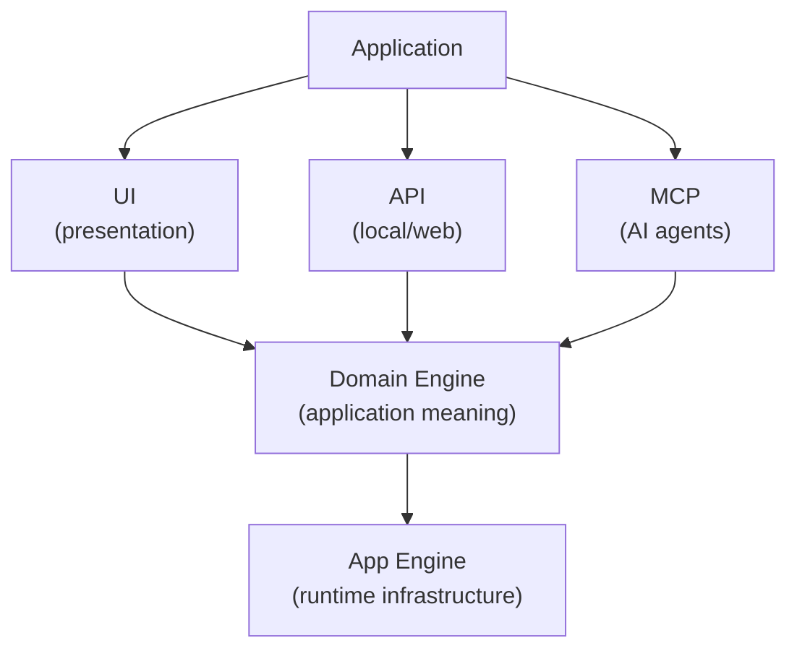
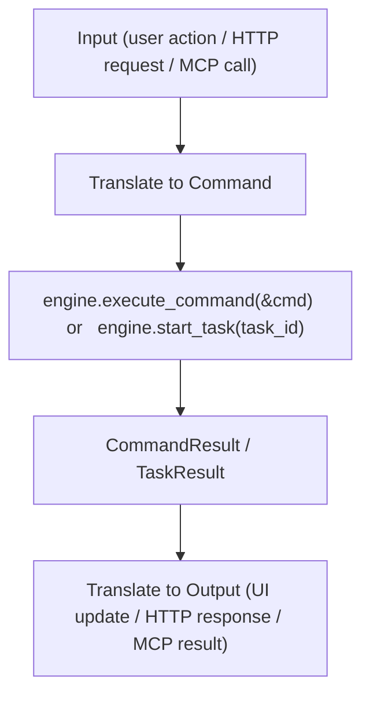
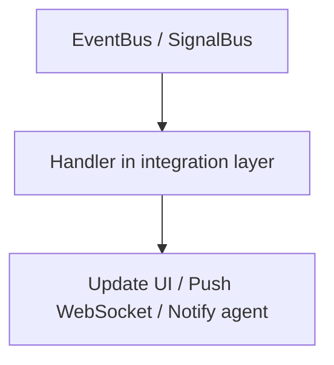
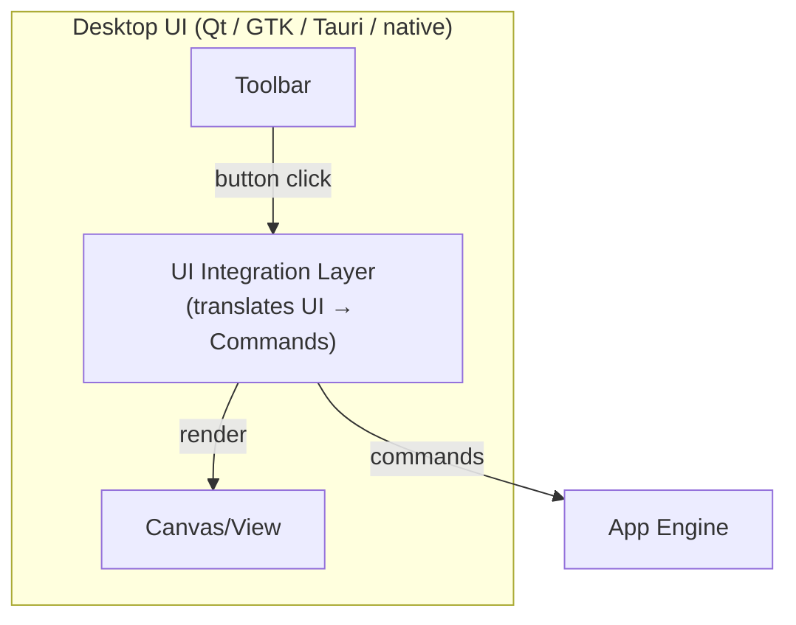
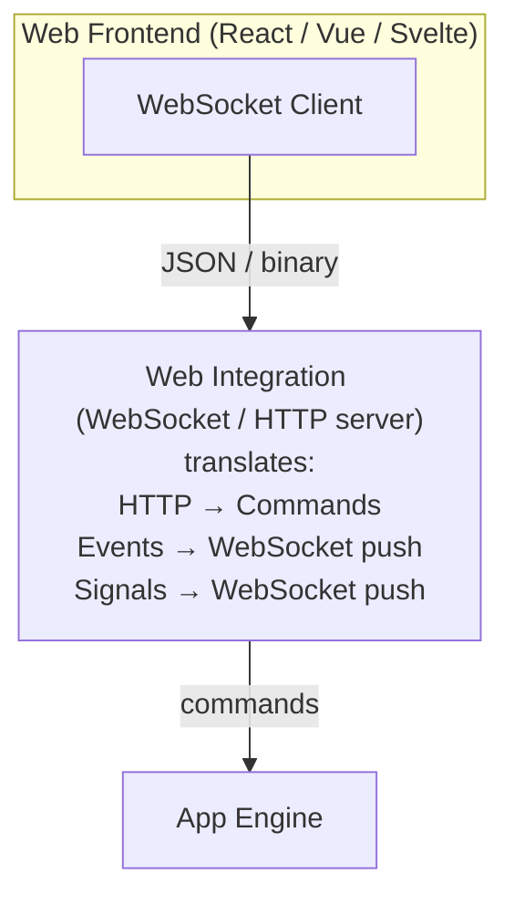
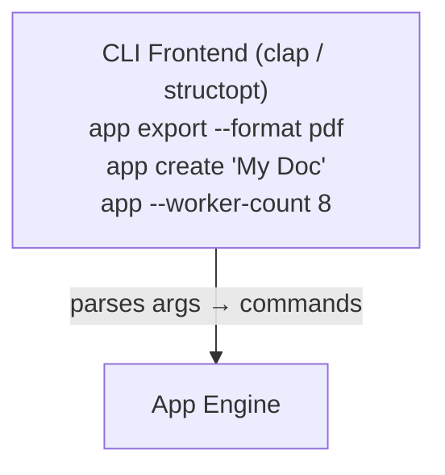
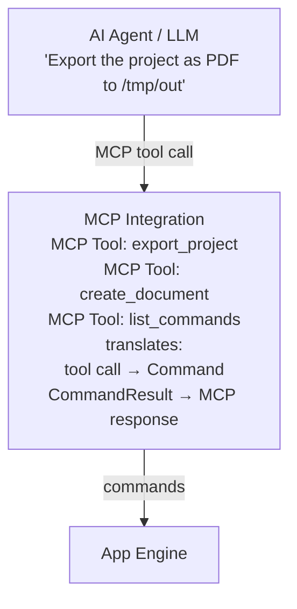
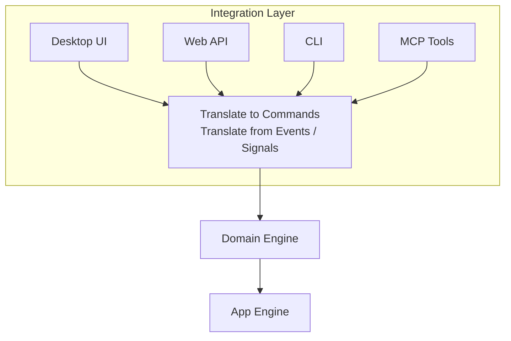

# UI, API, MCP & Complete Example

## Overview

The final layer wraps both engines and exposes them to the outside world:



Each external surface translates user/agent intents into **commands**, and translates engine **events/signals** back into user/agent-facing responses.

---

## The Integration Principle

All external layers follow the same pattern:



And in reverse:



The integration layer **never** calls domain functions directly. It always goes through commands.

---

## Desktop UI



### UI → App Engine

```rust
// User clicks "Export" button
fn on_export_clicked(engine: &mut AppEngine, project_id: &str) {
    let cmd = Command::new(
        "project.export",
        CommandContext::new(ExecutionId::new())
            .with_deadline(Deadline::after(Duration::from_secs(30))),
        CommandInput::new(ExportProjectInput {
            project_id: project_id.to_string(),
            format: "pdf".to_string(),
            output_path: "/tmp/export.pdf".to_string(),
        }),
    );

    match engine.execute_command(&cmd) {
        Ok(result) => {
            show_status(&format!("Exported: {:?}", result.output::<String>()));
        }
        Err(e) => show_error(&e.to_string()),
    }
}
```

### App Engine → UI (via Signals)

```rust
// UI subscribes to progress signals during long operations
engine.signal_bus().subscribe(
    "task.progress_changed",
    Box::new(|signal: &Signal| {
        let progress = signal.payload::<f32>().unwrap_or(0.0);
        // update_progress_bar(progress);
        println!("Progress: {:.0}%", progress * 100.0);
    }),
);

// UI subscribes to events
engine.event_bus_mut().subscribe(
    "document.created",
    event_handler(|_event: &Event| {
        // refresh_document_list();
        println!("Document created");
    }),
);
```

### Preferences

```rust
// UI reads and writes user preferences (thread-safe — Phase 23)
engine.preferences().set("theme", "dark");
engine.preferences().set("show_toolbar", "true");

// UI reads preferences on startup
let theme = engine.preferences().get("theme").as_deref().unwrap_or("light");
let show_toolbar = engine.preferences().get_bool("show_toolbar").unwrap_or(true);
```

### Configuration

```rust
// UI reads configuration (thread-safe — Phase 23)
let worker_count = engine.config_store().get_i64("worker_count").unwrap_or(4);

// UI changes configuration (persists to backend — Phase 15)
engine.config_store().set("app.name", "MyApp").unwrap();
```

---

## Web UI



### HTTP API → Commands

```rust
// POST /api/documents → document.create command
fn handle_create_document(req: HttpRequest, engine: &AppEngine) -> HttpResponse {
    let cmd = Command::new(
        "document.create",
        CommandContext::new(ExecutionId::new()),
        CommandInput::new(req.body["title"].clone()),
    );

    match engine.execute_command(&cmd) {
        Ok(result) => HttpResponse::ok(json!({
            "document_id": result.output::<String>(),
        })),
        Err(e) => HttpResponse::error(&e.to_string()),
    }
}
```

### Events → WebSocket Push

```rust
// WebSocket clients receive events in real-time
engine.event_bus_mut().subscribe(
    "document.changed",
    event_handler(move |event: &Event| {
        let ws_message = json!({
            "type": event.event_type(),
            "source": event.source(),
        });
        // websocket.broadcast(ws_message);
    }),
);

engine.signal_bus().subscribe(
    "task.progress_changed",
    Box::new(|signal: &Signal| {
        let ws_message = json!({
            "type": signal.signal_type(),
            "progress": signal.payload::<f32>().unwrap_or(0.0),
        });
        // websocket.broadcast(ws_message);
    }),
);
```

---

## CLI



```rust
use clap::{Parser, Subcommand};

#[derive(Parser)]
struct Cli {
    #[command(subcommand)]
    command: CliCommand,
}

#[derive(Subcommand)]
enum CliCommand {
    Create { title: String },
    Export { project_id: String, format: String, output: String },
    List,
}

fn main() {
    let cli = Cli::parse();
    let mut engine: AppEngine = Bootstrap::create().unwrap();
    // Register domain handlers
    domain_engine::register_with_engine(&mut engine).unwrap();
    engine.initialize().unwrap();
    engine.start().unwrap();

    match cli.command {
        CliCommand::Create { title } => {
            let result = engine.execute_command(&Command::new(
                "document.create",
                CommandContext::new(ExecutionId::new()),
                CommandInput::new(CreateDocumentInput { title }),
            )).unwrap();
            println!("Created: {}", result.output::<String>().unwrap());
        }
        CliCommand::Export { project_id, format, output } => {
            let task_id = engine.task_manager().create(
                "project.export",
                TaskContext::new(ExecutionId::new()),
                TaskInput::new(ExportProjectInput {
                    project_id, format, output_path: output,
                }),
            ).unwrap();
            let result = engine.start_task(task_id).unwrap();
            println!("Export complete: {:?}", result.output::<ExportResult>());
        }
        CliCommand::List => {
            for def in engine.command_executor().list() {
                println!("  {} — {}", def.id(), def.description());
            }
        }
    }

    engine.stop().unwrap();
    engine.dispose().unwrap();
}
```

### CLI Configuration Override

```rust
// CLI flags override configuration
let cli = Cli::parse();

// Apply config overrides (thread-safe — Phase 23)
if let Some(workers) = cli.worker_count {
    engine.config_store().set("worker_count", &workers.to_string()).unwrap();
}

engine.initialize()?;
engine.start()?;
```

---

## Local API (Library Mode)

For applications that embed the engine as a library (other Rust code, FFI, embedded systems):

```rust
/// Public API for embedding the application as a library.
pub struct AppApi {
    engine: AppEngine,
}

impl AppApi {
    pub fn new() -> Self {
        let mut engine = Bootstrap::create().unwrap();
        domain_engine::register_with_engine(&mut engine).unwrap();
        engine.initialize().unwrap();
        engine.start().unwrap();
        Self { engine }
    }

    pub fn create_document(&mut self, title: &str) -> Result<String, String> {
        let result = self.engine.execute_command(&Command::new(
            "document.create",
            CommandContext::new(ExecutionId::new()),
            CommandInput::new(CreateDocumentInput { title: title.to_string() }),
        )).map_err(|e| e.to_string())?;

        result.output::<String>().ok_or("no document id".to_string())
    }

    pub fn export_project(&mut self, project_id: &str, format: &str, path: &str) -> Result<(), String> {
        let task_id = self.engine.task_manager().create(
            "project.export",
            TaskContext::new(ExecutionId::new()),
            TaskInput::new(ExportProjectInput {
                project_id: project_id.to_string(),
                format: format.to_string(),
                output_path: path.to_string(),
            }),
        ).map_err(|e| e.to_string())?;

        let result = self.engine.start_task(task_id).map_err(|e| e.to_string())?;

        if result.is_completed() { Ok(()) }
        else { Err("export failed".to_string()) }
    }

    pub fn on_document_changed<F>(&mut self, handler: F)
    where
        F: Fn(&Event) + Send + Sync + 'static,
    {
        self.engine.event_bus_mut().subscribe(
            "document.changed",
            event_handler(handler),
        );
    }

    pub fn shutdown(&mut self) {
        self.engine.stop().unwrap();
        self.engine.dispose().unwrap();
    }
}
```

### Usage

```rust
let mut app = AppApi::new();

let doc_id = app.create_document("Hello World")?;
app.export_project("proj_1", "pdf", "/tmp/out.pdf")?;

app.on_document_changed(|event| {
    println!("Document changed: {}", event.event_type());
});

app.shutdown();
```

---

## MCP (Model Context Protocol)

For AI agent integration:



### MCP Tool Definition

```rust
/// MCP tool: create_document
///
/// Creates a new document with the given title.
///
/// Parameters:
///   - title (string, required): The document title
///
/// Returns:
///   - document_id (string): The created document's ID
fn mcp_create_document(params: serde_json::Value, engine: &AppEngine) -> serde_json::Value {
    let title = params["title"].as_str().expect("title required");

    let command = Command::new(
        "document.create",
        CommandContext::new(ExecutionId::new()),
        CommandInput::new(CreateDocumentInput { title: title.to_string() }),
    );

    match engine.execute_command(&command) {
        Ok(result) => json!({
            "document_id": result.output::<String>().unwrap_or_default(),
        }),
        Err(e) => json!({ "error": e.to_string() }),
    }
}

/// MCP tool: export_project
///
/// Exports a project to the specified format.
///
/// Parameters:
///   - project_id (string, required): The project to export
///   - format (string, required): Output format (pdf, png, etc.)
///   - output_path (string, required): Where to save the export
///
/// Returns:
///   - output_path (string): The path to the exported file
///   - page_count (number): Number of pages exported
fn mcp_export_project(params: serde_json::Value, engine: &mut AppEngine) -> serde_json::Value {
    let input = ExportProjectInput {
        project_id: params["project_id"].as_str().unwrap().to_string(),
        format: params["format"].as_str().unwrap().to_string(),
        output_path: params["output_path"].as_str().unwrap().to_string(),
    };

    let task_id = match engine.task_manager().create(
        "project.export",
        TaskContext::new(ExecutionId::new()),
        TaskInput::new(input),
    ) {
        Ok(id) => id,
        Err(e) => return json!({ "error": e.to_string() }),
    };

    match engine.start_task(task_id) {
        Ok(result) => {
            let export_result: &ExportResult = result.output::<ExportResult>().unwrap();
            json!({
                "output_path": export_result.output_path,
                "page_count": export_result.page_count,
            })
        }
        Err(e) => json!({ "error": e.to_string() }),
    }
}

/// MCP tool: list_available_commands
///
/// Lists all commands available in the application.
///
/// Returns:
///   - commands (array): List of {id, name, description}
fn mcp_list_commands(_params: serde_json::Value, engine: &AppEngine) -> serde_json::Value {
    let commands: Vec<serde_json::Value> = engine.command_executor()
        .list()
        .iter()
        .map(|def| json!({
            "id": def.id(),
            "name": def.name(),
            "description": def.description(),
        }))
        .collect();

    json!({ "commands": commands })
}
```

### Agent Subscription to Events

```rust
// Agent receives real-time updates via MCP notifications
engine.event_bus_mut().subscribe(
    "task.completed",
    event_handler(|event: &Event| {
        // Notify the agent that a task completed
        // mcp_server.notify("task.completed", event.payload());
    }),
);

engine.event_bus_mut().subscribe(
    "document.changed",
    event_handler(|event: &Event| {
        // Notify the agent that a document changed
        // mcp_server.notify("document.changed", {});
    }),
);
```

---

## Headless Operation

The App Engine runs perfectly without any UI, API, or MCP:

```rust
// Pure headless batch processing
fn main() {
    let mut engine: AppEngine = Bootstrap::create().unwrap();
    domain_engine::register_with_engine(&mut engine).unwrap();

    // Load configuration (persists to file — Phase 15)
    engine.config_store_mut().set("batch_mode", "true").unwrap();

    engine.initialize().unwrap();
    engine.start().unwrap();

    // Process a queue of work
    let tasks = load_batch_tasks(); // application-specific
    for task_input in tasks {
        let task_id = engine.task_manager_mut().create(
            "project.export",
            TaskContext::new(ExecutionId::new()),
            TaskInput::new(task_input),
        ).unwrap();

        let result = engine.start_task(task_id).unwrap();

        if result.is_completed() {
            println!("OK: {:?}", result.output::<ExportResult>());
        } else if result.is_failed() {
            eprintln!("FAILED: {}", result.error().unwrap_or("unknown"));
        }
    }

    // Cancel any running tasks on shutdown (Phase 26)
    engine.stop().unwrap();
    // Unload all resources on dispose (Phase 26)
    engine.dispose().unwrap();
}
```

No UI, no HTTP server, no MCP — just the engine doing work.

---

## Thread-Safe Sharing (Phase 23)

All managers are `Send + Sync`. The engine can be shared across threads:

```rust
use std::sync::Arc;
use std::thread;

let engine = Arc::new(Bootstrap::create().unwrap());

// Thread 1: UI thread — reads config and preferences
let ui_engine = Arc::clone(&engine);
let ui_handle = thread::spawn(move || {
    let theme = ui_engine.preferences().get("theme");
    let name = ui_engine.config_store().get("app.name");
});

// Thread 2: Worker thread — executes tasks
let worker_engine = Arc::clone(&engine);
let worker_handle = thread::spawn(move || {
    // Thread-safe task execution
    let engine_ref = worker_engine.engine_ref();
    let result = worker_engine.start_task(task_id).unwrap();
});

// Thread 3: Monitor — subscribes to signals
let monitor_engine = Arc::clone(&engine);
let monitor_handle = thread::spawn(move || {
    monitor_engine.signal_bus().subscribe(
        "task.progress_changed",
        Box::new(|s: &Signal| {
            println!("Progress: {:.0}%", s.payload::<f32>().unwrap_or(0.0) * 100.0);
        }),
    );
});

ui_handle.join().unwrap();
worker_handle.join().unwrap();
monitor_handle.join().unwrap();
```

### Async Execution (Phase 21)

For I/O-heavy handlers (LLM API calls, web requests, file I/O):

```rust
// With async-runtime feature enabled
let mut engine = Bootstrap::create().unwrap();
engine.register_async_task(
    TaskDefinition::new("async.fetch", "Fetch", "Fetch data asynchronously"),
    Box::new(AsyncFetchHandler),
)?;

let runtime = AsyncRuntime::new()?;
let result = engine.start_task_async(task_id, &runtime)?;
```

---

## Complete Application Example

```rust
use app_shell::app_engine::*;
use std::sync::{Arc, Mutex};

fn main() {
    // ─── Bootstrap ───
    let mut engine: AppEngine = Bootstrap::create().expect("bootstrap failed");

    // ─── Domain Registration ───
    domain_engine::register_with_engine(&mut engine).expect("domain registration failed");

    // ─── Configuration ───
    engine.config_store_mut().set("app.name", "MyApp").unwrap();
    engine.config_store_mut().set("worker_count", "4").unwrap();

    // ─── Preferences ───
    engine.preferences_mut().set("theme", "dark");
    engine.preferences_mut().set("language", "en");

    // ─── Event Subscriptions (Integration Layer) ───
    // UI subscribes to progress
    engine.signal_bus().subscribe(
        "task.progress_changed",
        Box::new(|signal: &Signal| {
            let progress = signal.payload::<f32>().unwrap_or(0.0);
            println!("[UI] Progress: {:.0}%", progress * 100.0);
        }),
    );

    // History subscribes to meaningful events
    engine.event_bus_mut().subscribe(
        "document.created",
        event_handler(|event: &Event| {
            println!("[History] Recorded: {}", event.event_type());
        }),
    );

    // API/MCP subscribes to task events
    engine.event_bus_mut().subscribe(
        "task.completed",
        event_handler(|event: &Event| {
            println!("[API] Task completed: source={}", event.source().unwrap_or("?"));
        }),
    );

    // ─── Lifecycle ───
    engine.initialize().expect("initialize failed");
    engine.start().expect("start failed");

    // ─── Application Work ───

    // Create a document (command — synchronous, panic-isolated)
    let create_result = engine.execute_command(&Command::new(
        "document.create",
        CommandContext::new(ExecutionId::new()),
        CommandInput::new(CreateDocumentInput {
            title: "My Document".to_string(),
        }),
    )).unwrap();

    let doc_id = create_result.output::<String>().unwrap();
    println!("Created document: {}", doc_id);

    // Publish a domain event (consumed by History, UI, etc.)
    engine.event_bus().publish(
        &Event::new("document.created")
            .with_payload(doc_id.clone())
            .with_source("main"),
    );

    // Export a project (task — managed, cancellable, has progress)
    let task_id = engine.task_manager_mut().create(
        "project.export",
        TaskContext::new(ExecutionId::new())
            .with_deadline(Deadline::after(std::time::Duration::from_secs(30))),
        TaskInput::new(ExportProjectInput {
            project_id: "proj_1".to_string(),
            format: "pdf".to_string(),
            output_path: "/tmp/export.pdf".to_string(),
        }),
    ).unwrap();

    let result = engine.start_task(task_id).unwrap();
    if result.is_completed() {
        let export_result: &ExportResult = result.output::<ExportResult>().unwrap();
        println!("Exported {} pages to {}", export_result.page_count, export_result.output_path);
    }

    // Load a resource (RAII handle auto-releases on drop — Phase 25)
    let handle = engine.resource_manager()
        .load("document", "file:///docs/my_doc.dp")
        .unwrap();

    let doc_data = engine.resource_manager()
        .with_resource(handle.resource_id(), |r| {
            r.data::<DocumentData>().map(|d| d.clone())
        })
        .flatten();

    if let Some(data) = doc_data {
        println!("Loaded document: {}", data.title);
    }

    // ─── Shutdown (Phase 26: cleanup) ───
    engine.stop().expect("stop failed");
    // ↑ Cancels all running tasks
    engine.dispose().expect("dispose failed");
    // ↑ Unloads all non-in-use resources

    println!("Application complete. Final state: {:?}", engine.state());
}
```

---

## Integration Layer Summary



| Layer | Translates | Direction |
|---|---|---|
| Desktop UI | Button clicks → Commands | Inbound |
| Desktop UI | Signals → UI updates | Outbound |
| Web API | HTTP requests → Commands | Inbound |
| Web API | Events → WebSocket pushes | Outbound |
| CLI | Args → Commands | Inbound |
| CLI | Results → stdout | Outbound |
| MCP | Tool calls → Commands/Tasks | Inbound |
| MCP | Events → Agent notifications | Outbound |

All layers follow the same pattern: **translate external input into commands, translate events/signals into external output.**

---

## Architecture Rules

1. **Integration layers never call domain functions directly.** Always through commands.
2. **Integration layers never access domain objects directly.** Always through command results or events.
3. **One command can serve all integration layers.** The same `document.create` command works for UI, API, CLI, and MCP.
4. **Events serve all integration layers.** The same `document.changed` event updates the UI, pushes to WebSocket, and notifies the AI agent.
5. **The App Engine doesn't know which integration layers exist.** It just provides commands and events.
6. **The Domain Engine doesn't know which integration layers exist.** It just provides command handlers and task handlers.
7. **Adding a new integration layer** (e.g., a new MCP endpoint) requires zero changes to the engines — just a new translation layer.

---

## Quick Reference

| Want to... | Do this |
|---|---|
| Add a UI button | Create a command, execute via `engine.execute_command()` |
| Show progress | Subscribe to `signal_bus()` with `task.progress_changed` |
| Add HTTP endpoint | Translate request → `Command`, execute, return result |
| Add MCP tool | Define tool schema, translate call → `Command`/`Task` |
| Add CLI command | Parse args, translate to `Command`, execute |
| Get real-time updates | Subscribe to `event_bus()` or `signal_bus()` |
| Read user settings | `engine.preferences().get("key")` |
| Change settings | `engine.preferences().set("key", "value")` |
| Read configuration | `engine.config_store().get("key")` |
| Change configuration | `engine.config_store().set("key", "value")` |
| Run headless | Just don't start a UI/API/MCP server — engine works alone |
| Share across threads | `Arc<AppEngine>` — all managers are `Send + Sync` |
| Run async | `engine.start_task_async(task_id, &runtime)` |
| Serialize for IPC | `input.ensure_serialized(&registry)` then send bytes |
| Deserialize from IPC | `CommandInput::from_bytes(type_name, bytes)` then `ensure_deserialized()` |
| Add retry on failure | `scheduler.submit_with_retry(task_id, schedule, priority, RetryPolicy)` |
| Check permissions | `PermissionCheckedEngineRef::try_load_resource()` |
| Cancel running tasks | `engine.stop()` calls `cancel_all()` automatically |
| Unload resources | `engine.dispose()` calls `unload_all()` automatically |

---

## Conclusion

The App Engine is now a **complete, production-ready generic application runtime**:

```text
Phase 1:  Runtime + Lifecycle
Phase 2:  Context + State
Phase 3:  Commands
Phase 4:  Tasks + Execution
Phase 5:  Scheduling
Phase 6:  Events + Signals
Phase 7:  History (undo/redo/replay)
Phase 8:  Resources (load/cache/unload)
Phase 9:  Services (long-lived capabilities)
Phase 10: Plugins (extension packages)
Phase 11: Configuration + Preferences
Phase 12: Integration cleanup + AppEngine
Phase 13: Handler Capabilities (EngineRef)
Phase 14: Execution Control (cancellation, deadline, streaming)
Phase 15: Persistence (file/memory backends)
Phase 16: Resource Lifecycle (RAII, dependencies)
Phase 17: Plugin & Security (permissions, dynamic loading)
Phase 18: Concurrency (thread-safe, async traits)
Phase 19: Communication & Reliability (priority, isolation, retry)
Phase 20: Developer Experience (mocks, metadata, versioning)
Phase 21: Async Runtime (optional tokio)
Phase 22: Serialization (Serializer trait, registry)
Phase 23: Thread-Safe Managers (all Send + Sync)
Phase 24: Panic Isolation (catch_unwind on all handlers)
Phase 25: RAII Resource Handles (auto-release on drop)
Phase 26: Lifecycle Cleanup (cancel tasks on stop, unload on dispose)
Phase 27: Retry Policy (handle_task_failure)
Phase 28: Plugin Permissions (PermissionCheckedEngineRef)
```

The architecture provides:

- **Stable contracts** — commands, tasks, events, signals, resources, services, plugins.
- **Clean boundaries** — App Engine ↔ Domain Engine ↔ Integration Layer.
- **Decoupled communication** — producers don't know consumers.
- **Thread safety** — all managers are `Send + Sync`.
- **Extensibility** — plugins add capabilities without modifying the core.
- **Observability** — events, signals, progress streaming, and history.
- **Headless operation** — no UI, API, or MCP required.
- **Panic isolation** — one crashing handler doesn't kill the engine.
- **RAII resources** — handles auto-release on drop.
- **Lifecycle cleanup** — tasks cancelled on stop, resources unloaded on dispose.
- **Retry policies** — failed tasks can be retried with configurable backoff.
- **Permission enforcement** — plugins can be restricted to specific capabilities.
- **Serialization** — optional serialized bytes on all payloads for IPC.
- **Async execution** — optional `tokio` integration for I/O-heavy handlers.
- **Dependency-free** — zero external crates by default.

The Domain Engine provides **meaning**. The App Engine provides **machinery**. The Integration Layer provides **access**. Each layer is independently evolvable.

---

## Guide Index

| # | File | Topic |
|---|---|---|
| 01 | [01-overview.md](01-overview.md) | What App Engine Is |
| 02 | [02-architecture.md](02-architecture.md) | Architecture & Boundaries |
| 03 | [03-bootstrap-and-lifecycle.md](03-bootstrap-and-lifecycle.md) | Creating and Running an App |
| 04 | [04-context-and-state.md](04-context-and-state.md) | Context & State |
| 05 | [05-commands-and-tasks.md](05-commands-and-tasks.md) | Application Operations |
| 06 | [06-scheduling-and-communication.md](06-scheduling-and-communication.md) | Scheduling, Events & Signals |
| 07 | [07-history-and-resources.md](07-history-and-resources.md) | History & Resources |
| 08 | [08-services-and-plugins.md](08-services-and-plugins.md) | Services & Plugins |
| 09 | [09-domain-engine-integration.md](09-domain-engine-integration.md) | Domain Engine Integration |
| 10 | [10-application-integration.md](10-application-integration.md) | UI, API, MCP & Complete Example |