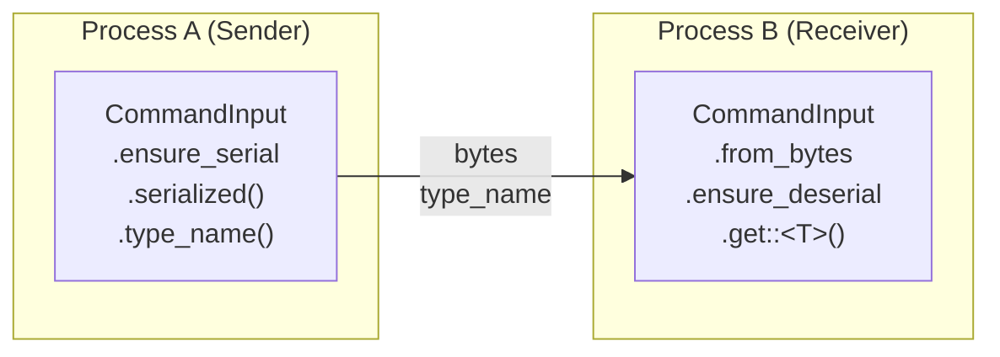

# Persistence & Serialization

## Overview

Two systems provide application continuity across restarts and across process boundaries:

```text
Persistence     = "How do settings and history survive a restart?"
Serialization   = "How do payloads cross process boundaries (IPC)?"
```

Both are **dependency-free** by default. The Domain Engine provides the storage and serialization logic; the App Engine provides the contracts.

---

## Part 1: Persistence (Phase 15)

### StorageBackend Trait

The `StorageBackend` trait is a generic key-value storage interface:

```rust
use app_shell::app_engine::StorageBackend;

pub trait StorageBackend: Send + Sync {
    fn load(&self, key: &str) -> Result<Option<String>, PersistenceError>;
    fn save(&self, key: &str, value: &str) -> Result<(), PersistenceError>;
    fn remove(&self, key: &str) -> Result<(), PersistenceError>;
    fn exists(&self, key: &str) -> bool;
    fn keys(&self) -> Result<Vec<String>, PersistenceError>;
}
```

Two implementations are provided:

| Backend | Purpose |
|---|---|
| `MemoryStorageBackend` | In-memory (default, backward compatible) |
| `FileStorageBackend` | Persists to a directory (one file per key) |

### MemoryStorageBackend

```rust
use app_shell::app_engine::MemoryStorageBackend;

let backend = MemoryStorageBackend::new();
backend.save("key1", "value1")?;
backend.save("key2", "value2")?;

assert_eq!(backend.load("key1")?, Some("value1".to_string()));
assert!(backend.exists("key1"));
assert!(!backend.exists("missing"));

backend.remove("key1")?;
assert!(!backend.exists("key1"));

let keys = backend.keys()?;
assert_eq!(keys.len(), 1);
```

### FileStorageBackend

Persists each key as a separate file in a directory:

```rust
use app_shell::app_engine::FileStorageBackend;
use std::env::temp_dir;

let dir = temp_dir().join("my_app_config");
let backend = FileStorageBackend::new(&dir)?;

backend.save("app.name", "MyApp")?;
backend.save("worker_count", "8")?;

assert_eq!(backend.load("app.name")?, Some("MyApp".to_string()));
assert!(backend.exists("worker_count"));
```

**Survives recreation:**

```rust
// First backend writes
{
    let backend = FileStorageBackend::new(&dir)?;
    backend.save("persistent", "data")?;
}

// Second backend reads from the same files
let backend2 = FileStorageBackend::new(&dir)?;
assert_eq!(backend2.load("persistent")?, Some("data".to_string()));
```

**Key sanitization:** Keys with `/` or `\` are sanitized to `_` to prevent directory traversal:

```rust
backend.save("app/name", "value")?;  // Stored as "app_name"
assert!(backend.exists("app/name"));
assert_eq!(backend.load("app/name")?, Some("value".to_string()));
```

---

### ConfigStore with Backend

`ConfigStore` can be created with a persistence backend:

```rust
use app_shell::app_engine::{
    Config, ConfigPropertyDefinition, ConfigSchema, ConfigStore,
    FileStorageBackend, MemoryStorageBackend,
};

let schema = ConfigSchema::new()
    .with_property(
        ConfigPropertyDefinition::new("app.name", "App name")
            .with_default("Default")
            .required(),
    )
    .with_property(
        ConfigPropertyDefinition::new("worker_count", "Workers")
            .with_default("4")
            .with_min("1")
            .with_max("32"),
    );

// With file backend (persists across restarts)
let mut store = ConfigStore::with_backend(
    schema,
    Box::new(FileStorageBackend::new("/path/to/config")?),
);

// With memory backend (for testing)
let store = ConfigStore::with_memory_backend(schema);

// Without backend (backward compatible — in-memory only)
let store = ConfigStore::new(schema);
```

### How Persistence Works

When `set()` is called:

```rust
// ConfigStore::set() — thread-safe (Phase 23)
store.set("worker_count", "8")?;
// 1. Validates against schema
// 2. Saves to backend (file/memory)
// 3. Updates in-memory config
// 4. Fires change notification callback
```

When `reset()` is called:

```rust
// ConfigStore::reset()
store.reset();
// 1. Resets to schema defaults
// 2. Reloads from backend (overrides defaults with persisted values)
```

When `save()` is called with a full `Config`:

```rust
let mut new_config = Config::new();
new_config.set("app.name", "NewApp");
new_config.set("worker_count", "16");
store.save(new_config)?;
// 1. Validates entire config against schema
// 2. Persists all keys to backend
// 3. Updates in-memory config
// 4. Fires change notifications for each changed key
```

### Change Notifications (Phase 19)

`ConfigStore` can fire callbacks when values change:

```rust
use std::sync::{Arc, Mutex};

let store = ConfigStore::new(ConfigSchema::new()
    .with_property(ConfigPropertyDefinition::new("key", "Key").with_default("default")));

let received = Arc::new(Mutex::new(None::<(String, Option<String>, Option<String>)>));
let r = received.clone();
store.on_changed(move |key, old, new| {
    *r.lock().unwrap() = Some((
        key.to_string(),
        old.map(|s| s.to_string()),
        new.map(|s| s.to_string()),
    ));
});

store.set("key", "new_value")?;

let received = received.lock().unwrap();
let (key, old, new) = received.as_ref().unwrap();
assert_eq!(key, "key");
assert_eq!(old.as_deref(), Some("default"));  // old value was the default
assert_eq!(new.as_deref(), Some("new_value"));
```

### Thread-Safe ConfigStore (Phase 23)

`ConfigStore` uses `Mutex<Config>` internally. All methods take `&self`:

```rust
let store = Arc::new(ConfigStore::new(schema));

// Concurrent reads
let s1 = Arc::clone(&store);
let s2 = Arc::clone(&store);

let h1 = std::thread::spawn(move || { s1.get("key") });
let h2 = std::thread::spawn(move || { s2.set("key", "value").unwrap() });

h1.join().unwrap();
h2.join().unwrap();
```

### HistoryStore with Backend (Phase 22)

`HistoryStore` can also persist:

```rust
use app_shell::app_engine::{HistoryStore, MemoryStorageBackend};

let backend = Box::new(MemoryStorageBackend::new());
let store = HistoryStore::with_backend(backend);
assert!(store.has_backend());

// Append (entry metadata is persisted)
let id = store.append(
    HistoryEntry::new("test.operation").undoable(),
);
assert_eq!(store.entry_count(), 1);
```

---

## Part 2: Serialization (Phase 22)

### The Problem

App Engine containers (`CommandInput`, `TaskInput`, `Event`, `HistoryEntry`, `Resource`) use `Box<dyn Any + Send>` for type-erased payloads. `dyn Any` cannot be serialized — the engine doesn't know the concrete type.

### The Solution

A `Serializer` trait that the Domain Engine implements for its payload types, plus a `SerializationRegistry` that the engine uses to look up the right serializer by type name.

### Serializer Trait

```rust
use app_shell::app_engine::Serializer;
use std::any::Any;

pub trait Serializer: Send + Sync {
    fn type_name(&self) -> &str;
    fn serialize(&self, data: &dyn Any) -> Result<Vec<u8>, SerializationError>;
    fn deserialize(&self, bytes: &[u8]) -> Result<Box<dyn Any + Send>, SerializationError>;
}
```

### SerializationRegistry

Stores serializers by type name. Thread-safe (`RwLock` internally):

```rust
use app_shell::app_engine::SerializationRegistry;

let registry = SerializationRegistry::new();

// Register a serializer for a domain type
registry.register(Box::new(MyInputSerializer));

// Check registration
assert!(registry.has_serializer("my_domain::MyInput"));

// Serialize
let bytes = registry.serialize(&my_input, "my_domain::MyInput")?;

// Deserialize
let data = registry.deserialize(&bytes, "my_domain::MyInput")?;
```

### Domain Serializer Example

```rust
use app_shell::app_engine::{Serializer, SerializationError};
use std::any::Any;

#[derive(Debug, Clone, PartialEq)]
struct ExportInput {
    project_id: String,
    format: String,
    output_path: String,
}

struct ExportInputSerializer;

impl Serializer for ExportInputSerializer {
    fn type_name(&self) -> &str {
        "my_domain::ExportInput"
    }

    fn serialize(&self, data: &dyn Any) -> Result<Vec<u8>, SerializationError> {
        let input = data.downcast_ref::<ExportInput>()
            .ok_or_else(|| SerializationError::TypeMismatch {
                expected: self.type_name().to_string(),
                actual: "unknown".to_string(),
            })?;
        // Simple pipe-delimited serialization
        let serialized = format!("{}|{}|{}", input.project_id, input.format, input.output_path);
        Ok(serialized.into_bytes())
    }

    fn deserialize(&self, bytes: &[u8]) -> Result<Box<dyn Any + Send>, SerializationError> {
        let s = std::str::from_utf8(bytes)
            .map_err(|e| SerializationError::DeserializationFailed {
                type_name: self.type_name().to_string(),
                reason: e.to_string(),
            })?;
        let parts: Vec<&str> = s.split('|').collect();
        if parts.len() != 3 {
            return Err(SerializationError::DeserializationFailed {
                type_name: self.type_name().to_string(),
                reason: "expected 'project_id|format|output_path'".to_string(),
            });
        }
        Ok(Box::new(ExportInput {
            project_id: parts[0].to_string(),
            format: parts[1].to_string(),
            output_path: parts[2].to_string(),
        }))
    }
}
```

---

## Serialized Payloads on Containers

All payload-carrying containers support optional serialized bytes alongside typed data:

### CommandInput

```rust
use app_shell::app_engine::CommandInput;

// Create with typed data only
let input = CommandInput::new(ExportInput {
    project_id: "proj_42".to_string(),
    format: "pdf".to_string(),
    output_path: "/tmp/out.pdf".to_string(),
});

// Create from serialized bytes (for IPC)
let input = CommandInput::from_bytes(
    "my_domain::ExportInput",
    serialized_bytes,
);

// Create with both (typed + serialized)
let input = CommandInput::with_serialized(
    ExportInput { project_id: "p1".into(), format: "pdf".into(), output_path: "/tmp".into() },
    serialized_bytes,
);

// Access
input.get::<ExportInput>();   // Typed data (in-process)
input.serialized();           // Serialized bytes (for IPC)
input.type_name();            // Type name string
input.has_data();             // Has typed data?
input.has_serialized();       // Has serialized bytes?
```

### TaskInput

Same API:

```rust
use app_shell::app_engine::TaskInput;

let input = TaskInput::new(ExportInput { /* ... */ });
let input = TaskInput::from_bytes("my_domain::ExportInput", bytes);
let input = TaskInput::with_serialized(ExportInput { /* ... */ }, bytes);

input.ensure_serialized(&registry)?;    // Serialize if not already
input.ensure_deserialized(&registry)?;  // Deserialize if not already
```

### Event

```rust
use app_shell::app_engine::Event;

// Typed payload only
let event = Event::new("document.exported")
    .with_payload(ExportResult { /* ... */ });

// From serialized bytes (IPC)
let event = Event::from_serialized(
    "document.exported",
    "my_domain::ExportResult",
    serialized_bytes,
);

// Both forms
let event = Event::new("document.exported")
    .with_payload_and_serialized(ExportResult { /* ... */ }, bytes);

event.ensure_serialized(&registry)?;
event.ensure_deserialized(&registry)?;
```

---

## IPC Roundtrip Pattern

The serialization system enables sending commands, tasks, and events across process boundaries:



### Full Roundtrip Example

```rust
use app_shell::app_engine::*;

// --- Domain type ---
#[derive(Debug, Clone, PartialEq)]
struct ExportInput {
    project_id: String,
    format: String,
}

// --- Domain serializer ---
struct ExportInputSerializer;

impl Serializer for ExportInputSerializer {
    fn type_name(&self) -> &str { "demo::ExportInput" }

    fn serialize(&self, data: &dyn Any) -> Result<Vec<u8>, SerializationError> {
        let input = data.downcast_ref::<ExportInput>()
            .ok_or_else(|| SerializationError::TypeMismatch {
                expected: self.type_name().to_string(),
                actual: "unknown".to_string(),
            })?;
        Ok(format!("{}|{}", input.project_id, input.format).into_bytes())
    }

    fn deserialize(&self, bytes: &[u8]) -> Result<Box<dyn Any + Send>, SerializationError> {
        let s = std::str::from_utf8(bytes)
            .map_err(|e| SerializationError::DeserializationFailed {
                type_name: self.type_name().to_string(),
                reason: e.to_string(),
            })?;
        let parts: Vec<&str> = s.split('|').collect();
        Ok(Box::new(ExportInput {
            project_id: parts[0].to_string(),
            format: parts[1].to_string(),
        }))
    }
}

// --- Roundtrip ---

fn roundtrip() {
    let registry = SerializationRegistry::new();
    registry.register(Box::new(ExportInputSerializer));

    // Sender creates input with typed data
    let mut input = CommandInput::new(ExportInput {
        project_id: "proj_42".to_string(),
        format: "pdf".to_string(),
    });

    // Serialize for IPC
    input.ensure_serialized(&registry).unwrap();
    let type_name = input.type_name();
    let bytes = input.serialized().unwrap().to_vec();

    // Receiver reconstructs from bytes
    let mut received = CommandInput::from_bytes(type_name, bytes);
    assert!(!received.has_data());  // Not deserialized yet

    // Deserialize back to typed data
    received.ensure_deserialized(&registry).unwrap();
    assert!(received.has_data());

    let data: &ExportInput = received.get::<ExportInput>().unwrap();
    assert_eq!(data.project_id, "proj_42");
    assert_eq!(data.format, "pdf");
}
```

### Event Roundtrip

```rust
// Sender creates event with typed payload
let mut event = Event::new("document.exported")
    .with_payload(ExportInput {
        project_id: "doc_42".to_string(),
        format: "pdf".to_string(),
    });

// Serialize for IPC
event.ensure_serialized(&registry).unwrap();
let type_name = event.payload_type_name();
let bytes = event.serialized_payload().unwrap().to_vec();

// Receiver reconstructs from bytes
let mut received = Event::from_serialized("document.exported", type_name, bytes);
assert!(!received.has_payload());

// Deserialize
received.ensure_deserialized(&registry).unwrap();
let payload = received.payload::<ExportInput>().unwrap();
assert_eq!(payload.project_id, "doc_42");
```

---

## Integration with ConfigStore

`ConfigStore` persists key-value strings via `StorageBackend`. The serialization system is **not** used for configuration — configuration is always `String`-based.

For complex configuration objects, serialize them to a string format (JSON, TOML) in the Domain Engine and store the string:

```rust
// Domain code serializes config to JSON string
let json = serde_json::to_string(&my_config)?;
engine.config_store().set("my_plugin.config", &json)?;
```

---

## Thread Safety

All systems are thread-safe (Phase 23):

| System | Lock Type | Notes |
|---|---|---|
| `ConfigStore` | `Mutex<Config>` | All methods `&self` |
| `HistoryStore` | `Mutex<Vec>` + `Mutex<usize>` | All methods `&self` |
| `SerializationRegistry` | `RwLock<HashMap>` | `register()` uses write, `serialize()/deserialize()` use read |
| `MemoryStorageBackend` | `Mutex<HashMap>` | All methods `&self` |
| `FileStorageBackend` | `Mutex<HashMap>` (cache) | Files are source of truth, cache for fast reads |

All are `Send + Sync`.

---

## Quick Reference

### StorageBackend API

```rust
backend.load("key")?           // → Option<String>
backend.save("key", "value")?  // → ()
backend.remove("key")?         // → ()
backend.exists("key")          // → bool
backend.keys()?                // → Vec<String>
```

### ConfigStore with Backend

```rust
// Create
ConfigStore::new(schema)                    // No backend
ConfigStore::with_backend(schema, backend)  // With backend
ConfigStore::with_memory_backend(schema)    // Memory backend

// Persistence
store.set("key", "value")?   // Saves to backend
store.save(config)?          // Saves all keys
store.remove("key")          // Removes from backend
store.reset()                // Defaults + reload from backend

// Change notification
store.on_changed(|key, old, new| { ... });

// Queries
store.has_backend()    // → bool
store.get("key")       // → Option<String>
store.contains("key")  // → bool
store.key_count()      // → usize
```

### SerializationRegistry API

```rust
registry.register(serializer)                // Register by type name
registry.has_serializer("type_name")         // → bool
registry.serialize(&data, "type_name")?      // → Vec<u8>
registry.deserialize(&bytes, "type_name")?   // → Box<dyn Any + Send>
registry.registered_types()                  // → Vec<String>
registry.len()                               // → usize
```

### Container Serialization Methods

```rust
// CommandInput / TaskInput
input.from_bytes(type_name, bytes)     // Construct from IPC
input.with_serialized(data, bytes)     // Both forms
input.ensure_serialized(&registry)?    // Serialize if not present
input.ensure_deserialized(&registry)?  // Deserialize if not present
input.serialized()                     // → Option<&[u8]>
input.has_serialized()                 // → bool

// Event
event.from_serialized(event_type, type_name, bytes)
event.with_payload_and_serialized(data, bytes)
event.ensure_serialized(&registry)?
event.ensure_deserialized(&registry)?
event.serialized_payload()       // → Option<&[u8]>
event.has_serialized_payload()   // → bool
```

---

## Next Steps

- [09-domain-engine-integration.md](09-domain-engine-integration.md) — How domain code provides serializers.
- [11-handler-capabilities.md](11-handler-capabilities.md) — What handlers can access via `EngineRef`.
- [03-bootstrap-and-lifecycle.md](03-bootstrap-and-lifecycle.md) — Loading configuration during bootstrap.
- [16-testing-and-metadata.md](16-testing-and-metadata.md) — Testing serialization roundtrips.