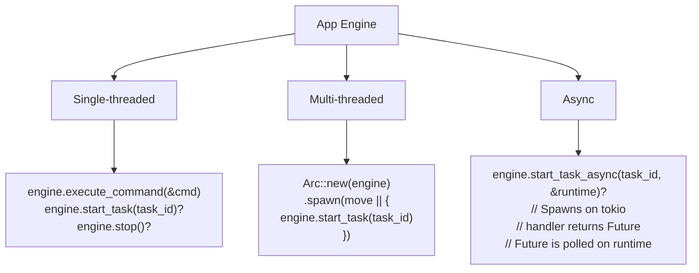

# Concurrency & Async

## Overview

The App Engine is designed for both single-threaded and multi-threaded applications. All managers are `Send + Sync`. For I/O-heavy work, optional `tokio` integration enables true async execution.



---

## Part 1: Thread Safety

### All Managers Are Send + Sync

Every manager in the engine uses interior mutability (`Mutex` or `RwLock`) so methods take `&self` instead of `&mut self`:

| Manager | Lock Type | Why |
|---|---|---|
| `TaskManager` | `Mutex` (tasks) + `RwLock` (executor) | `Task` has `Box<dyn Any + Send>` (Send, not Sync) |
| `ConfigStore` | `Mutex` (config) | `Config` has `HashMap<String, String>` |
| `Preferences` | `Mutex` (values) | `HashMap<String, String>` |
| `ResourceManager` | `Mutex` (cache, source_index, ref_counts) + `RwLock` (loaders) | `Resource` has `Box<dyn Any + Send>` |
| `Scheduler` | `Mutex` (scheduled, queue) + `RwLock` (triggers, paused) | Jobs are `Clone` |
| `HistoryStore` | `Mutex` (entries, position) | `HistoryEntry` has `Box<dyn Any + Send>` |
| `SignalBus` | `Mutex` (subscriptions) | Callbacks are `Box<dyn Fn>` |
| `StateManager` | `Mutex` (via StateStore) | Generic `S: Clone + PartialEq + Debug` |
| `EventBus` | No lock | `publish(&self)` is safe; `subscribe(&mut self)` is setup-time |
| `CommandExecutor` | No lock | `execute(&self)` is safe; `register(&mut self)` is setup-time |

### Key Rule: Mutex vs RwLock

- **`Mutex`** is used when the contained type has `Box<dyn Any + Send>` (Send but not Sync). `Mutex<T>` is `Sync` when `T: Send`.
- **`RwLock`** is used when the contained type is `Send + Sync` (e.g., `Box<dyn ResourceLoader + Send + Sync>`). `RwLock<T>` is `Sync` when `T: Send + Sync`.
- **No lock** is used when only `&self` methods exist (read-only at runtime).

### Verifying Send + Sync

```rust
use app_shell::app_engine::*;

fn assert_send_sync<T: Send + Sync>() {}

assert_send_sync::<TaskManager>();
assert_send_sync::<ConfigStore>();
assert_send_sync::<Preferences>();
assert_send_sync::<ResourceManager>();
assert_send_sync::<Scheduler>();
assert_send_sync::<HistoryStore>();
assert_send_sync::<SignalBus>();
assert_send_sync::<StateManager<LifecycleState>>();
```

### Sharing Across Threads

```rust
use std::sync::Arc;
use std::thread;

// ConfigStore — thread-safe reads and writes
let config = Arc::new(ConfigStore::new(ConfigSchema::new()));

let c1 = Arc::clone(&config);
let c2 = Arc::clone(&config);

let h1 = thread::spawn(move || {
    c1.set("key", "value1").unwrap();
});

let h2 = thread::spawn(move || {
    let val = c2.get("key");
    println!("Read: {:?}", val);
});

h1.join().unwrap();
h2.join().unwrap();
```

### Concurrent Task Creation

```rust
let mgr = Arc::new(TaskManager::new());
mgr.register(
    TaskDefinition::new("app.echo", "Echo", "Echo"),
    Box::new(EchoHandler),
).unwrap();

let mut handles = vec![];
for i in 0..10 {
    let mgr_clone = Arc::clone(&mgr);
    handles.push(thread::spawn(move || {
        mgr_clone.create(
            "app.echo",
            TaskContext::new(ExecutionId::new()),
            TaskInput::new(format!("task_{}", i)),
        ).unwrap()
    }));
}

let mut task_ids = vec![];
for h in handles {
    task_ids.push(h.join().unwrap());
}

// All tasks created successfully — no Mutex poisoning
assert_eq!(mgr.count(), 10);

// All IDs are unique
let mut sorted = task_ids.clone();
sorted.sort();
sorted.dedup();
assert_eq!(sorted.len(), 10);
```

### Concurrent Resource Loading

```rust
let mgr = Arc::new(ResourceManager::new());
mgr.set_self_ref(Arc::downgrade(&mgr));
mgr.register_loader(Box::new(StringLoader));

let mut handles = vec![];
for i in 0..5 {
    let mgr_clone = Arc::clone(&mgr);
    handles.push(thread::spawn(move || {
        mgr_clone.load("text", &format!("file:///test_{}.txt", i)).unwrap()
    }));
}

for h in handles {
    h.join().unwrap();
}

assert_eq!(mgr.resource_count(), 5);
```

---

## Part 2: TaskPool

A minimal thread pool for concurrent sync handler execution:

```rust
use app_shell::app_engine::TaskPool;

let pool = TaskPool::new(4);  // 4 worker threads
assert_eq!(pool.size(), 4);

let result = Arc::new(Mutex::new(0));
let r = result.clone();
pool.spawn(move || {
    *r.lock().unwrap() = 42;
});

std::thread::sleep(std::time::Duration::from_millis(50));
assert_eq!(*result.lock().unwrap(), 42);
```

### Multiple Jobs

```rust
let pool = TaskPool::new(4);
let counter = Arc::new(Mutex::new(0));

for _ in 0..10 {
    let c = counter.clone();
    pool.spawn(move || {
        *c.lock().unwrap() += 1;
    });
}

std::thread::sleep(std::time::Duration::from_millis(100));
assert_eq!(*counter.lock().unwrap(), 10);
```

---

## Part 3: Async Runtime (Phase 21)

### Feature Flag

Async support is **optional** — enabled via the `async-runtime` feature:

```toml
[features]
default = []
async-runtime = ["tokio"]

[dependencies]
tokio = { version = "1", features = ["rt", "rt-multi-thread", "sync", "time"], optional = true }
```

Without the feature, the engine uses synchronous execution exclusively. With the feature, `AsyncTaskHandler` becomes usable.

### AsyncRuntime

A wrapper around tokio's runtime:

```rust
#[cfg(feature = "async-runtime")]
use app_shell::app_engine::AsyncRuntime;

let runtime = AsyncRuntime::new()?;
let result = runtime.block_on(async { 42 });
assert_eq!(result, 42);
```

### AsyncTaskHandler

The async counterpart to `TaskHandler`:

```rust
#[cfg(feature = "async-runtime")]
use app_shell::app_engine::{AsyncTaskHandler, AsyncTaskFuture};

struct AsyncFetchHandler;

impl AsyncTaskHandler for AsyncFetchHandler {
    fn execute(
        &self,
        input: &TaskInput,
        _ctx: &TaskContext,
        _engine: &EngineRef,
    ) -> AsyncTaskFuture {
        let s = input.get::<String>().cloned().unwrap_or_default();
        Box::pin(async move {
            // Async I/O here — can use tokio
            tokio::time::sleep(std::time::Duration::from_millis(10)).await;
            Ok(TaskResult::completed_with(s))
        })
    }
}
```

### Registering Async Handlers

```rust
// Register an async handler
engine.register_async_task(
    TaskDefinition::new("async.fetch", "Fetch", "Fetch data asynchronously"),
    Box::new(AsyncFetchHandler),
)?;

// Create a task
let task_id = engine.task_manager().create(
    "async.fetch",
    TaskContext::new(ExecutionId::new()),
    TaskInput::new("hello async".to_string()),
)?;

// Execute asynchronously
let runtime = AsyncRuntime::new()?;
let result = engine.start_task_async(task_id, &runtime)?;

assert!(result.is_completed());
assert_eq!(result.output::<String>(), Some(&"hello async".to_string()));
```

### How Async Execution Works

1. HandlerKind is checked (Sync vs Async)
2. If Sync → delegate to start() (synchronous)
3. If Async → call handler.execute() to get Box<dyn Future>
   a. The handler captures what it needs from EngineRef
   b. The future must be 'static (no borrowed references)
   c. The future is spawned on tokio's runtime
   d. The calling thread blocks on the result

### Async Handler Constraints

The async handler's `execute()` is called **synchronously** to obtain the `Box<dyn Future>`. The future is then polled by tokio. The handler must clone/own whatever it needs from `EngineRef` before returning the future — the future must be `'static`.

```rust
// CORRECT: Clone before async boundary
impl AsyncTaskHandler for MyHandler {
    fn execute(&self, input: &TaskInput, _: &TaskContext, _: &EngineRef) -> AsyncTaskFuture {
        let data = input.get::<String>().cloned().unwrap_or_default();
        Box::pin(async move {
            // `data` is owned — 'static
            tokio::time::sleep(Duration::from_millis(10)).await;
            Ok(TaskResult::completed_with(data))
        })
    }
}
```

For non-`Clone` input types, use serialized bytes:

```rust
impl AsyncTaskHandler for MyHandler {
    fn execute(&self, input: &TaskInput, _: &TaskContext, _: &EngineRef) -> AsyncTaskFuture {
        let bytes = input.serialized().map(|b| b.to_vec());
        let type_name = input.type_name();

        Box::pin(async move {
            if let Some(bytes) = bytes {
                // Deserialize inside the async boundary
                // let data = registry.deserialize(&bytes, type_name)?;
            }
            Ok(TaskResult::completed())
        })
    }
}
```

### Async with Sleep

```rust
struct SleepHandler;
impl AsyncTaskHandler for SleepHandler {
    fn execute(&self, _: &TaskInput, _: &TaskContext, _: &EngineRef) -> AsyncTaskFuture {
        Box::pin(async move {
            tokio::time::sleep(Duration::from_millis(10)).await;
            Ok(TaskResult::completed())
        })
    }
}
```

### Async Handler Can Fail

```rust
struct FailHandler;
impl AsyncTaskHandler for FailHandler {
    fn execute(&self, _: &TaskInput, _: &TaskContext, _: &EngineRef) -> AsyncTaskFuture {
        Box::pin(async {
            tokio::time::sleep(Duration::from_millis(1)).await;
            Err(TaskError::ExecutionFailed {
                id: 0,
                reason: "async failure".to_string(),
            })
        })
    }
}
```

---

## Part 4: Mixed Sync + Async

Sync and async handlers can coexist in the same engine:

```rust
// Register sync handler
engine.task_manager().register(
    TaskDefinition::new("sync.echo", "Sync Echo", "Synchronous"),
    Box::new(SyncEchoHandler),
)?;

// Register async handler
engine.register_async_task(
    TaskDefinition::new("async.echo", "Async Echo", "Asynchronous"),
    Box::new(AsyncEchoHandler),
)?;

let runtime = AsyncRuntime::new()?;

// Execute sync task — start_task_async delegates to start() for sync handlers
let sync_result = engine.start_task_async(sync_task_id, &runtime)?;
assert!(sync_result.is_completed());

// Execute async task — spawns on tokio
let async_result = engine.start_task_async(async_task_id, &runtime)?;
assert!(async_result.is_completed());
```

`start_task_async()` automatically detects whether the handler is sync or async:
- **Sync handler** → delegates to `start()` (synchronous)
- **Async handler** → spawns on tokio and blocks on the result

### HandlerKind

The executor tracks whether each handler is sync or async:

```rust
use app_shell::app_engine::HandlerKind;

// (Available internally — not typically used by application code)
```

---

## Part 5: Panic Isolation in Concurrent Context

Even in multi-threaded scenarios, panics are isolated (Phase 24):

### Task Handler Panics

```rust
struct PanickingTaskHandler;
impl TaskHandler for PanickingTaskHandler {
    fn execute(&self, _: &TaskInput, _: &TaskContext, _: &EngineRef) -> Result<TaskResult, TaskError> {
        panic!("task handler crashed!");
    }
}

// From any thread:
let result = engine.start_task(task_id);
assert!(result.is_err());
assert!(result.unwrap_err().to_string().contains("handler panicked: task handler crashed!"));

// TaskManager still usable — Mutex NOT poisoned
assert_eq!(engine.task_manager().count(), 1);
assert_eq!(engine.task_manager().get_state(task_id), Some(TaskState::Failed));
```

### Event Handler Panics

Event dispatch is also panic-isolated (Phase 19):

```rust
struct PanickingEventHandler;
impl EventHandler for PanickingEventHandler {
    fn handle(&self, _: &Event) {
        panic!("event handler crashed!");
    }
}

engine.event_bus_mut().subscribe("test.isolation", Box::new(PanickingEventHandler));

// From any thread:
engine.event_bus().publish(&Event::new("test.isolation"));
// ↑ Does not crash — panic is caught by catch_unwind
```

---

## Building and Testing

### Default Build (No Async)

```bash
cargo build
cargo test
```

Zero external dependencies. All managers thread-safe (`Send + Sync`). Synchronous execution only.

### Async Build

```bash
cargo build --features async-runtime
cargo test --features async-runtime
```

Adds `tokio` as a dependency. `AsyncTaskHandler`, `AsyncRuntime`, `start_task_async()`, `register_async_task()` become available.

### Async-Specific Tests

Async tests use `#[cfg(feature = "async-runtime")]`:

```rust
#![cfg(feature = "async-runtime")]

use app_shell::app_engine::*;

#[test]
fn async_handler_executes() {
    let engine = Bootstrap::create().unwrap();
    engine.register_async_task(
        TaskDefinition::new("async.echo", "Async Echo", "Echoes asynchronously"),
        Box::new(AsyncEchoHandler),
    ).unwrap();

    let task_id = engine.task_manager().create(
        "async.echo",
        TaskContext::new(ExecutionId::new()),
        TaskInput::new("hello async".to_string()),
    ).unwrap();

    let runtime = AsyncRuntime::new().unwrap();
    let result = engine.start_task_async(task_id, &runtime).unwrap();
    assert!(result.is_completed());
}
```

---

## Quick Reference

### Thread Safety

```rust
// All managers are Send + Sync
fn assert_send_sync<T: Send + Sync>() {}
assert_send_sync::<TaskManager>();
assert_send_sync::<ConfigStore>();
assert_send_sync::<ResourceManager>();
assert_send_sync::<Scheduler>();

// Share via Arc
let engine = Arc::new(Bootstrap::create()?);
let clone = Arc::clone(&engine);
std::thread::spawn(move || {
    clone.config_store().set("key", "value").unwrap();
});
```

### TaskPool

```rust
let pool = TaskPool::new(4);    // 4 workers
pool.size()                     // → 4
pool.spawn(|| { /* work */ });  // Non-blocking
```

### Async (with feature flag)

```rust
// AsyncRuntime
let runtime = AsyncRuntime::new()?;
runtime.block_on(async { 42 });      // → 42
runtime.spawn(async { /* ... */ });  // JoinHandle

// Register + execute async
engine.register_async_task(definition, Box::new(AsyncHandler))?;
let result = engine.start_task_async(task_id, &runtime)?;

// Async handler trait
impl AsyncTaskHandler for MyHandler {
    fn execute(&self, input: &TaskInput, ctx: &TaskContext, engine: &EngineRef) -> AsyncTaskFuture {
        let data = input.get::<String>().cloned().unwrap_or_default();
        Box::pin(async move {
            tokio::time::sleep(Duration::from_millis(10)).await;
            Ok(TaskResult::completed_with(data))
        })
    }
}
```

### Cargo.toml

```toml
[features]
default = []
async-runtime = ["tokio"]

[dependencies]
tokio = { version = "1", features = ["rt", "rt-multi-thread", "sync", "time"], optional = true }
```

---

## Next Steps

- [05-commands-and-tasks.md](05-commands-and-tasks.md) — Commands, tasks, and handler registration.
- [11-handler-capabilities.md](11-handler-capabilities.md) — What handlers can access via `EngineRef`.
- [15-communication-reliability.md](15-communication-reliability.md) — Panic isolation, priority, and retry in depth.
- [03-bootstrap-and-lifecycle.md](03-bootstrap-and-lifecycle.md) — Lifecycle with concurrent managers.