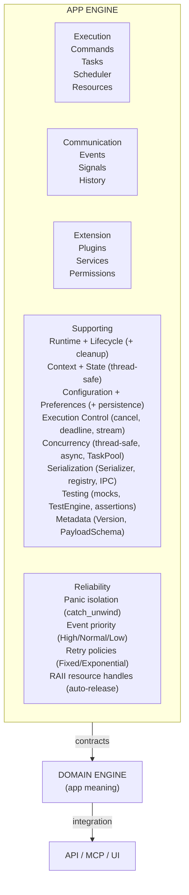
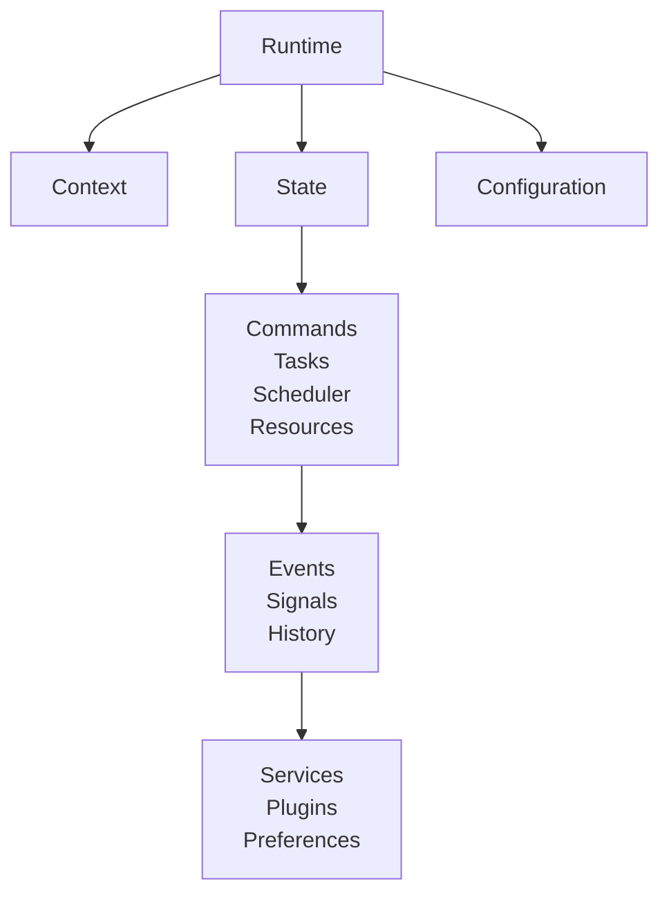
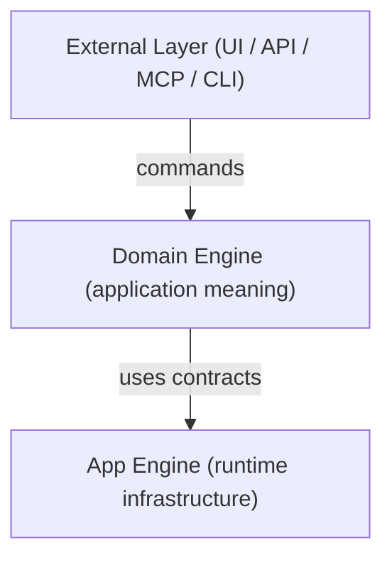

<p align="center">
  <h1 align="center">⚙️ App Engine</h1>
  <p align="center">
    A dependency-free application runtime for Rust.<br>
    Commands, Tasks, Scheduling, Events, Signals, History, Resources, Services, Plugins, and more — all in one coherent library.
  </p>
</p>

<p align="center">
  <a href="#features">Features</a> ·
  <a href="#quick-start">Quick Start</a> ·
  <a href="#architecture">Architecture</a> ·
  <a href="#guides">Guides</a>
</p>

---

## What Is This?

App Engine is a **generic application runtime infrastructure** — the layer between your domain logic and the outside world. It provides the mechanisms that most applications need (lifecycle, commands, tasks, scheduling, events, signals, history, resources, services, plugins, configuration) without knowing what your application actually does.



**Zero external dependencies by default.** Optional `tokio` for async execution.

---

## Comparison

| Feature | App Engine | bevy_app | tokio | iced | tauri |
|---|---|---|---|---|---|
| Lifecycle | ✅ 5-state | ✅ | ❌ | ❌ | ❌ |
| Commands | ✅ | ❌ | ❌ | ❌ | ❌ |
| Tasks | ✅ | ❌ | ✅ | ❌ | ❌ |
| Scheduler | ✅ | ❌ | ✅ (async) | ❌ | ❌ |
| Events | ✅ priority + isolation | ❌ | ❌ | ❌ | ❌ |
| Signals | ✅ thread-safe | ❌ | ❌ | ✅ | ❌ |
| History | ✅ undo/redo/replay | ❌ | ❌ | ❌ | ❌ |
| Resources | ✅ RAII + deps | ❌ | ❌ | ❌ | ❌ |
| Services | ✅ panic-isolated | ✅ | ❌ | ❌ | ❌ |
| Plugins | ✅ permissions | ✅ | ❌ | ❌ | ✅ |
| Config | ✅ persistent | ❌ | ❌ | ❌ | ✅ |
| Persistence | ✅ file/memory | ❌ | ❌ | ❌ | ❌ |
| Serialization | ✅ zero deps | ❌ | ❌ | ❌ | ❌ |
| Concurrency | ✅ Send + Sync | ✅ | ✅ | ❌ | ❌ |
| Async | ✅ optional tokio | ❌ | ✅ | ❌ | ❌ |
| Panic isolation | ✅ all handlers | ❌ | ❌ | ❌ | ❌ |
| Dependencies | zero by default | many | tokio | many | many |

---

## Features

### Execution Systems

| System | What It Does |
|---|---|
| **Commands** | Application intents — "do X." Registered, executed, panic-isolated. |
| **Tasks** | Managed work with lifecycle: `Pending → Running → Completed/Failed/Cancelled`. Cancellation, deadlines, progress streaming. |
| **Scheduler** | Decides *when* tasks run: immediate, delayed, interval, triggered. Priority queue. Retry policies with fixed/exponential backoff. |
| **Resources** | Load, cache, track, and release generic data. RAII handles auto-release on drop. Dependency tracking. Thread-safe. |

### Communication Systems

| System | What It Does |
|---|---|
| **Events** | "Something happened." One-to-many, priority-ordered, panic-isolated. Serialized payload support for IPC. |
| **Signals** | "Something changed." Lightweight, thread-safe. Progress streaming from task handlers. |
| **History** | Ordered operations with undo/redo/replay/transactions. Persistence-ready. |

### Extension Systems

| System | What It Does |
|---|---|
| **Services** | Long-lived capabilities that start/stop with the app. Panic-isolated lifecycle. |
| **Plugins** | Extension packages contributing commands, tasks, resources, services, handlers. Permission-controlled. Dynamic loader stub for `.so`/`.dll`. |

### Foundation Systems

| System | What It Does |
|---|---|
| **Runtime + Lifecycle** | Owns the application lifetime. Cancels tasks on stop. Unloads resources on dispose. |
| **Context** | Identity hierarchy: `Application → Session → Execution`. |
| **State** | Generic key-value state store with validated transitions. Thread-safe. |
| **Configuration** | Persistent settings. File/memory backends. Change notifications. Thread-safe. |
| **Preferences** | User-facing settings. Thread-safe. |
| **EngineRef** | Read-only bundle of subsystems passed to handlers. Handlers can publish events, load resources, write config, submit to scheduler. |
| **Execution Control** | `CancellationToken`, `Deadline`, `TaskOutputChannel`. |
| **Persistence** | `StorageBackend` trait with `FileStorageBackend` and `MemoryStorageBackend`. |
| **Serialization** | `Serializer` trait + `SerializationRegistry`. Serialized bytes on all payloads for IPC. Zero external deps. |
| **Concurrency** | All managers `Send + Sync`. `TaskPool`. Optional `AsyncRuntime` (tokio). |
| **Panic Isolation** | All handler calls wrapped in `catch_unwind`. Mutex not poisoned. |
| **Testing** | `MockCommandExecutor`, `MockEventBus`, `MockSignalBus`, `TestEngine`, assertion helpers. |
| **Metadata** | `Version`, `PayloadSchema` on all definitions. |

---

## Quick Start

```rust
use app_shell::app_engine::*;
use std::any::Any;

// --- Your command handler ---
struct GreetCommand;

impl CommandHandler for GreetCommand {
    fn execute(
        &self,
        input: &CommandInput,
        _: &CommandContext,
        engine: &EngineRef,
    ) -> Result<CommandResult, CommandError> {
        let name: &String = input.get::<String>()
            .ok_or_else(|| CommandError::InvalidArguments("expected name".to_string()))?;

        // Publish an event through EngineRef
        engine.event_bus.publish(
            &Event::new("greet.done").with_source("GreetCommand")
        );

        Ok(CommandResult::success_with(format!("Hello, {}!", name)))
    }
}

// --- Your resource loader ---
struct TextLoader;
impl ResourceLoader for TextLoader {
    fn resource_type(&self) -> &str { "text" }
    fn load(&self, source: &str) -> Result<Box<dyn Any + Send>, ResourceError> {
        Ok(Box::new(format!("content:{}", source)))
    }
}

// --- Closure wrapper for events ---
struct ClosureEventHandler<F: Fn(&Event) + Send + Sync + 'static> { f: F }
impl<F: Fn(&Event) + Send + Sync + 'static> EventHandler for ClosureEventHandler<F> {
    fn handle(&self, event: &Event) { (self.f)(event); }
}
fn event_handler<F: Fn(&Event) + Send + Sync + 'static>(f: F) -> Box<dyn EventHandler> {
    Box::new(ClosureEventHandler { f })
}

// --- Main ---
fn main() {
    let mut engine: AppEngine = Bootstrap::create().expect("bootstrap failed");

    // Register your handlers
    engine.command_executor_mut().register(
        CommandDefinition::new("app.greet", "Greet", "Greet someone"),
        Box::new(GreetCommand),
    ).unwrap();
    engine.resource_manager().register_loader(Box::new(TextLoader));

    // Subscribe to events
    let received = std::sync::Arc::new(std::sync::Mutex::new(false));
    let r = received.clone();
    engine.event_bus_mut().subscribe(
        "greet.done",
        event_handler(move |_event: &Event| { *r.lock().unwrap() = true; }),
    );

    // Lifecycle
    engine.initialize().unwrap();
    engine.start().unwrap();

    // Execute a command
    let cmd = Command::new(
        "app.greet",
        CommandContext::new(ExecutionId::new()),
        CommandInput::new("World".to_string()),
    );
    let result = engine.execute_command(&cmd).unwrap();
    println!("{}", result.output::<String>().unwrap());
    assert!(*received.lock().unwrap());

    // Load a resource (RAII handle auto-releases on drop)
    let handle = engine.resource_manager().load("text", "file:///welcome.txt").unwrap();
    let data = engine.resource_manager()
        .with_resource(handle.resource_id(), |r| r.data::<String>().map(|s| s.clone()))
    .flatten();
    println!("Loaded: {}", data.unwrap());

    // Undo/redo
    engine.history_store().append(
        HistoryEntry::new("greet").undoable().with_source("main"),
    );
    engine.history_store().undo();
    engine.history_store().redo();

    // Shutdown (cancels tasks, unloads resources)
    engine.stop().unwrap();
    engine.dispose().unwrap();
    println!("Done! State: {:?}", engine.state());
}
```

---

## Architecture



### Dependency Direction

```text
Domain Engine ──→ App Engine ──→ (nothing)
Domain Engine ──→ App Engine ✗→ Domain Engine
App Engine     ✗→ UI / API / MCP
```

### Layered Architecture



Each layer knows only the layer below it. The App Engine never imports domain types, UI types, or API types.

---

## Installation

Add to your `Cargo.toml`:

```toml
[dependencies]
app_shell = { path = "path/to/AppShell" }

# Optional: async runtime
app_shell = { path = "path/to/AppShell", features = ["async-runtime"] }
```

### Features

| Feature | Description |
|---|---|
| `default` | Zero external dependencies. All systems included (sync only). |
| `async-runtime` | Adds `tokio` for async task execution via `AsyncTaskHandler`. |

```toml
[features]
default = []
async-runtime = ["tokio"]

[dependencies]
tokio = { version = "1", features = ["rt", "rt-multi-thread", "sync", "time"], optional = true }
```

---

## Key Properties

| Property | Status |
|---|---|
| **Dependency-free** | ✅ Zero external crates by default |
| **Thread-safe** | ✅ All managers are `Send + Sync` |
| **Panic-isolated** | ✅ All handler calls wrapped in `catch_unwind` |
| **RAII resources** | ✅ Handles auto-release on drop |
| **Backward compatible** | ✅ Default permissions = `FULL_ACCESS` |
| **Headless** | ✅ Runs without UI, API, or MCP |
| **Serializable** | ✅ `Serializer` trait, zero deps |
| **Persistent** | ✅ `StorageBackend` trait, file + memory |
| **Testable** | ✅ Mocks, `TestEngine`, assertion helpers |
| **Versioned** | ✅ `Version`, `PayloadSchema` on all definitions |
| **Async-ready** | ✅ Optional `tokio` integration |

---

## Subsystem Summary

```mermaid
flowchart TD
    AE["APP ENGINE"] --> EX["Execution"]
    AE --> CO["Communication"]
    AE --> EN["Extension"]
    AE --> FO["Foundation"]
    AE --> RE["Reliability"]

    EX --> EX1["Commands (intent → execution, panic-isolated)"]
    EX --> EX2["Tasks (managed work, cancel, deadline, progress)"]
    EX --> EX3["Scheduler (when work runs, retry, triggers)"]
    EX --> EX4["Resources (load, cache, RAII handles, dependencies)"]

    CO --> CO1["Events (one-to-many, priority, panic-isolated)"]
    CO --> CO2["Signals (lightweight change notifications)"]
    CO --> CO3["History (undo/redo/replay/transactions)"]

    EN --> EN1["Services (long-lived, panic-isolated lifecycle)"]
    EN --> EN2["Plugins (extension packages, permission-controlled)"]

    FO --> FO1["Runtime + Lifecycle (+ cleanup on stop/dispose)"]
    FO --> FO2["Context (Application → Session → Execution)"]
    FO --> FO3["State (generic key-value, thread-safe)"]
    FO --> FO4["Configuration (persistent, thread-safe, change notifications)"]
    FO --> FO5["Preferences (user-facing, thread-safe)"]
    FO --> FO6["EngineRef (handler capabilities)"]
    FO --> FO7["Execution Control (cancel, deadline, stream)"]
    FO --> FO8["Persistence (StorageBackend trait)"]
    FO --> FO9["Serialization (Serializer trait, registry)"]
    FO --> FO10["Concurrency (TaskPool, AsyncRuntime)"]
    FO --> FO11["Testing (mocks, TestEngine)"]
    FO --> FO12["Metadata (Version, PayloadSchema)"]

    RE --> RE1["Panic Isolation (catch_unwind on all handlers)"]
    RE --> RE2["Event Priority (High/Normal/Low)"]
    RE --> RE3["Retry Policies (Fixed/Exponential)"]
    RE --> RE4["RAII Handles (auto-release on drop)"]
```



---

## When to Use

✅ **Use App Engine when**:
-	You need managed execution (commands, tasks, scheduling)
-	You need undo/redo with transactions
-	You need plugin extensibility with permission control
-	You need decoupled communication (events/signals)
-	You need resource management with RAII handles
-	You need long-lived services with panic isolation
-	You need thread-safe managers (`Send + Sync`)
-	You need async execution (optional tokio)
-	You need serialization for IPC (zero deps)
-	You want stable contracts between runtime and domain logic

❌ **Don't use App Engine if:**
-	Your app is a simple script
-	You have no lifecycle/undo/extensibility needs
-	You don't need domain/UI/API separation

---

## License

Apache-2.0

---

## Contributing

(Not Yet) ~~Pull requests welcome. See the [architecture guide](02-architecture.md) before contributing — clean boundaries are the engine's core value proposition.~~

---


## Guide

### Core Architecture

| # | Guide | Topic |
|---|---|---|
| 01 | [Overview](01-overview.md) | What App Engine is, what it provides, what it doesn't |
| 02 | [Architecture](02-architecture.md) | Layering, boundaries, subsystem ownership |
| 03 | [Bootstrap & Lifecycle](03-bootstrap-and-lifecycle.md) | Creating, running, shutting down |
| 04 | [Context & State](04-context-and-state.md) | Identity hierarchy, state management |
| 05 | [Commands & Tasks](05-commands-and-tasks.md) | Intents, managed work, registration, execution |
| 06 | [Scheduling & Communication](06-scheduling-and-communication.md) | Scheduler, events, signals |
| 07 | [History & Resources](07-history-and-resources.md) | Undo/redo, RAII handles, dependencies |
| 08 | [Services & Plugins](08-services-and-plugins.md) | Long-lived capabilities, extensions, permissions |
| 09 | [Domain Engine Integration](09-domain-engine-integration.md) | How to build your domain layer |
| 10 | [Application Integration](10-application-integration.md) | UI, API, MCP, CLI, headless |

### Advanced Features

| # | Guide | Topic |
|---|---|---|
| 11 | [Handler Capabilities](11-handler-capabilities.md) | EngineRef, what handlers can access |
| 12 | [Execution Control](12-execution-control.md) | Cancellation, deadlines, progress streaming |
| 13 | [Persistence & Serialization](13-persistence-and-serialization.md) | Storage backends, Serializer trait, IPC |
| 14 | [Concurrency & Async](14-concurrency-and-async.md) | Thread safety, TaskPool, AsyncRuntime |
| 15 | [Communication & Reliability](15-communication-reliability.md) | Priority, panic isolation, retry |
| 16 | [Testing & Metadata](16-testing-and-metadata.md) | Mocks, TestEngine, Version, PayloadSchema |
| 17 | [Plugin Security](17-plugin-security.md) | Permissions, PermissionCheckedEngineRef |

### Reference

| # | Guide | Topic |
|---|---|---|
| 18 | [Public API Reference](18-public-api-reference.md) | Complete type/trait listing |
| 19 | [Error Reference](19-error-reference.md) | All error types and variants |
| 20 | [Quick Start](20-quick-start.md) | 5-minute getting started |

---

<p align="center">
  <sub>Built with ❤️ in Rust. Zero dependencies. No compromise.</sub>
</p>